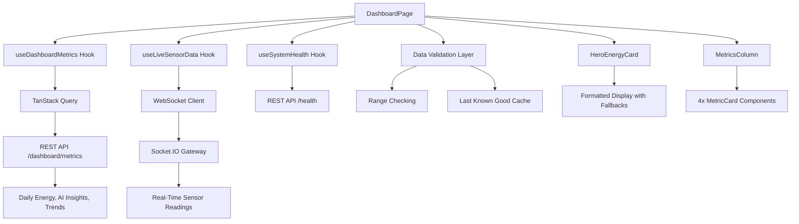

# Design Document: EcoStep Hero Energy Dashboard

## Overview

This design specifies the technical implementation of the EcoStep Hero Energy Dashboard redesign, transforming the current equal-weight metric grid into a hero-focused layout with energy output (kWh) as the primary visual element. The redesign establishes a clear data-first visual hierarchy inspired by modern industrial monitoring systems, enabling users to assess current energy generation within 1 second of page load.

### Design Goals

1. **Immediate Visual Clarity**: Large hero energy card (60-65% width) dominates the layout, making energy output instantly recognizable
2. **Clean Data-First Hierarchy**: Numeric values are the visual heroes, not decorative icons or gradients
3. **Real-Time Performance**: Sub-1-second WebSocket updates with debouncing and data validation
4. **Responsive Excellence**: Seamless adaptation across desktop (side-by-side), tablet (2x2 grid), mobile (stacked)
5. **Production-Grade Error Handling**: Graceful fallbacks, last-known-good data caching, and clear error states

### Technology Stack

- **UI Framework**: React 18 with TypeScript
- **State Management**: TanStack Query (React Query) for server state, local state for UI
- **Real-Time**: Socket.IO WebSocket client
- **Styling**: Tailwind CSS with design tokens system
- **Data Visualization**: Recharts for mini trend graphs
- **Performance**: React.memo, useMemo, useCallback, CSS containment

---

## Architecture

### Component Hierarchy

```
DashboardPage (existing, enhanced)
├── DashboardHeader (existing, enhanced with date/time)
├── HeroSection (NEW)
│   └── HeroEnergyCard (NEW)
│       ├── EnergyValueDisplay (internal)
│       ├── TrendIndicator (NEW)
│       ├── MiniTrendGraph (NEW)
│       └── AIInsightSection (NEW)
└── MetricsColumn (NEW)
    ├── MetricCard (existing, reused)
    │   ├── VoltageMetric
    │   ├── PowerMetric
    │   ├── CurrentMetric
    │   └── StepCountMetric
```

### Data Flow Architecture



### State Management Strategy

**Server State (TanStack Query)**:
- Daily energy metrics (`/dashboard/metrics`)
- AI insights and trend data
- System health status
- 30-second refetch interval with stale-while-revalidate

**WebSocket State (Socket.IO)**:
- Real-time sensor readings (voltage, current, power, steps)
- Connection status monitoring
- Automatic reconnection handling

**Local Component State**:
- Last known good data cache (fallback on validation failure)
- Loading skeletons and error states
- UI interaction states (hover, focus)

**Derived State (useMemo)**:
- Formatted numeric values with precision
- Trend calculations and color determination
- Empty state detection

---

## Component Design Specifications

### 1. HeroEnergyCard Component

**Purpose**: Primary KPI display showing daily energy output with contextual information.

**Props Interface**:
```typescript
interface HeroEnergyCardProps {
  // Core data
  energyValue: number | undefined;
  previousDayEnergy: number | undefined;
  trendData: TrendDataPoint[];
  aiInsight: string | undefined;
  
  // State flags
  isLoading: boolean;
  isError: boolean;
  
  // Callbacks
  onRetry?: () => void;
}

interface TrendDataPoint {
  timestamp: string;
  value: number;
}
```

**Visual Specifications**:
- **Container**: 60-65% width on desktop, full width on mobile/tablet
- **Padding**: 32px (desktop), 24px (tablet), 20px (mobile)
- **Border Radius**: 12px
- **Background**: Solid card background with 1px hairline border
- **Min Height**: 400px (desktop) to accommodate all sections

**Layout Structure**:
```
┌─────────────────────────────────────────────┐
│  Label: "Today's Energy Generated"         │  <- 13px uppercase
│                                             │
│  Value: "24.7"  Unit: "kWh"                │  <- 56-72px | 24-32px
│                                             │
│  Trend: ↑ 12.5% vs yesterday               │  <- Color-coded arrow
│                                             │
│  ┌─────────────────────────────────────┐  │
│  │ Mini Trend Graph (24h sparkline)    │  │  <- 25% card height max
│  └─────────────────────────────────────┘  │
│                                             │
│  ──────────────────────────────────────    │  <- Divider
│  💡 AI Insight: "Peak generation at 2pm"  │  <- 60-150 chars, muted
└─────────────────────────────────────────────┘
```

**Typography Scale**:
- Energy Value: `text-[56px] sm:text-[64px] lg:text-[72px]`
- Unit: `text-[24px] sm:text-[28px] lg:text-[32px]`
- Label: `text-[13px]` uppercase, tracking-wide
- Trend: `text-[15px]` medium weight
- AI Insight: `text-[13px] sm:text-[14px] lg:text-[15px]`

**Color Specifications**:
- Energy Value: `#3ED98A` (accent green)
- Unit: `#6B7280` (muted, 60% opacity)
- Trend Up: `#3ED98A` with ↑ arrow
- Trend Down: `#F59E0B` (amber) with ↓ arrow
- Trend Neutral: `#9CA3AF` (gray) with ─ icon
- AI Insight: `#6B7280` (muted)

**Empty States**:
- No data: Display `"0.0"` with 50% opacity
- Loading: Skeleton with shimmer animation
- Error: Red border with retry button

**Performance Optimizations**:
```typescript
export const HeroEnergyCard = React.memo(function HeroEnergyCard(props) {
  // Memoize formatted value
  const formattedEnergy = useMemo(() => 
    props.energyValue?.toFixed(1) ?? '0.0',
    [props.energyValue]
  );
  
  // Memoize trend calculation
  const trendData = useMemo(() => 
    calculateTrend(props.energyValue, props.previousDayEnergy),
    [props.energyValue, props.previousDayEnergy]
  );
  
  return (
    <div className="eco-card" style={{ contain: 'layout style' }}>
      {/* ... */}
    </div>
  );
});
```

---

### 2. TrendIndicator Component

**Purpose**: Color-coded percentage change display with directional arrow icon.

**Props Interface**:
```typescript
interface TrendIndicatorProps {
  currentValue: number | undefined;
  previousValue: number | undefined;
  format?: 'percentage' | 'absolute';
  showIcon?: boolean;
}

type TrendDirection = 'up' | 'down' | 'neutral' | 'no-data';

interface TrendCalculation {
  direction: TrendDirection;
  percentage: number;
  color: string;
  icon: React.ReactNode;
  label: string;
}
```

**Calculation Logic**:
```typescript
function calculateTrend(current: number | undefined, previous: number | undefined): TrendCalculation {
  // No comparison data
  if (current === undefined || previous === undefined) {
    return {
      direction: 'no-data',
      percentage: 0,
      color: '#9CA3AF',
      icon: <HelpCircle />,
      label: 'No comparison data'
    };
  }
  
  // Neutral case
  if (current === previous) {
    return {
      direction: 'neutral',
      percentage: 0,
      color: '#9CA3AF',
      icon: <Minus />,
      label: 'No change'
    };
  }
  
  // Calculate percentage
  const percentChange = ((current - previous) / previous) * 100;
  const isPositive = percentChange > 0;
  
  return {
    direction: isPositive ? 'up' : 'down',
    percentage: Math.abs(percentChange),
    color: isPositive ? '#3ED98A' : '#F59E0B',
    icon: isPositive ? <TrendingUp /> : <TrendingDown />,
    label: `${isPositive ? '↑' : '↓'} ${Math.abs(percentChange).toFixed(1)}% vs yesterday`
  };
}
```

**Visual Design**:
```tsx
<div className="flex items-center gap-2" style={{ marginTop: '12px' }}>
  <span style={{ color: trend.color }}>
    {trend.icon}
  </span>
  <span 
    className="text-[15px] font-medium"
    style={{ color: trend.color }}
  >
    {trend.label}
  </span>
</div>
```

**Color Rules**:
- **Green (#3ED98A)**: Positive change (energy increase)
- **Amber (#F59E0B)**: Negative change (energy decrease)
- **Gray (#9CA3AF)**: No change or no data

---

### 3. MiniTrendGraph Component

**Purpose**: Compact 24-hour sparkline visualization for quick pattern recognition.

**Props Interface**:
```typescript
interface MiniTrendGraphProps {
  data: TrendDataPoint[];
  height?: number; // Max 25% of card height
  showAxes?: boolean; // Default false
  accentColor?: string; // Default #3ED98A
}

interface TrendDataPoint {
  timestamp: string; // ISO 8601
  value: number;
}
```

**Implementation (Recharts)**:
```typescript
import { LineChart, Line, ResponsiveContainer } from 'recharts';

export const MiniTrendGraph = React.memo(function MiniTrendGraph({
  data,
  height = 100,
  showAxes = false,
  accentColor = '#3ED98A'
}: MiniTrendGraphProps) {
  // Filter to last 24 hours
  const filteredData = useMemo(() => {
    const now = new Date();
    const oneDayAgo = new Date(now.getTime() - 24 * 60 * 60 * 1000);
    return data.filter(d => new Date(d.timestamp) >= oneDayAgo);
  }, [data]);
  
  // Empty state
  if (filteredData.length < 2) {
    return (
      <div 
        className="flex items-center justify-center text-sm text-gray-400"
        style={{ height }}
      >
        Insufficient data
      </div>
    );
  }
  
  return (
    <ResponsiveContainer width="100%" height={height}>
      <LineChart data={filteredData} margin={{ top: 5, right: 5, bottom: 5, left: 5 }}>
        <Line 
          type="monotone"
          dataKey="value"
          stroke={accentColor}
          strokeWidth={2}
          dot={false}
          animationDuration={300}
        />
      </LineChart>
    </ResponsiveContainer>
  );
});
```

**Visual Specifications**:
- **Height**: Max 100px (25% of 400px card height)
- **Margin**: 16px above AI insight section
- **Line Color**: #3ED98A (accent green)
- **Line Width**: 2px
- **No Axes**: Clean, minimal presentation
- **Animation**: 300ms ease on data update

**Empty State**:
- Show "Insufficient data" message when < 2 data points
- Gray text, centered

---

### 4. AIInsightSection Component

**Purpose**: Executive summary text derived from historical pattern analysis.

**Props Interface**:
```typescript
interface AIInsightSectionProps {
  insight: string | undefined;
  isLoading: boolean;
  maxLength?: number; // Default 150
}
```

**Visual Design**:
```tsx
<div 
  className="border-t pt-4"
  style={{
    borderColor: theme === 'dark' ? 'rgba(137, 215, 183, 0.12)' : 'rgba(26, 49, 44, 0.08)',
    marginTop: '16px'
  }}
>
  <div className="flex items-start gap-2">
    <Sparkles className="w-4 h-4 flex-shrink-0" style={{ color: '#3ED98A' }} />
    <p 
      className="text-[13px] sm:text-[14px] lg:text-[15px]"
      style={{ 
        color: theme === 'dark' ? '#9CA3AF' : '#6B7280',
        lineHeight: 1.5
      }}
    >
      {insight || 'Analysis in progress...'}
    </p>
  </div>
</div>
```

**Content Rules**:
- **Length**: 60-150 characters (brief, actionable)
- **Tone**: Professional, data-driven, not marketing
- **Examples**:
  - ✅ "Peak generation at 2pm today, 15% above average"
  - ✅ "Energy output steady across morning hours"
  - ❌ "Amazing performance! You're crushing it!"

**Fallback States**:
- No insight: "Analysis in progress..."
- Loading: Skeleton animation
- Error: Hide section entirely (not critical data)

---

### 5. MetricsColumn Component

**Purpose**: Container for 4 stacked metric cards (Voltage, Power, Current, Steps).

**Props Interface**:
```typescript
interface MetricsColumnProps {
  voltage: number | undefined;
  current: number | undefined;
  power: number | undefined;
  stepCount: number | undefined;
  isLoading: boolean;
}
```

**Layout Structure**:
```
┌─────────────────┐
│ Voltage Card    │  <- 35-40% width, equal height
├─────────────────┤
│ Power Card      │  <- 16px vertical gap
├─────────────────┤
│ Current Card    │
├─────────────────┤
│ Step Count Card │
└─────────────────┘
```

**CSS Grid Implementation**:
```tsx
<div 
  className="metrics-column"
  style={{
    display: 'flex',
    flexDirection: 'column',
    gap: '16px',
    width: '35%', // Desktop
    minWidth: '280px'
  }}
>
  <MetricCard label="Voltage" value={voltage} unit="V" precision={1} color="accent" />
  <MetricCard label="Power" value={power} unit="W" precision={1} color="amber" />
  <MetricCard label="Current" value={current} unit="A" precision={2} color="blue" />
  <MetricCard label="Steps Today" value={stepCount} unit="" precision={0} color="accent" icon={<Footprints />} />
</div>
```

**Responsive Behavior**:
- **Desktop (≥1024px)**: 35-40% width, stacked vertically
- **Tablet (768-1023px)**: 2x2 grid below hero card
- **Mobile (<768px)**: Full width, stacked below hero card

---

### 6. MetricCard Component (Enhanced)

**Existing component, documented for reference**

**Props Interface**:
```typescript
interface MetricCardProps {
  label: string;
  value: number | undefined;
  unit: string;
  precision: number;
  color: 'accent' | 'amber' | 'blue' | 'red';
  icon?: React.ReactNode;
  showTrend?: boolean;
  trendPercentage?: number;
}
```

**Typography Specifications**:
- **Label**: 13px uppercase, tracking-wide, muted
- **Value**: 28px (mobile) → 32px (tablet) → 36px (desktop)
- **Unit**: 16px → 17px → 18px, inline with value

**Color Mapping**:
- `accent`: #3ED98A (voltage, energy, steps)
- `amber`: #F59E0B (power)
- `blue`: #3B82F6 (current)
- `red`: #EF4444 (errors, alerts)

---

### 7. DashboardHeader Component (Enhanced)

**New Features**:
- Current date display
- Real-time clock (updates every second)
- System status badge (Online/Offline/Warning)
- WebSocket disconnection indicator

**Enhanced Props**:
```typescript
interface DashboardHeaderProps {
  title: string;
  subtitle: string;
  systemStatus: 'connected' | 'disconnected' | 'unknown';
  alertsCount: number;
  isPublicUser: boolean;
  isWebSocketConnected: boolean;
  onAlertsClick: () => void;
}
```

**New Header Layout**:
```
┌────────────────────────────────────────────────────────────────┐
│ EcoStep Central                              Wed, Jan 15, 2025 │
│ Real-time monitoring...                         2:45:32 PM     │
│ ● Online                                [🔔 Alerts (3)]        │
└────────────────────────────────────────────────────────────────┘
```

**Clock Implementation**:
```typescript
function DashboardHeaderEnhanced(props: DashboardHeaderProps) {
  const [currentTime, setCurrentTime] = useState(new Date());
  
  // Update clock every second
  useEffect(() => {
    const interval = setInterval(() => {
      setCurrentTime(new Date());
    }, 1000);
    
    return () => clearInterval(interval);
  }, []);
  
  const formattedDate = currentTime.toLocaleDateString('en-US', {
    month: 'long',
    day: 'numeric',
    year: 'numeric'
  });
  
  const formattedTime = currentTime.toLocaleTimeString('en-US', {
    hour: 'numeric',
    minute: '2-digit',
    second: '2-digit',
    hour12: true
  });
  
  return (
    <header className="dashboard-header">
      <div className="header-left">
        <h1>{props.title}</h1>
        <p>{props.subtitle}</p>
        <StatusBadge status={props.systemStatus} />
      </div>
      <div className="header-right">
        <div className="datetime">
          <span className="date">{formattedDate}</span>
          <span className="time">{formattedTime}</span>
        </div>
        <button onClick={props.onAlertsClick}>
          <Bell /> Alerts {props.alertsCount > 0 && `(${props.alertsCount})`}
        </button>
      </div>
    </header>
  );
}
```

**Status Badge Colors**:
- **Online**: Green background (#3ED98A), green text
- **Offline**: Red background (#EF4444), red text
- **Warning**: Amber background (#F59E0B), amber text

---

## Data Management

### WebSocket Integration

**Connection Strategy**:
```typescript
// hooks/useLiveSensorData.ts (enhanced)
import { useEffect, useState, useCallback } from 'react';
import { io, Socket } from 'socket.io-client';
import type { SensorReading } from '../types/dashboard.types';

export function useLiveSensorData() {
  const [lastReading, setLastReading] = useState<SensorReading | undefined>(undefined);
  const [isConnected, setIsConnected] = useState(false);
  const [socket, setSocket] = useState<Socket | null>(null);
  
  // Debounce updates to max 1 per second
  const [updateQueue, setUpdateQueue] = useState<SensorReading[]>([]);
  
  useEffect(() => {
    // Initialize Socket.IO connection
    const socketInstance = io(import.meta.env.VITE_API_URL || 'http://localhost:3000', {
      path: '/socket.io',
      transports: ['websocket', 'polling'],
      reconnection: true,
      reconnectionDelay: 1000,
      reconnectionAttempts: 5
    });
    
    socketInstance.on('connect', () => {
      console.log('[WebSocket] Connected');
      setIsConnected(true);
    });
    
    socketInstance.on('disconnect', () => {
      console.log('[WebSocket] Disconnected');
      setIsConnected(false);
    });
    
    // Listen for sensor readings
    socketInstance.on('sensor:reading', (data: SensorReading) => {
      setUpdateQueue(prev => [...prev, data]);
    });
    
    setSocket(socketInstance);
    
    return () => {
      socketInstance.disconnect();
    };
  }, []);
  
  // Debounced update processor (max 1 update/second)
  useEffect(() => {
    if (updateQueue.length === 0) return;
    
    const timer = setTimeout(() => {
      // Take the most recent reading from queue
      const latestReading = updateQueue[updateQueue.length - 1];
      setLastReading(latestReading);
      setUpdateQueue([]);
    }, 1000);
    
    return () => clearTimeout(timer);
  }, [updateQueue]);
  
  return {
    lastReading,
    isConnected,
    socket
  };
}
```

**Data Validation Layer**:
```typescript
// utils/validateSensorData.ts
interface ValidationRange {
  min: number;
  max: number;
  field: string;
}

const VALIDATION_RANGES: ValidationRange[] = [
  { field: 'voltage', min: 0, max: 500 },
  { field: 'current', min: 0, max: 100 },
  { field: 'power', min: 0, max: 50000 },
  { field: 'stepCount', min: 0, max: 1000000 }
];

export function validateSensorReading(reading: SensorReading): boolean {
  for (const range of VALIDATION_RANGES) {
    const value = reading[range.field as keyof SensorReading];
    
    if (value !== undefined && typeof value === 'number') {
      if (value < range.min || value > range.max) {
        console.warn(
          `[Validation] ${range.field} out of range: ${value} (expected ${range.min}-${range.max})`
        );
        return false;
      }
    }
  }
  
  return true;
}
```

### REST API Integration

**Daily Energy Metrics Fetching**:
```typescript
// hooks/useDashboardMetrics.ts (enhanced)
import { useQuery } from '@tanstack/react-query';
import { dashboardService } from '@/api/services';

interface EnhancedDashboardMetrics {
  dailyEnergy: number;
  previousDayEnergy: number;
  energyTrend: TrendDataPoint[];
  aiInsight: string;
  // ... existing metrics
}

export function useDashboardMetrics() {
  return useQuery<EnhancedDashboardMetrics>({
    queryKey: ['dashboard', 'metrics'],
    queryFn: async () => {
      const response = await dashboardService.getMetrics();
      return response.data;
    },
    refetchInterval: 60000, // Refetch every 60 seconds
    staleTime: 50000, // Data is fresh for 50 seconds
    retry: 3,
    retryDelay: (attemptIndex) => Math.min(1000 * 2 ** attemptIndex, 5000),
    // Enable background refetching
    refetchOnMount: true,
    refetchOnWindowFocus: true,
    // Stale-while-revalidate: keep showing old data while fetching new
    placeholderData: (previousData) => previousData
  });
}
```

**AI Insights Fetching** (separate endpoint for caching):
```typescript
// hooks/useAIInsights.ts
export function useAIInsights() {
  return useQuery({
    queryKey: ['dashboard', 'ai-insights'],
    queryFn: async () => {
      const response = await dashboardService.getAIInsights();
      return response.data;
    },
    refetchInterval: 300000, // Refetch every 5 minutes (AI is slow-changing)
    staleTime: 240000, // Fresh for 4 minutes
    retry: 2
  });
}
```

### Last-Known-Good Caching Strategy

```typescript
// DashboardPage.tsx data management
function DashboardPage() {
  const { lastReading, isConnected } = useLiveSensorData();
  const { data: metrics, isError } = useDashboardMetrics();
  
  // Last known good data cache
  const [lastGoodReading, setLastGoodReading] = useState<SensorReading | undefined>(undefined);
  const [lastGoodMetrics, setLastGoodMetrics] = useState<DashboardMetrics | undefined>(undefined);
  
  // Update cache when new valid data arrives
  useEffect(() => {
    if (lastReading && validateSensorReading(lastReading)) {
      setLastGoodReading(lastReading);
    }
  }, [lastReading]);
  
  useEffect(() => {
    if (metrics && validateMetrics(metrics)) {
      setLastGoodMetrics(metrics);
    }
  }, [metrics]);
  
  // Use last known good data on validation failure
  const displayReading = lastReading && validateSensorReading(lastReading)
    ? lastReading
    : lastGoodReading;
  
  const displayMetrics = metrics && validateMetrics(metrics)
    ? metrics
    : lastGoodMetrics;
  
  return (
    <div>
      <HeroEnergyCard
        energyValue={displayMetrics?.dailyEnergy}
        previousDayEnergy={displayMetrics?.previousDayEnergy}
        trendData={displayMetrics?.energyTrend || []}
        aiInsight={displayMetrics?.aiInsight}
        isLoading={!displayMetrics}
        isError={isError && !lastGoodMetrics}
      />
      <MetricsColumn
        voltage={displayReading?.voltage}
        current={displayReading?.current}
        power={displayReading?.power}
        stepCount={displayReading?.stepCount}
        isLoading={!displayReading}
      />
    </div>
  );
}
```

---

## Responsive Layout System

### Desktop Layout (≥1024px)

**CSS Grid Implementation**:
```tsx
<div 
  className="dashboard-content"
  style={{
    display: 'grid',
    gridTemplateColumns: '65% 35%',
    gap: '24px',
    maxWidth: '1600px',
    margin: '0 auto'
  }}
>
  {/* Hero Section - Left */}
  <div className="hero-section">
    <HeroEnergyCard {...heroProps} />
  </div>
  
  {/* Metrics Column - Right */}
  <div 
    className="metrics-column"
    style={{
      display: 'flex',
      flexDirection: 'column',
      gap: '16px'
    }}
  >
    <MetricCard {...voltageProps} />
    <MetricCard {...powerProps} />
    <MetricCard {...currentProps} />
    <MetricCard {...stepProps} />
  </div>
</div>
```

**Layout Constraints**:
- Hero Card: 60-65% width (prefer 65% for balance)
- Metrics Column: 35-40% width (prefer 35%)
- Gap: 24px horizontal
- Max Width: 1600px (centered)

### Tablet Layout (768px - 1023px)

**Stacked Hero + 2x2 Grid**:
```tsx
<div className="dashboard-content tablet">
  {/* Hero Card - Full Width */}
  <div className="hero-section" style={{ marginBottom: '24px' }}>
    <HeroEnergyCard {...heroProps} />
  </div>
  
  {/* Metrics Grid - 2x2 */}
  <div 
    style={{
      display: 'grid',
      gridTemplateColumns: 'repeat(2, 1fr)',
      gap: '16px'
    }}
  >
    <MetricCard {...voltageProps} />
    <MetricCard {...powerProps} />
    <MetricCard {...currentProps} />
    <MetricCard {...stepProps} />
  </div>
</div>
```

**Typography Adjustments**:
- Hero Energy Value: 48-56px (down from 56-72px)
- Metric Values: 32px (down from 36px)
- Padding: 24px (down from 32px)

### Mobile Layout (<768px)

**Fully Stacked**:
```tsx
<div 
  className="dashboard-content mobile"
  style={{
    display: 'flex',
    flexDirection: 'column',
    gap: '16px'
  }}
>
  <HeroEnergyCard {...heroProps} />
  <MetricCard {...voltageProps} />
  <MetricCard {...powerProps} />
  <MetricCard {...currentProps} />
  <MetricCard {...stepProps} />
</div>
```

**Typography Adjustments**:
- Hero Energy Value: 36-48px
- Metric Values: 28px
- Padding: 20px (down from 24px)
- Hero Card Min Height: 350px (down from 400px)

### Responsive Media Queries

```css
/* Desktop (default) */
.dashboard-content {
  display: grid;
  grid-template-columns: 65% 35%;
  gap: 24px;
}

.hero-energy-card {
  padding: 32px;
  min-height: 400px;
}

.hero-energy-value {
  font-size: 72px;
}

/* Tablet */
@media (max-width: 1023px) {
  .dashboard-content {
    display: block;
  }
  
  .hero-section {
    margin-bottom: 24px;
  }
  
  .metrics-column {
    display: grid;
    grid-template-columns: repeat(2, 1fr);
    gap: 16px;
  }
  
  .hero-energy-card {
    padding: 24px;
  }
  
  .hero-energy-value {
    font-size: 56px;
  }
}

/* Mobile */
@media (max-width: 767px) {
  .dashboard-content {
    display: flex;
    flex-direction: column;
    gap: 16px;
  }
  
  .metrics-column {
    display: flex;
    flex-direction: column;
    gap: 16px;
  }
  
  .hero-energy-card {
    padding: 20px;
    min-height: 350px;
  }
  
  .hero-energy-value {
    font-size: 48px;
  }
  
  .metric-card {
    padding: 20px;
  }
}
```

---

## Visual Design System

### Typography Scale

**Hero Energy Display**:
```typescript
const HERO_TYPOGRAPHY = {
  mobile: {
    value: '36px',
    unit: '20px',
    label: '12px'
  },
  tablet: {
    value: '56px',
    unit: '26px',
    label: '13px'
  },
  desktop: {
    value: '72px',
    unit: '32px',
    label: '13px'
  }
};
```

**Metric Card Display**:
```typescript
const METRIC_TYPOGRAPHY = {
  mobile: {
    value: '28px',
    unit: '16px',
    label: '13px'
  },
  tablet: {
    value: '32px',
    unit: '17px',
    label: '13px'
  },
  desktop: {
    value: '36px',
    unit: '18px',
    label: '13px'
  }
};
```

**Font Features**:
- **Tabular Numerals**: `font-variant-numeric: tabular-nums;` for all numeric displays
- **Tracking**: `-0.02em` for large values (>48px)
- **Line Height**: `1` for metric values (tight), `1.5` for body text

### Color System

**Primary Accent**:
- Main: `#3ED98A` (EcoStep green)
- Hover: `#35C27B`
- Active: `#2CAB6C`

**Semantic Colors**:
```typescript
const SEMANTIC_COLORS = {
  success: '#22C55E',  // Healthy/positive
  warning: '#F59E0B',  // Caution/decrease
  error: '#EF4444',    // Critical/offline
  info: '#3B82F6'      // Current (blue)
};
```

**Neutral Palette (Light Mode)**:
```typescript
const LIGHT_NEUTRALS = {
  background: '#FFFFFF',
  card: '#FFFFFF',
  border: 'rgba(26, 49, 44, 0.08)',
  textPrimary: '#1A312C',
  textSecondary: '#6B7280',
  textMuted: '#9CA3AF'
};
```

**Dark Mode Palette**:
```typescript
const DARK_NEUTRALS = {
  background: '#0F1116',
  card: '#1C1F28',
  border: 'rgba(137, 215, 183, 0.12)',
  textPrimary: '#F9FAFB',
  textSecondary: '#9CA3AF',
  textMuted: '#6B7280'
};
```

### Spacing System

**Layout Spacing**:
- Section gap (header → hero → footer): `24px`
- Card internal padding: `32px` (desktop), `24px` (tablet), `20px` (mobile)
- Metric column gap: `16px` vertical
- Hero card sections: `16px` between graph and insight

**Element Spacing**:
- Label → Value: `8px`
- Value → Trend: `12px`
- Trend → Graph: `16px`
- Graph → Divider: `16px`
- Divider → Insight: `16px` padding-top

### Border Radius

**Card Components**:
- All cards: `12px` (moderate, not bubbly)
- Buttons: `8px`
- Badges: `6px` (small) or `9999px` (pills)

**No Extreme Radii**:
- ❌ Avoid: `20px+` (too bubbly)
- ✅ Use: `12px` max for cards

### Shadow Specifications

**Floating Elements Only**:
```typescript
const SHADOWS = {
  floating: '0 8px 30px rgba(26, 49, 44, 0.08)',
  floatingLarge: '0 12px 40px rgba(26, 49, 44, 0.12)'
};
```

**No Shadows On**:
- Cards (use hairline borders instead)
- Buttons (use borders)
- Containers

**Use Shadows Only For**:
- Modals
- Dropdowns
- Tooltips
- Popovers

### Dark Mode Implementation

**Theme Detection**:
```typescript
// Use existing theme context
import { useTheme } from '@/contexts/ThemeContext';

function Component() {
  const { theme } = useTheme(); // 'light' | 'dark'
  
  const colors = theme === 'dark' ? DARK_NEUTRALS : LIGHT_NEUTRALS;
  
  return (
    <div style={{ 
      backgroundColor: colors.card,
      color: colors.textPrimary,
      border: `1px solid ${colors.border}`
    }}>
      {/* ... */}
    </div>
  );
}
```

**Tailwind Dark Mode Classes**:
```tsx
<div className="
  bg-white dark:bg-[#1C1F28]
  text-[#1A312C] dark:text-[#F9FAFB]
  border-[rgba(26,49,44,0.08)] dark:border-[rgba(137,215,183,0.12)]
">
  {/* ... */}
</div>
```

---

## Performance Optimizations

### React Optimization Strategies

**1. Component Memoization**:
```typescript
// Memoize all card components to prevent unnecessary re-renders
export const HeroEnergyCard = React.memo(
  function HeroEnergyCard(props: HeroEnergyCardProps) {
    // Component implementation
  },
  // Custom comparison function (optional)
  (prevProps, nextProps) => {
    return (
      prevProps.energyValue === nextProps.energyValue &&
      prevProps.previousDayEnergy === nextProps.previousDayEnergy &&
      prevProps.isLoading === nextProps.isLoading
    );
  }
);

export const MetricCard = React.memo(function MetricCard(props: MetricCardProps) {
  // Component implementation
});

export const TrendIndicator = React.memo(function TrendIndicator(props: TrendIndicatorProps) {
  // Component implementation
});
```

**2. Value Formatting with useMemo**:
```typescript
function HeroEnergyCard({ energyValue, previousDayEnergy }: Props) {
  // Memoize formatted value to avoid recalculating on every render
  const formattedEnergy = useMemo(() => {
    if (energyValue === undefined) return '0.0';
    return energyValue.toFixed(1);
  }, [energyValue]);
  
  // Memoize trend calculation
  const trendData = useMemo(() => {
    return calculateTrend(energyValue, previousDayEnergy);
  }, [energyValue, previousDayEnergy]);
  
  return (
    <div>
      <span className="energy-value">{formattedEnergy}</span>
      <TrendIndicator {...trendData} />
    </div>
  );
}
```

**3. Event Handler Optimization with useCallback**:
```typescript
function DashboardPage() {
  const navigate = useNavigate();
  
  // Memoize callback to prevent child re-renders
  const handleAlertsClick = useCallback(() => {
    navigate('/alerts');
  }, [navigate]);
  
  const handleRetry = useCallback(() => {
    refetchMetrics();
  }, [refetchMetrics]);
  
  return (
    <DashboardHeader onAlertsClick={handleAlertsClick} />
  );
}
```

### WebSocket Data Debouncing

**Strategy**: Buffer incoming messages and process at max 1 update/second.

```typescript
export function useLiveSensorData() {
  const [lastReading, setLastReading] = useState<SensorReading | undefined>(undefined);
  const [updateQueue, setUpdateQueue] = useState<SensorReading[]>([]);
  
  // Collect incoming messages
  useEffect(() => {
    socket.on('sensor:reading', (data: SensorReading) => {
      setUpdateQueue(prev => [...prev, data]);
    });
  }, [socket]);
  
  // Debounced processor: max 1 update/second
  useEffect(() => {
    if (updateQueue.length === 0) return;
    
    const timer = setTimeout(() => {
      // Take most recent reading from queue
      const latestReading = updateQueue[updateQueue.length - 1];
      
      // Validate before applying
      if (validateSensorReading(latestReading)) {
        setLastReading(latestReading);
      }
      
      // Clear queue
      setUpdateQueue([]);
    }, 1000);
    
    return () => clearTimeout(timer);
  }, [updateQueue]);
  
  return { lastReading };
}
```

**Benefits**:
- Prevents excessive re-renders (max 1/second instead of 10+/second)
- Reduces CPU usage and battery drain
- Smoother visual updates
- Still feels real-time to users

### CSS Containment for Layout Performance

**Apply containment to all card components**:
```tsx
<div 
  className="hero-energy-card"
  style={{
    contain: 'layout style', // Isolate layout calculations
    willChange: 'auto' // Let browser optimize
  }}
>
  {/* Card content */}
</div>
```

**Benefits**:
- Browser can optimize layout calculations
- Prevents layout thrashing during updates
- Improves scroll performance
- Reduces paint areas

**Containment Types**:
- `layout`: Isolates layout calculations
- `style`: Isolates style recalculations
- `paint`: Isolates paint operations (use carefully, can break overflow)

### Lazy Loading for Heavy Components

**MiniTrendGraph lazy loading**:
```typescript
import { lazy, Suspense } from 'react';

// Lazy load Recharts (heavy dependency)
const MiniTrendGraph = lazy(() => import('./MiniTrendGraph'));

function HeroEnergyCard(props: Props) {
  return (
    <div>
      {/* ... other content ... */}
      
      <Suspense fallback={<GraphSkeleton />}>
        <MiniTrendGraph data={props.trendData} />
      </Suspense>
    </div>
  );
}
```

**Benefits**:
- Reduces initial bundle size
- Faster Time to Interactive (TTI)
- Graph only loads when hero card is visible

### requestAnimationFrame for Smooth Updates

**Use RAF for visual updates**:
```typescript
function useAnimatedValue(targetValue: number) {
  const [displayValue, setDisplayValue] = useState(targetValue);
  
  useEffect(() => {
    let animationFrameId: number;
    
    const animate = () => {
      setDisplayValue(prev => {
        const diff = targetValue - prev;
        if (Math.abs(diff) < 0.1) return targetValue;
        return prev + diff * 0.1; // Smooth interpolation
      });
      
      animationFrameId = requestAnimationFrame(animate);
    };
    
    animate();
    
    return () => {
      cancelAnimationFrame(animationFrameId);
    };
  }, [targetValue]);
  
  return displayValue;
}

// Usage in HeroEnergyCard
function HeroEnergyCard({ energyValue }: Props) {
  const animatedValue = useAnimatedValue(energyValue ?? 0);
  
  return (
    <span className="energy-value">
      {animatedValue.toFixed(1)}
    </span>
  );
}
```

**Benefits**:
- Smooth 60fps value transitions
- No jank or stuttering
- Professional feel

---

## Error Handling

### WebSocket Disconnection Handling

**Connection Status Monitoring**:
```typescript
function DashboardPage() {
  const { lastReading, isConnected } = useLiveSensorData();
  const [wasConnected, setWasConnected] = useState(isConnected);
  
  // Detect disconnection transitions
  useEffect(() => {
    if (wasConnected && !isConnected) {
      // Show toast notification
      showToast('Lost connection to sensor network. Retrying...', 'warning');
    }
    
    if (!wasConnected && isConnected) {
      // Show reconnection success
      showToast('Reconnected to sensor network', 'success');
    }
    
    setWasConnected(isConnected);
  }, [isConnected, wasConnected]);
  
  return (
    <DashboardHeader
      isWebSocketConnected={isConnected}
      // ... other props
    />
  );
}
```

**Visual Indicators**:
1. **Header Badge**: Red "Disconnected" badge in header
2. **Toast Notification**: Warning toast on disconnection
3. **Last Update Timestamp**: Show "Last updated 2 minutes ago"
4. **Data Staleness**: Dim values that haven't updated in >5 minutes

### API Failure Recovery

**Error Boundary at Page Level**:
```typescript
// components/DashboardErrorBoundary.tsx
import { Component, ReactNode } from 'react';

interface Props {
  children: ReactNode;
  onReset: () => void;
}

interface State {
  hasError: boolean;
  error: Error | null;
}

export class DashboardErrorBoundary extends Component<Props, State> {
  constructor(props: Props) {
    super(props);
    this.state = { hasError: false, error: null };
  }
  
  static getDerivedStateFromError(error: Error): State {
    return { hasError: true, error };
  }
  
  componentDidCatch(error: Error, errorInfo: React.ErrorInfo) {
    console.error('[ErrorBoundary] Caught error:', error, errorInfo);
  }
  
  render() {
    if (this.state.hasError) {
      return (
        <div className="error-page">
          <h2>Something went wrong</h2>
          <p>{this.state.error?.message}</p>
          <button onClick={this.props.onReset}>
            Reload Dashboard
          </button>
        </div>
      );
    }
    
    return this.props.children;
  }
}
```

**Query Error Handling with Retry**:
```typescript
function DashboardPage() {
  const {
    data: metrics,
    isError,
    error,
    refetch,
    isRefetching
  } = useDashboardMetrics();
  
  // Show error UI with retry button
  if (isError && !metrics) {
    return (
      <DataFetchError
        message="Failed to load dashboard metrics. Please try again."
        error={error}
        onRetry={refetch}
        isRetrying={isRefetching}
      />
    );
  }
  
  return (
    <div>
      {/* Normal dashboard content */}
    </div>
  );
}
```

### Data Validation and Range Checking

**Validation Function**:
```typescript
// utils/validateSensorData.ts
interface ValidationResult {
  isValid: boolean;
  errors: string[];
}

const RANGES = {
  voltage: { min: 0, max: 500, unit: 'V' },
  current: { min: 0, max: 100, unit: 'A' },
  power: { min: 0, max: 50000, unit: 'W' },
  stepCount: { min: 0, max: 1000000, unit: '' },
  dailyEnergy: { min: 0, max: 1000, unit: 'kWh' }
};

export function validateSensorReading(reading: SensorReading): ValidationResult {
  const errors: string[] = [];
  
  for (const [field, range] of Object.entries(RANGES)) {
    const value = reading[field as keyof SensorReading];
    
    if (value !== undefined && typeof value === 'number') {
      if (value < range.min || value > range.max) {
        errors.push(
          `${field} (${value}${range.unit}) is outside valid range (${range.min}-${range.max}${range.unit})`
        );
      }
    }
  }
  
  return {
    isValid: errors.length === 0,
    errors
  };
}
```

**Fallback Behavior**:
```typescript
function DashboardPage() {
  const { lastReading } = useLiveSensorData();
  const [lastGoodReading, setLastGoodReading] = useState<SensorReading | undefined>(undefined);
  
  useEffect(() => {
    if (lastReading) {
      const validation = validateSensorReading(lastReading);
      
      if (validation.isValid) {
        // Store as last known good
        setLastGoodReading(lastReading);
      } else {
        // Log validation errors
        console.warn('[Validation]', validation.errors.join(', '));
        
        // Keep using last known good data
        // (lastGoodReading remains unchanged)
      }
    }
  }, [lastReading]);
  
  // Always use last known good data
  const displayReading = lastGoodReading;
  
  return (
    <MetricsColumn
      voltage={displayReading?.voltage}
      current={displayReading?.current}
      power={displayReading?.power}
      stepCount={displayReading?.stepCount}
    />
  );
}
```

### Empty State Designs

**Hero Card Empty State**:
```tsx
function HeroEnergyCard({ energyValue, isLoading }: Props) {
  if (isLoading) {
    return <HeroCardSkeleton />;
  }
  
  if (energyValue === undefined) {
    return (
      <div className="hero-energy-card empty-state">
        <div className="empty-icon">
          <Zap size={48} color="#9CA3AF" />
        </div>
        <h3>Waiting for data...</h3>
        <p>Energy readings will appear once sensors begin transmitting.</p>
      </div>
    );
  }
  
  return (
    <div className="hero-energy-card">
      <span className="energy-value" style={{ opacity: energyValue === 0 ? 0.5 : 1 }}>
        {energyValue.toFixed(1)}
      </span>
      <span className="unit">kWh</span>
    </div>
  );
}
```

**Metric Card Empty State**:
```tsx
function MetricCard({ value, label, unit }: Props) {
  const displayValue = value === undefined ? '0' : value.toFixed(precision);
  const opacity = value === undefined ? 0.5 : 1;
  
  return (
    <div className="metric-card">
      <span className="label">{label}</span>
      <span className="value" style={{ opacity }}>
        {displayValue}
      </span>
      <span className="unit">{unit}</span>
    </div>
  );
}
```

### Loading State Designs

**Skeleton Components**:
```tsx
// components/HeroCardSkeleton.tsx
export function HeroCardSkeleton() {
  return (
    <div className="hero-energy-card skeleton">
      <div className="skeleton-label" />
      <div className="skeleton-value" />
      <div className="skeleton-trend" />
      <div className="skeleton-graph" />
      <div className="skeleton-insight" />
    </div>
  );
}

// CSS
.skeleton {
  @apply animate-pulse;
}

.skeleton-label {
  height: 16px;
  width: 200px;
  background: linear-gradient(90deg, #E5E7EB 25%, #F3F4F6 50%, #E5E7EB 75%);
  background-size: 200% 100%;
  animation: shimmer 1.5s infinite;
  border-radius: 4px;
}

.skeleton-value {
  height: 72px;
  width: 300px;
  margin-top: 12px;
  background: linear-gradient(90deg, #E5E7EB 25%, #F3F4F6 50%, #E5E7EB 75%);
  background-size: 200% 100%;
  animation: shimmer 1.5s infinite;
  border-radius: 8px;
}

@keyframes shimmer {
  0% { background-position: 200% 0; }
  100% { background-position: -200% 0; }
}
```

---

## Testing Strategy

### Unit Tests

**Test Coverage for All Components**:
1. HeroEnergyCard: value formatting, trend calculation, empty states
2. TrendIndicator: percentage calculation, color logic, edge cases
3. MiniTrendGraph: data filtering, empty state, rendering
4. MetricCard: value formatting, precision, color mapping
5. Data validation: range checking, type validation

**Example Unit Test**:
```typescript
// components/__tests__/TrendIndicator.test.tsx
import { describe, it, expect } from 'vitest';
import { render, screen } from '@testing-library/react';
import { TrendIndicator } from '../TrendIndicator';

describe('TrendIndicator', () => {
  it('shows positive trend with green color', () => {
    render(<TrendIndicator currentValue={100} previousValue={80} />);
    
    const indicator = screen.getByText(/↑ 25.0% vs yesterday/);
    expect(indicator).toBeInTheDocument();
    expect(indicator).toHaveStyle({ color: '#3ED98A' });
  });
  
  it('shows negative trend with amber color', () => {
    render(<TrendIndicator currentValue={80} previousValue={100} />);
    
    const indicator = screen.getByText(/↓ 20.0% vs yesterday/);
    expect(indicator).toBeInTheDocument();
    expect(indicator).toHaveStyle({ color: '#F59E0B' });
  });
  
  it('shows "No change" for equal values', () => {
    render(<TrendIndicator currentValue={100} previousValue={100} />);
    
    expect(screen.getByText('No change')).toBeInTheDocument();
  });
  
  it('shows "No comparison data" when previous value is undefined', () => {
    render(<TrendIndicator currentValue={100} previousValue={undefined} />);
    
    expect(screen.getByText('No comparison data')).toBeInTheDocument();
  });
});
```

### Integration Tests

**Test Scenarios**:
1. WebSocket connection and data flow
2. API error recovery with retry
3. Data validation and fallback behavior
4. Responsive layout transitions
5. Dark mode theme switching

**Example Integration Test**:
```typescript
// pages/__tests__/DashboardPage.integration.test.tsx
import { describe, it, expect, vi } from 'vitest';
import { render, screen, waitFor } from '@testing-library/react';
import { QueryClient, QueryClientProvider } from '@tanstack/react-query';
import { DashboardPage } from '../DashboardPage';

describe('DashboardPage Integration', () => {
  it('displays hero energy card with real-time updates', async () => {
    const queryClient = new QueryClient();
    
    // Mock API response
    vi.mock('@/api/services', () => ({
      dashboardService: {
        getMetrics: vi.fn().mockResolvedValue({
          data: {
            dailyEnergy: 24.7,
            previousDayEnergy: 22.0
          }
        })
      }
    }));
    
    render(
      <QueryClientProvider client={queryClient}>
        <DashboardPage />
      </QueryClientProvider>
    );
    
    // Wait for data to load
    await waitFor(() => {
      expect(screen.getByText('24.7')).toBeInTheDocument();
      expect(screen.getByText('kWh')).toBeInTheDocument();
      expect(screen.getByText(/↑ 12.3% vs yesterday/)).toBeInTheDocument();
    });
  });
  
  it('shows error state and allows retry on API failure', async () => {
    // Mock API failure
    vi.mock('@/api/services', () => ({
      dashboardService: {
        getMetrics: vi.fn().mockRejectedValue(new Error('Network error'))
      }
    }));
    
    render(<DashboardPage />);
    
    await waitFor(() => {
      expect(screen.getByText(/Failed to load dashboard metrics/)).toBeInTheDocument();
      expect(screen.getByRole('button', { name: /Retry/ })).toBeInTheDocument();
    });
  });
});
```

---

## Accessibility

### Keyboard Navigation

**Focus Management**:
- All interactive elements have visible focus indicators
- Tab order follows visual hierarchy: Header → Hero → Metrics
- Skip link to jump to main content
- Escape key dismisses modals/popovers

**Focus Styles**:
```css
*:focus {
  outline: 2px solid #3ED98A;
  outline-offset: 2px;
}

*:focus:not(:focus-visible) {
  outline: none;
}

*:focus-visible {
  outline: 2px solid #3ED98A;
  outline-offset: 2px;
}
```

### Screen Reader Support

**ARIA Labels and Live Regions**:
```tsx
<div 
  className="hero-energy-card"
  role="region"
  aria-label="Today's Energy Generated"
>
  <div 
    className="energy-value"
    aria-live="polite"
    aria-atomic="true"
  >
    <span aria-label={`${energyValue} kilowatt hours`}>
      {energyValue}
    </span>
    <span aria-hidden="true">kWh</span>
  </div>
  
  <div 
    className="trend-indicator"
    aria-live="polite"
  >
    <span className="sr-only">
      Energy trend: up 12.5% compared to yesterday
    </span>
    <span aria-hidden="true">↑ 12.5% vs yesterday</span>
  </div>
</div>
```

**Status Indicators**:
```tsx
<div 
  className="system-status"
  role="status"
  aria-live="polite"
>
  <span className="sr-only">System status: Online</span>
  <span className="status-dot" aria-hidden="true" />
  <span aria-hidden="true">Online</span>
</div>
```

### Color Contrast

**WCAG AA Compliance**:
- All text has minimum 4.5:1 contrast ratio
- Large text (≥24px) has minimum 3:1 contrast
- Interactive elements have 3:1 contrast with background

**Contrast Checks**:
```typescript
// Light mode
const LIGHT_CONTRAST = {
  textPrimary: '#1A312C', // 10.5:1 on white
  textSecondary: '#6B7280', // 4.6:1 on white
  accent: '#3ED98A', // 3.2:1 on white (for large text only)
};

// Dark mode
const DARK_CONTRAST = {
  textPrimary: '#F9FAFB', // 15.8:1 on #0F1116
  textSecondary: '#9CA3AF', // 7.2:1 on #0F1116
  accent: '#3ED98A', // 5.1:1 on #0F1116
};
```

### Reduced Motion Support

**Respect prefers-reduced-motion**:
```tsx
const prefersReducedMotion = window.matchMedia('(prefers-reduced-motion: reduce)').matches;

function HeroEnergyCard(props: Props) {
  const animationDuration = prefersReducedMotion ? '0ms' : '300ms';
  
  return (
    <div style={{ transition: `all ${animationDuration} ease` }}>
      {/* ... */}
    </div>
  );
}
```

**CSS**:
```css
@media (prefers-reduced-motion: reduce) {
  * {
    animation-duration: 0.01ms !important;
    animation-iteration-count: 1 !important;
    transition-duration: 0.01ms !important;
  }
}
```

---

## Implementation Checklist

### Phase 1: Core Components
- [ ] Create HeroEnergyCard component with empty state
- [ ] Implement TrendIndicator with color logic
- [ ] Create MiniTrendGraph with Recharts
- [ ] Implement AIInsightSection
- [ ] Create MetricsColumn layout container
- [ ] Enhance DashboardHeader with date/time/status

### Phase 2: Data Integration
- [ ] Enhance useLiveSensorData with WebSocket
- [ ] Implement data validation utility
- [ ] Add last-known-good caching strategy
- [ ] Implement debouncing for WebSocket updates
- [ ] Add AI insights API endpoint and hook
- [ ] Implement trend data fetching

### Phase 3: Layout & Responsiveness
- [ ] Implement desktop CSS Grid layout (65/35)
- [ ] Add tablet breakpoint with 2x2 grid
- [ ] Add mobile breakpoint with stacked layout
- [ ] Implement responsive typography scaling
- [ ] Test on real devices (iOS, Android, tablets)

### Phase 4: Performance
- [ ] Wrap all components with React.memo
- [ ] Add useMemo for value formatting
- [ ] Add useCallback for event handlers
- [ ] Apply CSS containment to cards
- [ ] Lazy load MiniTrendGraph component
- [ ] Implement requestAnimationFrame for animations

### Phase 5: Error Handling
- [ ] Add error boundary at page level
- [ ] Implement WebSocket disconnection handling
- [ ] Add API error recovery with retry
- [ ] Implement empty state designs
- [ ] Add loading skeleton components
- [ ] Test error scenarios (network offline, invalid data)

### Phase 6: Accessibility
- [ ] Add ARIA labels and live regions
- [ ] Implement keyboard navigation
- [ ] Add visible focus indicators
- [ ] Test with screen readers (NVDA, VoiceOver)
- [ ] Verify color contrast (WCAG AA)
- [ ] Add reduced motion support

### Phase 7: Testing
- [ ] Write unit tests for all components
- [ ] Write integration tests for data flow
- [ ] Add visual regression tests
- [ ] Test responsive breakpoints
- [ ] Test dark mode
- [ ] Test error recovery

### Phase 8: Documentation & Polish
- [ ] Document component APIs
- [ ] Add Storybook stories for all components
- [ ] Write deployment guide
- [ ] Conduct code review
- [ ] Performance audit with Lighthouse
- [ ] Final QA pass

---

## Deployment Considerations

### Environment Variables

```env
# WebSocket Configuration
VITE_API_URL=http://localhost:3000
VITE_WS_URL=ws://localhost:3000

# Feature Flags
VITE_ENABLE_AI_INSIGHTS=true
VITE_ENABLE_TREND_GRAPH=true

# Performance
VITE_WS_DEBOUNCE_MS=1000
VITE_METRICS_REFETCH_INTERVAL=60000
```

### Build Optimization

**Vite Configuration**:
```typescript
// vite.config.ts
export default defineConfig({
  build: {
    rollupOptions: {
      output: {
        manualChunks: {
          'recharts': ['recharts'], // Separate chunk for heavy charting library
          'vendor': ['react', 'react-dom', '@tanstack/react-query']
        }
      }
    },
    chunkSizeWarningLimit: 600
  }
});
```

### Monitoring & Analytics

**Performance Metrics to Track**:
- Time to First Byte (TTFB)
- First Contentful Paint (FCP)
- Largest Contentful Paint (LCP) - Target: <2.5s
- Cumulative Layout Shift (CLS) - Target: <0.1
- First Input Delay (FID) - Target: <100ms
- WebSocket message rate and latency

**Error Tracking**:
- WebSocket disconnection frequency
- API error rate
- Data validation failure rate
- Component error boundary triggers

---

## Future Enhancements

### Phase 2 Features (Post-Launch)
1. **Historical Comparison**: View energy trends over 7/30/90 days
2. **Goal Setting**: Set daily/monthly energy targets with progress indicators
3. **Export Data**: Download energy reports as CSV/PDF
4. **Custom Alerts**: Configure threshold alerts for voltage/current/power
5. **Multi-Sensor View**: Compare multiple sensor readings side-by-side
6. **Predictive Analytics**: ML-powered energy forecasting

### Technical Debt & Improvements
1. **WebSocket Reconnection Strategy**: Exponential backoff with jitter
2. **Offline Support**: Service worker for offline data caching
3. **Internationalization**: Multi-language support (i18n)
4. **Advanced Animations**: Framer Motion for hero card transitions
5. **Real-Time Collaboration**: Share dashboard views with stakeholders
6. **PWA Support**: Install as native app with push notifications

---

## Conclusion

This design specification provides a comprehensive blueprint for implementing the EcoStep Hero Energy Dashboard redesign. The architecture prioritizes:

1. **Visual Clarity**: Hero-focused layout with energy as the primary KPI
2. **Real-Time Performance**: Sub-1-second WebSocket updates with debouncing
3. **Production-Grade Quality**: Error handling, fallbacks, and validation
4. **Responsive Excellence**: Seamless adaptation across all device sizes
5. **Accessibility**: WCAG AA compliance with keyboard and screen reader support

The implementation follows React best practices with performance optimizations (React.memo, useMemo, CSS containment) and comprehensive error handling (error boundaries, data validation, last-known-good caching).

All new components integrate seamlessly with the existing design system, maintaining consistency with color tokens, typography scales, and spacing rules while introducing a clear data-first visual hierarchy that enables users to assess energy generation at a glance.
