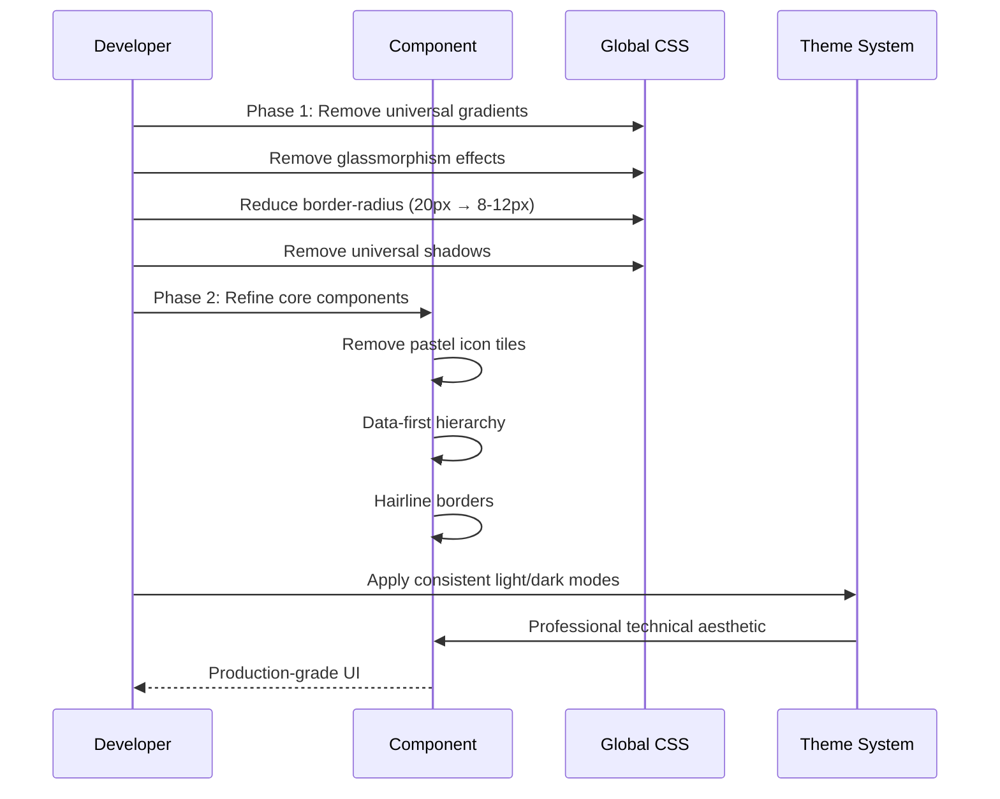

# Design Document: EcoStep UI Refinement - Remove "AI-Generated Dashboard" Look

## Overview

Transform the EcoStep IoT energy monitoring system from a generic AI-generated dashboard template into a deliberately designed, production-grade technical monitoring interface. This is purely a visual refinement project targeting CSS, styling, and component presentation without any functionality changes.

## Main Algorithm/Workflow



## Core Interfaces/Types

### Style Configuration

```typescript
// Design System Tokens
interface EcoStepDesignTokens {
  colors: {
    // Primary brand color (flat, no gradients)
    ecoGreen: '#3DDC97'
    ecoGreenHover: '#35c27b'
    ecoGreenActive: '#2cab6c'
    
    // Neutral hierarchy
    neutral: {
      50: '#FAFAFA'   // Subtle background
      100: '#F5F5F5'  // Surface
      200: '#E5E5E5'  // Border
      600: '#525252'  // Primary text
      900: '#171717'  // Headings
    }
    
    // Semantic (flat colors only)
    semantic: {
      green: '#22C55E'   // Healthy/Success
      amber: '#F59E0B'   // Warning
      red: '#EF4444'     // Error
      blue: '#3B82F6'    // Info (sparingly)
    }
    
    // Dark mode
    dark: {
      background: '#0F1116'     // Deep charcoal
      surface: '#1C1F28'        // Cards
      border: '#2A2E37'         // Hairline
      textPrimary: '#F9FAFB'    // Primary text
      textSecondary: '#9CA3AF'  // Secondary
    }
  }
  
  spacing: {
    borderRadius: {
      sm: '6px'   // Small elements
      md: '8px'   // Standard cards
      lg: '12px'  // Large containers
      full: '9999px'  // Pills/badges only
    }
  }
  
  typography: {
    metricPrimary: { size: '36px', weight: 600, features: 'tabular-nums' }
    metricSecondary: { size: '20px', weight: 600, features: 'tabular-nums' }
    metricLabel: { size: '13px', weight: 500, transform: 'uppercase', letterSpacing: 'wide' }
    pageTitle: { size: '32px', weight: 700 }
    sectionTitle: { size: '20px', weight: 600 }
    cardTitle: { size: '16px', weight: 600 }
  }
}

// Component Style Props
interface ComponentStyleProps {
  variant?: 'primary' | 'secondary' | 'ghost' | 'danger'
  size?: 'sm' | 'md' | 'lg'
  hasShadow?: boolean  // Should be false by default, true only for floating elements
  hasGradient?: boolean  // Should be false (no gradients)
  borderRadius?: 'sm' | 'md' | 'lg' | 'full'
}

// Badge Configuration
interface BadgeConfig {
  variant: 'success' | 'warning' | 'error' | 'info'
  size?: 'sm' | 'md'
  hasBorder: true  // Always add subtle borders
  shape: 'rounded' | 'pill'  // rounded-md (6px) unless truly a pill
}

// Card Configuration
interface CardConfig {
  variant: 'default' | 'compact'
  hasBorder: true  // Hairline 1px borders
  hasGlassmorphism: false  // Remove backdrop-filter
  elevation: 'none' | 'floating'  // Shadow only for floating (modals, dropdowns)
  borderRadius: '8px' | '12px'
}
```

## Key Functions with Formal Specifications

### Function 1: removeGradients()

```typescript
function removeGradients(element: CSSStyleDeclaration): void
```

**Preconditions:**
- `element` is a valid CSS style declaration object
- Element currently uses gradient backgrounds

**Postconditions:**
- All `background: linear-gradient()` replaced with flat colors
- All `background: radial-gradient()` replaced with flat colors
- EcoStep green (#3DDC97) used for primary actions
- No gradients remain except for logos (if essential)

**Loop Invariants:** N/A

### Function 2: removeGlassmorphism()

```typescript
function removeGlassmorphism(element: HTMLElement): CSSStyleDeclaration
```

**Preconditions:**
- `element` exists in DOM
- Element has glassmorphic styles (backdrop-filter, rgba backgrounds)

**Postconditions:**
- `backdrop-filter: blur()` removed
- Background changed from `rgba(255, 255, 255, 0.72)` to solid colors
- Hairline borders (1px solid) added for definition
- Returns updated style declaration

**Loop Invariants:** N/A

### Function 3: reduceBorderRadius()

```typescript
function reduceBorderRadius(currentRadius: string): string
```

**Preconditions:**
- `currentRadius` is a valid CSS border-radius value

**Postconditions:**
- Large radius (16-20px) reduced to 8-12px
- Small radius (12-16px) reduced to 6-8px
- Pills (rounded-full) remain for badges only
- Returns new radius value

**Loop Invariants:** N/A

### Function 4: removeShadows()

```typescript
function removeShadows(element: HTMLElement, type: 'card' | 'floating'): void
```

**Preconditions:**
- `element` is a valid HTML element
- `type` correctly identifies element purpose

**Postconditions:**
- If `type === 'card'`: `box-shadow` removed completely
- If `type === 'floating'`: `box-shadow` retained (modals, dropdowns, tooltips)
- Surface contrast achieved through borders, not shadows

**Loop Invariants:** N/A

### Function 5: createDataHierarchy()

```typescript
function createDataHierarchy(metrics: MetricData[]): ComponentHierarchy
```

**Preconditions:**
- `metrics` array contains at least one metric
- Each metric has `value`, `label`, and `priority` properties

**Postconditions:**
- Primary metric has largest font size (36px) and bold weight
- Secondary metrics use 20px font size
- Labels use 13px uppercase with tracking
- Tabular numerals enabled for all numeric values
- Data values dominate visually over icons and labels

**Loop Invariants:** For each metric in iteration, hierarchy is maintained (primary > secondary > tertiary)

## Algorithmic Pseudocode

### Main Refinement Algorithm

```typescript
ALGORITHM refineEcoStepUI(application)
INPUT: application (React application with styled components)
OUTPUT: refined application with production-grade aesthetics

BEGIN
  ASSERT application !== null
  
  // Phase 1: Foundation (Global CSS and Core Components)
  globalStyles ← loadGlobalStyles(application)
  
  FOR each styleRule IN globalStyles DO
    ASSERT styleRule.isValid()
    
    IF containsGradient(styleRule) THEN
      styleRule ← removeGradients(styleRule)
    END IF
    
    IF containsGlassmorphism(styleRule) THEN
      styleRule ← removeGlassmorphism(styleRule)
    END IF
    
    IF hasBorderRadius(styleRule) THEN
      styleRule.borderRadius ← reduceBorderRadius(styleRule.borderRadius)
    END IF
    
    IF hasShadow(styleRule) THEN
      elementType ← determineElementType(styleRule)
      IF elementType !== 'floating' THEN
        styleRule ← removeShadows(styleRule, elementType)
      END IF
    END IF
  END FOR
  
  // Phase 2: Core Components
  components ← [Button, Badge, EcoCard, DashboardCard, LiveSensorCard, Navigation]
  
  FOR each component IN components DO
    ASSERT component.isReactComponent()
    
    componentStyles ← extractStyles(component)
    
    // Remove decorative elements
    IF hasPastelIconTile(component) THEN
      component ← removeIconTile(component)
      component ← addIconBesideLabel(component)
    END IF
    
    // Add hairline borders
    IF needsBorders(component) THEN
      component ← addHairlineBorders(component)
    END IF
    
    // Create data hierarchy
    IF hasMetricData(component) THEN
      component ← createDataHierarchy(component.metrics)
    END IF
    
    // Apply tabular numerals
    IF hasNumericData(component) THEN
      component ← applyTabularNumerals(component)
    END IF
  END FOR
  
  // Phase 3: Feature Pages
  pages ← [Dashboard, Analytics, Alerts, Sensors, Reports, Settings]
  
  FOR each page IN pages DO
    page ← refineContentHierarchy(page)
    page ← improveEmptyStates(page)
    page ← refineCharts(page)
  END FOR
  
  // Phase 4: Theme Application
  lightTheme ← generateLightTheme(designTokens)
  darkTheme ← generateDarkTheme(designTokens)
  
  application.themes ← {light: lightTheme, dark: darkTheme}
  
  ASSERT isProductionGrade(application)
  
  RETURN application
END
```

### Gradient Removal Algorithm

```typescript
ALGORITHM removeGradients(styleRule)
INPUT: styleRule (CSS style rule with potential gradients)
OUTPUT: styleRule with flat colors

BEGIN
  // Extract gradient type and colors
  IF styleRule.background.includes('linear-gradient') THEN
    gradient ← parseLinearGradient(styleRule.background)
    
    // Use first meaningful color or brand color
    IF gradient.isEcoStepBrand() THEN
      styleRule.background ← '#3DDC97'  // Flat EcoStep green
    ELSE IF gradient.isSemanticColor() THEN
      styleRule.background ← gradient.primaryColor
    ELSE
      styleRule.background ← gradient.colors[0]  // Use first color
    END IF
  END IF
  
  IF styleRule.background.includes('radial-gradient') THEN
    // Keep subtle ambient backgrounds but remove obvious glows
    gradient ← parseRadialGradient(styleRule.background)
    
    IF gradient.opacity > 0.2 THEN
      // Too obvious, remove completely
      styleRule.background ← 'transparent'
    ELSE
      // Subtle ambient, reduce opacity further
      gradient.opacity ← gradient.opacity * 0.5
      styleRule.background ← regenerateSubtleGradient(gradient)
    END IF
  END IF
  
  RETURN styleRule
END
```

### Glassmorphism Removal Algorithm

```typescript
ALGORITHM removeGlassmorphism(element)
INPUT: element (HTML element with glassmorphic styles)
OUTPUT: element with flat, bordered styling

BEGIN
  styles ← element.style
  
  // Remove backdrop blur
  IF styles.backdropFilter !== 'none' THEN
    styles.backdropFilter ← 'none'
    styles.webkitBackdropFilter ← 'none'
  END IF
  
  // Convert translucent backgrounds to solid
  IF isTranslucentBackground(styles.background) THEN
    rgba ← parseRGBA(styles.background)
    
    IF isDarkMode() THEN
      styles.background ← 'rgb(28, 31, 40)'  // Solid dark surface
    ELSE
      styles.background ← 'rgb(255, 255, 255)'  // Solid white
    END IF
  END IF
  
  // Add hairline borders for definition
  IF styles.border === 'none' OR styles.borderWidth === '0' THEN
    IF isDarkMode() THEN
      styles.border ← '1px solid rgba(137, 215, 183, 0.12)'
    ELSE
      styles.border ← '1px solid rgba(26, 49, 44, 0.08)'
    END IF
  END IF
  
  RETURN element
END
```

### Data Hierarchy Algorithm

```typescript
ALGORITHM createDataHierarchy(metrics)
INPUT: metrics (array of metric data objects)
OUTPUT: hierarchically styled component

BEGIN
  ASSERT metrics.length > 0
  
  // Sort by priority
  sortedMetrics ← sortByPriority(metrics)
  
  // Primary metric (highest priority)
  primary ← sortedMetrics[0]
  primary.fontSize ← '36px'
  primary.fontWeight ← 600
  primary.fontFeatures ← 'tabular-nums'
  primary.marginBottom ← '8px'
  
  // Remove competing icons
  IF primary.hasIconTile THEN
    primary.icon.display ← 'inline'  // Icon beside label
    primary.icon.size ← '16px'
    primary.icon.marginRight ← '6px'
    primary.iconTile ← null  // Remove tile
  END IF
  
  // Secondary metrics
  FOR i ← 1 TO sortedMetrics.length - 1 DO
    secondary ← sortedMetrics[i]
    secondary.fontSize ← '20px'
    secondary.fontWeight ← 600
    secondary.fontFeatures ← 'tabular-nums'
    
    // Subdued colors
    secondary.color ← isDarkMode() ? '#9CA3AF' : '#525252'
  END FOR
  
  // Labels for all metrics
  FOR each metric IN sortedMetrics DO
    metric.label.fontSize ← '13px'
    metric.label.fontWeight ← 500
    metric.label.textTransform ← 'uppercase'
    metric.label.letterSpacing ← '0.05em'
    metric.label.color ← isDarkMode() ? '#6B7280' : '#737373'
  END FOR
  
  RETURN sortedMetrics
END
```

## Example Usage

### Before: AI-Generated Look

```typescript
// ❌ Universal gradients
<div className="bg-gradient-to-br from-purple-500 to-blue-600">
  <h1>Welcome back!</h1>
</div>

// ❌ Excessive glassmorphism
<div className="glass-card" style={{
  background: 'rgba(255, 255, 255, 0.72)',
  backdropFilter: 'blur(20px)',
  borderRadius: '20px',
  boxShadow: '0 8px 30px rgba(0, 0, 0, 0.1)'
}}>
  {/* Content */}
</div>

// ❌ Pastel icon tiles competing with data
<div className="metric-card">
  <div className="icon-tile bg-gradient-to-br from-blue-400 to-purple-500 w-16 h-16 rounded-2xl">
    <Icon />
  </div>
  <div className="metric-value">1,234</div>
  <div className="metric-label">Active Sensors</div>
  <span className="badge bg-green-500 rounded-full">✓ Good</span>
</div>
```

### After: Production-Grade

```typescript
// ✅ Flat EcoStep green for primary actions only
<header className="border-b" style={{
  backgroundColor: '#FFFFFF',
  borderColor: 'rgba(26, 49, 44, 0.1)'
}}>
  <h1>Energy Dashboard</h1>
</header>

// ✅ Solid background with hairline borders
<div className="eco-card" style={{
  background: '#FFFFFF',
  border: '1px solid rgba(26, 49, 44, 0.08)',
  borderRadius: '8px',
  boxShadow: 'none'  // No shadow on cards
}}>
  {/* Content */}
</div>

// ✅ Data-first hierarchy with icon beside label
<div className="metric-card">
  <div className="metric-header">
    <ActivityIcon className="w-4 h-4 text-neutral-600" />
    <span className="metric-label">Active Sensors</span>
  </div>
  <div className="metric-value tabular-nums text-4xl font-semibold">
    1,234
  </div>
  <div className="metric-change text-sm text-neutral-600">
    +12 vs. previous 7 days
  </div>
</div>
```

### Button Refinement

```typescript
// Before: Gradient buttons
<button className="bg-gradient-to-r from-eco-green to-eco-teal rounded-2xl shadow-lg transform hover:scale-105">
  Save Changes
</button>

// After: Flat buttons with restrained hover
<button className="eco-btn-primary" style={{
  background: '#3DDC97',
  color: '#FFFFFF',
  borderRadius: '8px',
  boxShadow: 'none',
  padding: '10px 20px',
  fontWeight: 500
}}>
  Save Changes
</button>

// Hover state (CSS)
.eco-btn-primary:hover {
  background: #35c27b;  /* Slightly darker */
  opacity: 0.95;  /* Subtle */
  transform: none;  /* No scale transform */
}
```

### Badge Refinement

```typescript
// Before: Rounded-full without borders, arbitrary colors
<span className="badge rounded-full bg-green-100 text-green-800">
  ✓ Active
</span>

// After: Semantic colors with borders, rounded-md
<span className="eco-badge eco-badge-success" style={{
  background: 'rgba(34, 197, 94, 0.1)',
  color: '#15803d',
  border: '1px solid rgba(34, 197, 94, 0.2)',
  borderRadius: '6px',
  padding: '4px 12px',
  fontSize: '0.75rem',
  fontWeight: 500
}}>
  Active
</span>

// Only use checkmark when status is truly binary (on/off)
// Remove "✓" prefix for non-binary states
```

### Chart Refinement

```typescript
// Before: Glowing areas, decorative dots
<AreaChart data={data}>
  <defs>
    <linearGradient id="colorGlow" x1="0" y1="0" x2="0" y2="1">
      <stop offset="5%" stopColor="#8B5CF6" stopOpacity={0.8}/>
      <stop offset="95%" stopColor="#8B5CF6" stopOpacity={0}/>
    </linearGradient>
  </defs>
  <Area fillOpacity={1} fill="url(#colorGlow)" activeDot={{ r: 8 }} />
</AreaChart>

// After: Restrained colors, clear axes
<AreaChart data={data}>
  <CartesianGrid strokeDasharray="3 3" stroke="rgba(26, 49, 44, 0.1)" />
  <XAxis 
    dataKey="timestamp" 
    stroke="#525252"
    tick={{ fontSize: 12 }}
    label={{ value: 'Time (24h)', position: 'insideBottom', offset: -5 }}
  />
  <YAxis 
    stroke="#525252"
    tick={{ fontSize: 12 }}
    label={{ value: 'Energy (kWh)', angle: -90, position: 'insideLeft' }}
  />
  <Tooltip />
  <Area 
    type="monotone" 
    dataKey="value" 
    stroke="#3DDC97" 
    fill="rgba(61, 220, 151, 0.1)"
    strokeWidth={2}
    dot={false}  // No decorative dots
    activeDot={{ r: 4, fill: '#3DDC97' }}  // Only on hover
  />
</AreaChart>
```

## Correctness Properties

*A property is a characteristic or behavior that should hold true across all valid executions of a system—essentially, a formal statement about what the system should do. Properties serve as the bridge between human-readable specifications and machine-verifiable correctness guarantees.*

### Property 1: No Universal Gradients

*For any* styled element in the application (except logos), the element SHALL NOT use `linear-gradient()` or `radial-gradient()` in background properties, ensuring flat colors dominate the interface.

**Validates: Requirements 1.1, 1.2, 1.3, 1.4, 1.5**

### Property 2: Glassmorphism Elimination

*For any* card or container component, the element SHALL NOT use `backdrop-filter: blur()` or translucent rgba backgrounds with opacity > 0.1, ensuring solid, bordered surfaces.

**Validates: Requirements 2.1, 2.2, 2.3, 2.4, 2.5**

### Property 3: Border Radius Consistency

*For any* element with border-radius, the value SHALL be between 6-12px for standard elements (not 16-20px), with exceptions only for pills/badges that use `border-radius: 9999px`.

**Validates: Requirements 3.1, 3.2, 3.3, 3.4, 3.5**

### Property 4: Shadow Restriction

*For any* element with box-shadow, the element SHALL be a floating layer (modal, dropdown, tooltip) and NOT a standard card or container, ensuring shadows communicate layering, not decoration.

**Validates: Requirements 4.1, 4.2, 4.3, 4.4, 4.5**

### Property 5: Data Visual Hierarchy

*For any* metric display component, the numeric value SHALL have font-size >= 20px AND font-weight >= 600 AND tabular-nums enabled, while icons SHALL be <= 16px and positioned beside (not above) labels.

**Validates: Requirements 5.1, 5.2, 5.3, 5.4, 5.5, 5.6, 5.7**

### Property 6: Hairline Borders

*For any* card or container without backdrop-filter, the element SHALL have a 1px solid border with rgba opacity between 0.08-0.15, ensuring definition through borders rather than shadows.

**Validates: Requirements 7.1, 7.2, 7.3, 7.4, 7.5**

### Property 7: Semantic Badge Colors

*For any* status badge, the background color SHALL match semantic meaning (green for healthy/success, amber for warning, red for error) with a visible 1px border, and SHALL NOT use arbitrary purple, blue, or orange unless contextually meaningful.

**Validates: Requirements 8.1, 8.2, 8.3, 8.4, 8.5, 8.6, 8.7**

### Property 8: Button Flat Colors

*For any* button component (excluding links), the background SHALL be a solid color without gradients, and hover states SHALL only modify opacity or solid color (no transform: scale).

**Validates: Requirements 9.1, 9.2, 9.3, 9.4, 9.5, 9.6, 9.7**

### Property 9: Chart Restraint

*For any* data visualization chart, area fills SHALL have opacity <= 0.15, decorative dots SHALL be disabled (dot={false}), and activeDot radius SHALL be <= 4px, ensuring data clarity over decoration.

**Validates: Requirements 10.1, 10.2, 10.3, 10.4, 10.5, 10.6, 10.7, 10.8**

### Property 10: Typography Tabular Numerals

*For any* element displaying numeric data (metrics, timestamps, measurements), the CSS SHALL include `font-variant-numeric: tabular-nums` to ensure vertical alignment in columns and tables.

**Validates: Requirements 5.3, 11.4, 11.5**

### Property 11: Icon Size Restraint

*For any* icon within a metric or data display, the icon size SHALL be <= 20px (preferably 16px) and positioned beside the label (not in a large tile above), ensuring data values remain the visual hero.

**Validates: Requirements 5.4, 5.5, 6.1, 6.2, 6.3, 6.4, 6.5**

### Property 12: Dark Mode Consistency

*For any* styled element with light mode colors, there SHALL exist a corresponding dark mode variant with the same visual hierarchy, using dark design tokens (background: #0F1116, surface: #1C1F28, text: #F9FAFB).

**Validates: Requirements 12.1, 12.2, 12.3, 12.4, 12.5, 12.6, 12.7**

## Error Handling

### Missing Dark Mode Styles

**Condition:** Component has light mode styles but no dark mode equivalent
**Response:** Generate dark mode styles using design token mappings automatically
**Recovery:** Ensure all new components follow the dark mode pattern from design system

### Invalid Border Radius Values

**Condition:** Border radius exceeds 12px on non-pill elements
**Response:** Log warning and clamp to 12px maximum
**Recovery:** Audit all border-radius values during build

### Gradient Detection Failure

**Condition:** Gradient remains in production build
**Response:** Build-time CSS linter flags gradient usage
**Recovery:** Manual review and replacement with flat colors

## Testing Strategy

### Unit Testing Approach

**Focus:** Individual component styling
- Test each component renders without gradients
- Verify border-radius values fall within acceptable ranges
- Check dark mode variants exist for all components
- Validate tabular-nums applied to numeric displays

### Visual Regression Testing

**Tool:** Chromatic or Percy for automated screenshot comparison
- Capture before/after screenshots of all pages
- Compare with approved design tokens
- Flag any AI-generated aesthetics (gradients, excessive shadows, pastel tiles)

### Integration Testing Approach

**Focus:** Cross-component consistency
- Verify consistent spacing and typography across pages
- Test theme switching (light ↔ dark) maintains hierarchy
- Validate responsive behavior maintains design principles

### Accessibility Testing

**Focus:** Maintain WCAG compliance during refinement
- Ensure color contrast ratios meet AA standards (4.5:1 for text)
- Verify focus states remain visible with new flat design
- Test keyboard navigation still works with refined buttons

## Performance Considerations

**CSS Bundle Size:** Removing glassmorphism (backdrop-filter) may improve performance on lower-end devices

**Paint Performance:** Solid backgrounds render faster than gradients and blurs

**Animation Jank:** Removing transform hover effects reduces layout thrashing

## Security Considerations

No security impact - this is purely visual refinement with no changes to authentication, authorization, data handling, or API interactions.

## Dependencies

### Existing Dependencies (No Changes)
- React 18.x
- TypeScript 5.x
- Tailwind CSS 3.x
- Recharts (for data visualization)
- Lucide React (for icons)

### No New Dependencies Required
This is a pure CSS/styling refactoring using existing tooling.
