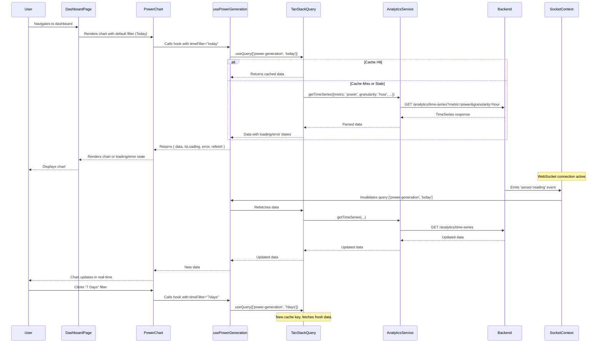

# Technical Design Document: Energy Monitoring & Analytics Charts

## Overview

This document provides the comprehensive technical design for implementing interactive, real-time analytics charts on the EcoStep Dashboard using Recharts. The feature integrates with the existing Dashboard page, leveraging established patterns for API communication (TanStack Query), real-time updates (WebSocket via SocketContext), theme management, and role-based access control.

### Objectives

- Add five chart types to visualize energy harvesting data: Power Generation Over Time, Voltage/Current Trends, Energy by Period, and Cumulative Energy
- Integrate seamlessly with the existing Dashboard page without creating duplicate views or routes
- Support both public users and system administrators with consistent UX
- Implement real-time chart updates via WebSocket for live data visualization
- Maintain responsive design across desktop, tablet, and mobile devices
- Follow EcoStep Design System for consistent visual identity and theme support

### Key Design Principles

1. **Reusability**: Chart components are composable and share common patterns for loading, empty, and error states
2. **Integration**: Leverage existing services (Analytics, Sensor), contexts (Theme, Socket, Auth), and data fetching infrastructure (TanStack Query)
3. **Performance**: Optimize data fetching with smart caching, limit data points for real-time charts, and use Recharts' built-in optimizations
4. **Accessibility**: Ensure charts are keyboard navigable, tooltips are readable, and color contrast meets WCAG standards
5. **Maintainability**: Clear component structure, TypeScript type safety, and consistent naming conventions

---

## Architecture

### System Architecture Overview

```mermaid
graph TB
    subgraph "Frontend Application"
        DP[Dashboard Page Component]
        CL[Chart Layout Container]
        
        subgraph "Chart Components"
            PGC[PowerGenerationChart]
            VCC[VoltageCurrentChart]
            EPC[EnergyPeriodChart]
            CEC[CumulativeEnergyChart]
        end
        
        subgraph "Shared Chart Components"
            CC[ChartContainer]
            CLS[ChartLoadingState]
            CES[ChartEmptyState]
            CERS[ChartErrorState]
        end
        
        subgraph "Custom Hooks"
            UTSD[useTimeSeriesData]
            UCRU[useChartRealTimeUpdates]
            UPG[usePowerGeneration]
            UEBD[useEnergyByDay]
        end
        
        subgraph "Contexts"
            TC[ThemeContext]
            SC[SocketContext]
            AC[AuthContext]
        end
        
        subgraph "Services"
            AS[Analytics Service]
            SS[Sensor Service]
            API[API Client]
        end
    end
    
    subgraph "Backend API"
        TS[/analytics/time-series]
        DA[/analytics/dashboard]
        RH[/iot/readings/history]
        LR[/iot/readings/latest]
        WS[WebSocket Gateway]
    end
    
    DP --> CL
    CL --> PGC
    CL --> VCC
    CL --> EPC
    CL --> CEC
    
    PGC --> CC
    VCC --> CC
    EPC --> CC
    CEC --> CC
    
    CC --> CLS
    CC --> CES
    CC --> CERS
    
    PGC --> UPG
    VCC --> UTSD
    EPC --> UEBD
    CEC --> UTSD
    
    UPG --> AS
    UTSD --> AS
    UEBD --> AS
    
    AS --> API
    SS --> API
    
    API --> TS
    API --> DA
    API --> RH
    API --> LR
    
    UCRU --> SC
    SC --> WS
    
    PGC --> TC
    VCC --> TC
    EPC --> TC
    CEC --> TC
    
    PGC --> AC
    VCC --> AC
    EPC --> AC
    CEC --> AC
    
    style DP fill:#428475,color:#fff
    style CL fill:#89D7B7,color:#1A312C
    style TC fill:#FFF4E1,color:#1A312C
    style SC fill:#FFF4E1,color:#1A312C
    style AC fill:#FFF4E1,color:#1A312C
```

### Component Hierarchy

```
DashboardPage
├── Quick Actions Panel (existing)
├── Header + Metrics Chips (existing)
├── Featured Power Output Card (existing)
├── Sensor Nodes List (existing)
└── Charts Layout Container (NEW)
    ├── PowerGenerationChart
    │   ├── ChartContainer
    │   │   ├── ChartLoadingState | ChartEmptyState | ChartErrorState | <Recharts LineChart>
    │   │   └── Time Filter Controls (Today | 7 Days | 30 Days)
    │   └── usePowerGeneration hook
    ├── VoltageCurrentChart
    │   ├── ChartContainer (Voltage)
    │   │   └── <Recharts LineChart>
    │   ├── ChartContainer (Current)
    │   │   └── <Recharts LineChart>
    │   └── useTimeSeriesData hook (x2)
    ├── EnergyPeriodChart
    │   ├── ChartContainer
    │   │   ├── <Recharts BarChart>
    │   │   └── Period Filter Controls (Hourly | Daily | Weekly)
    │   └── useEnergyByDay hook
    └── CumulativeEnergyChart
        ├── ChartContainer
        │   └── <Recharts AreaChart>
        └── useTimeSeriesData hook + cumulative calculation
```

### Data Flow Diagram



---

## Components and Interfaces

This section provides a high-level overview of the key components and their interfaces in the chart system. Detailed specifications are provided in the Low-Level Design section.

### Core Chart Components

1. **ChartContainer**: Shared wrapper component providing consistent styling, loading/error/empty states, and theme integration
2. **PowerGenerationChart**: Line chart displaying power output over time with time filter controls
3. **VoltageCurrentChart**: Dual line charts showing voltage and current measurements
4. **EnergyPeriodChart**: Bar chart displaying energy aggregated by period (hourly/daily/weekly)
5. **CumulativeEnergyChart**: Area chart showing cumulative energy harvested over time

### Shared UI Components

1. **ChartLoadingState**: Skeleton loader displayed during data fetching
2. **ChartEmptyState**: Message displayed when no data is available
3. **ChartErrorState**: Error message with retry button displayed on fetch failure
4. **CustomChartTooltip**: Themed tooltip for displaying data point details

### Custom Hooks

1. **useTimeSeriesData**: Generic hook for fetching time-series data from Analytics API
2. **usePowerGeneration**: Specialized hook for PowerGenerationChart with time filter logic
3. **useEnergyByPeriod**: Specialized hook for EnergyPeriodChart with period filter logic
4. **useChartRealTimeUpdates**: Hook for subscribing to WebSocket events and updating charts in real-time

### Layout Components

1. **ChartsLayoutContainer**: Responsive layout container organizing all charts on the Dashboard page

### Key Interfaces

```typescript
// Component Props
interface ChartContainerProps {
  title: string;
  subtitle?: string;
  isLoading?: boolean;
  error?: Error | null;
  isEmpty?: boolean;
  onRetry?: () => void;
  children: React.ReactNode;
  actions?: React.ReactNode;
  height?: number | string;
  className?: string;
}

// Hook Parameters
interface UseTimeSeriesDataParams {
  metric: MetricType;
  granularity: Granularity;
  startDate: string;
  endDate: string;
  sensorId?: string;
  enabled?: boolean;
}

// Hook Return Types
interface UseTimeSeriesDataReturn {
  data: TimeSeries | undefined;
  isLoading: boolean;
  error: Error | null;
  refetch: () => void;
}

// Filter Types
type TimeFilter = 'today' | '7days' | '30days';
type PeriodFilter = 'hourly' | 'daily' | 'weekly';
```

---

## Low-Level Design

### Component Specifications

#### 1. ChartContainer (Shared Wrapper Component)

**Purpose**: Provides consistent styling, loading/error/empty state handling, and theme integration for all charts.

**File**: `frontend/src/components/dashboard/ChartContainer.tsx`

**Props Interface**:
```typescript
interface ChartContainerProps {
  title: string;
  subtitle?: string;
  isLoading?: boolean;
  error?: Error | null;
  isEmpty?: boolean;
  onRetry?: () => void;
  children: React.ReactNode;
  actions?: React.ReactNode; // For filter buttons
  height?: number | string; // Default: 400px
  className?: string;
}
```

**Implementation Details**:
- Wraps chart content in a styled card following EcoStep Design System
- Uses ThemeContext to apply theme-appropriate background colors, borders, and shadows
- Conditionally renders ChartLoadingState, ChartEmptyState, ChartErrorState, or children based on props
- Header section displays title, subtitle, and optional action buttons (filters)
- Responsive height: adjusts based on screen size if not explicitly set

**Theme Colors**:
```typescript
const colors = {
  light: {
    cardBg: '#FFFFFF',
    text: '#1A312C',
    subtext: 'rgba(26, 49, 44, 0.7)',
    border: 'rgba(26, 49, 44, 0.1)',
  },
  dark: {
    cardBg: '#1C1F26',
    text: '#EDEEF0',
    subtext: '#9CA3AF',
    border: '#2A2E37',
  }
};
```

---

#### 2. ChartLoadingState

**Purpose**: Displays a skeleton loader while chart data is being fetched.

**File**: `frontend/src/components/dashboard/ChartLoadingState.tsx`

**Props Interface**:
```typescript
interface ChartLoadingStateProps {
  height?: number | string;
}
```

**Implementation Details**:
- Renders animated skeleton bars/lines mimicking chart appearance
- Uses CSS animations for shimmer effect
- Matches chart height for consistent layout (no layout shift)
- Theme-aware colors for skeleton elements

---

#### 3. ChartEmptyState

**Purpose**: Displays a message when no data is available for the selected time range.

**File**: `frontend/src/components/dashboard/ChartEmptyState.tsx`

**Props Interface**:
```typescript
interface ChartEmptyStateProps {
  message?: string; // Default: "No data available for this time range"
  suggestion?: string; // e.g., "Try selecting a different time period"
  height?: number | string;
}
```

**Implementation Details**:
- Centered layout with icon, message, and suggestion text
- Uses lucide-react icons (e.g., ChartNoAxesColumn for empty charts)
- Theme-aware text colors
- Matches chart height for consistent layout

---

#### 4. ChartErrorState

**Purpose**: Displays an error message with a retry button when data fetching fails.

**File**: `frontend/src/components/dashboard/ChartErrorState.tsx`

**Props Interface**:
```typescript
interface ChartErrorStateProps {
  error?: Error | string;
  onRetry?: () => void;
  height?: number | string;
}
```

**Implementation Details**:
- Centered layout with error icon, message, and retry button
- Displays error message if available (for debugging)
- Retry button calls onRetry callback
- Theme-aware styling with error accent color (#EF4444)

---

#### 5. PowerGenerationChart

**Purpose**: Visualizes real-time power output over time with selectable time ranges (Today, 7 Days, 30 Days).

**File**: `frontend/src/components/dashboard/PowerGenerationChart.tsx`

**Props Interface**:
```typescript
interface PowerGenerationChartProps {
  className?: string;
}
```

**State**:
```typescript
type TimeFilter = 'today' | '7days' | '30days';
const [timeFilter, setTimeFilter] = useState<TimeFilter>('today');
```

**Data Hook**:
```typescript
const { data, isLoading, error, refetch } = usePowerGeneration(timeFilter);
```

**Implementation Details**:
- Uses Recharts `<LineChart>` component with `<Line>`, `<XAxis>`, `<YAxis>`, `<CartesianGrid>`, `<Tooltip>`, `<ResponsiveContainer>`
- Filter buttons at top-right of chart card
- X-axis: Time (formatted based on granularity - "12 PM" for hourly, "Mon 15" for daily)
- Y-axis: Power in Watts (W)
- Line color: `#428475` (Muted Teal from EcoStep Design System)
- Tooltip: Displays exact value and timestamp
- Real-time updates: Subscribes to WebSocket events via useChartRealTimeUpdates hook

**Recharts Configuration**:
```typescript
<ResponsiveContainer width="100%" height={400}>
  <LineChart data={chartData}>
    <CartesianGrid strokeDasharray="3 3" stroke={gridColor} />
    <XAxis
      dataKey="timestamp"
      tickFormatter={formatTimestamp}
      stroke={textColor}
    />
    <YAxis
      label={{ value: 'Power (W)', angle: -90, position: 'insideLeft' }}
      stroke={textColor}
    />
    <Tooltip content={<CustomTooltip />} />
    <Line
      type="monotone"
      dataKey="value"
      stroke={accentColor}
      strokeWidth={2}
      dot={false}
      activeDot={{ r: 6 }}
    />
  </LineChart>
</ResponsiveContainer>
```

---

#### 6. VoltageCurrentChart

**Purpose**: Displays voltage and current measurements over time as two synchronized line charts.

**File**: `frontend/src/components/dashboard/VoltageCurrentChart.tsx`

**Props Interface**:
```typescript
interface VoltageCurrentChartProps {
  className?: string;
}
```

**Data Hooks**:
```typescript
const { data: voltageData, isLoading: voltageLoading } = useTimeSeriesData({
  metric: 'voltage',
  granularity: 'hour',
  startDate: last24Hours.start,
  endDate: last24Hours.end,
});

const { data: currentData, isLoading: currentLoading } = useTimeSeriesData({
  metric: 'current',
  granularity: 'hour',
  startDate: last24Hours.start,
  endDate: last24Hours.end,
});
```

**Implementation Details**:
- Two separate ChartContainer components stacked vertically (mobile) or side-by-side (desktop)
- Both charts use Recharts `<LineChart>` with synchronized X-axis domains
- Voltage chart: Y-axis in Volts (V), line color: `#428475` (Muted Teal)
- Current chart: Y-axis in Amperes (A), line color: `#F59E0B` (Amber)
- Shared X-axis timestamps (last 24 hours, hourly granularity)
- Tooltips formatted with appropriate units

**Alternative Implementation** (Single Dual-Axis Chart):
- Single Recharts `<LineChart>` with two `<YAxis>` components (left for voltage, right for current)
- Two `<Line>` components with distinct colors
- More compact but potentially less readable

**Recommended**: Two separate synchronized charts for clarity.

---

#### 7. EnergyPeriodChart

**Purpose**: Displays energy generation aggregated by period (Hourly, Daily, Weekly) as a bar chart.

**File**: `frontend/src/components/dashboard/EnergyPeriodChart.tsx`

**Props Interface**:
```typescript
interface EnergyPeriodChartProps {
  className?: string;
}
```

**State**:
```typescript
type PeriodFilter = 'hourly' | 'daily' | 'weekly';
const [periodFilter, setPeriodFilter] = useState<PeriodFilter>('daily');
```

**Data Hook**:
```typescript
const { data, isLoading, error, refetch } = useEnergyByPeriod(periodFilter);
```

**Implementation Details**:
- Uses Recharts `<BarChart>` with `<Bar>`, `<XAxis>`, `<YAxis>`, `<CartesianGrid>`, `<Tooltip>`, `<ResponsiveContainer>`
- Period filter buttons at top-right
- X-axis: Time period labels ("12 PM", "Mon 15", "Week 1")
- Y-axis: Energy in kilowatt-hours (kWh)
- Bar color: `#89D7B7` (Fresh Mint) with theme-appropriate opacity
- Tooltip: Displays exact energy value and period label

**Recharts Configuration**:
```typescript
<ResponsiveContainer width="100%" height={350}>
  <BarChart data={chartData}>
    <CartesianGrid strokeDasharray="3 3" stroke={gridColor} />
    <XAxis
      dataKey="label"
      stroke={textColor}
    />
    <YAxis
      label={{ value: 'Energy (kWh)', angle: -90, position: 'insideLeft' }}
      stroke={textColor}
    />
    <Tooltip content={<CustomTooltip />} />
    <Bar
      dataKey="value"
      fill={barColor}
      radius={[8, 8, 0, 0]}
    />
  </BarChart>
</ResponsiveContainer>
```

---

#### 8. CumulativeEnergyChart

**Purpose**: Displays cumulative energy harvested over time as an area chart.

**File**: `frontend/src/components/dashboard/CumulativeEnergyChart.tsx`

**Props Interface**:
```typescript
interface CumulativeEnergyChartProps {
  className?: string;
}
```

**Data Hook**:
```typescript
const { data: rawData, isLoading, error } = useTimeSeriesData({
  metric: 'energy',
  granularity: 'day',
  startDate: last30Days.start,
  endDate: last30Days.end,
});

// Transform to cumulative
const cumulativeData = useMemo(() => {
  if (!rawData?.dataPoints) return [];
  let cumulative = 0;
  return rawData.dataPoints.map(point => {
    cumulative += point.value;
    return { ...point, value: cumulative };
  });
}, [rawData]);
```

**Implementation Details**:
- Uses Recharts `<AreaChart>` with `<Area>`, `<XAxis>`, `<YAxis>`, `<CartesianGrid>`, `<Tooltip>`, `<ResponsiveContainer>`
- Calculates cumulative sum from time-series energy data
- X-axis: Dates (last 30 days)
- Y-axis: Cumulative energy in kilowatt-hours (kWh)
- Area fill: Gradient from `#89D7B7` (Fresh Mint) to transparent
- Displays total cumulative value as a metric overlay or in subtitle

**Recharts Configuration**:
```typescript
<ResponsiveContainer width="100%" height={350}>
  <AreaChart data={cumulativeData}>
    <defs>
      <linearGradient id="energyGradient" x1="0" y1="0" x2="0" y2="1">
        <stop offset="0%" stopColor="#89D7B7" stopOpacity={0.8} />
        <stop offset="100%" stopColor="#89D7B7" stopOpacity={0.1} />
      </linearGradient>
    </defs>
    <CartesianGrid strokeDasharray="3 3" stroke={gridColor} />
    <XAxis
      dataKey="timestamp"
      tickFormatter={formatDate}
      stroke={textColor}
    />
    <YAxis
      label={{ value: 'Cumulative Energy (kWh)', angle: -90, position: 'insideLeft' }}
      stroke={textColor}
    />
    <Tooltip content={<CustomTooltip />} />
    <Area
      type="monotone"
      dataKey="value"
      stroke="#89D7B7"
      strokeWidth={2}
      fill="url(#energyGradient)"
    />
  </AreaChart>
</ResponsiveContainer>
```

---

### Custom Hooks

#### 1. useTimeSeriesData

**Purpose**: Generic hook for fetching time-series data from the Analytics API.

**File**: `frontend/src/features/dashboard/hooks/useTimeSeriesData.ts`

**Interface**:
```typescript
interface UseTimeSeriesDataParams {
  metric: MetricType; // 'power' | 'voltage' | 'current' | 'energy'
  granularity: Granularity; // 'hour' | 'day' | 'week' | 'month'
  startDate: string; // ISO 8601 format
  endDate: string; // ISO 8601 format
  sensorId?: string; // Optional: filter by specific sensor
  enabled?: boolean; // Optional: conditionally enable query
}

interface UseTimeSeriesDataReturn {
  data: TimeSeries | undefined;
  isLoading: boolean;
  error: Error | null;
  refetch: () => void;
}

function useTimeSeriesData(params: UseTimeSeriesDataParams): UseTimeSeriesDataReturn;
```

**Implementation**:
```typescript
import { useQuery } from '@tanstack/react-query';
import { analyticsService } from '@/api/services';
import type { TimeSeries, MetricType, Granularity } from '@/features/analytics/types';

export function useTimeSeriesData({
  metric,
  granularity,
  startDate,
  endDate,
  sensorId,
  enabled = true,
}: UseTimeSeriesDataParams) {
  return useQuery({
    queryKey: ['analytics', 'time-series', metric, granularity, startDate, endDate, sensorId],
    queryFn: async () => {
      const response = await analyticsService.getTimeSeries({
        metric,
        granularity,
        startDate,
        endDate,
        sensorId,
      });
      return response;
    },
    enabled,
    staleTime: granularity === 'hour' ? 60000 : 300000, // 1 min for hourly, 5 min for daily
    refetchInterval: granularity === 'hour' ? 60000 : false, // Auto-refetch hourly data
    retry: 2,
    retryDelay: (attemptIndex) => Math.min(1000 * 2 ** attemptIndex, 5000),
  });
}
```

**TanStack Query Configuration**:
- **queryKey**: Includes all parameters to ensure unique cache entries
- **staleTime**: Hourly data stale after 1 minute, daily/weekly/monthly stale after 5 minutes
- **refetchInterval**: Auto-refetch hourly data every minute for near-real-time updates
- **retry**: Retry failed requests up to 2 times with exponential backoff

---

#### 2. usePowerGeneration

**Purpose**: Specialized hook for PowerGenerationChart with time filter logic.

**File**: `frontend/src/features/dashboard/hooks/usePowerGeneration.ts`

**Interface**:
```typescript
type TimeFilter = 'today' | '7days' | '30days';

interface UsePowerGenerationReturn {
  data: TimeSeries | undefined;
  isLoading: boolean;
  error: Error | null;
  refetch: () => void;
}

function usePowerGeneration(timeFilter: TimeFilter): UsePowerGenerationReturn;
```

**Implementation**:
```typescript
import { useMemo } from 'react';
import { useTimeSeriesData } from './useTimeSeriesData';
import { subDays, startOfDay, endOfDay } from 'date-fns';

export function usePowerGeneration(timeFilter: TimeFilter) {
  const { startDate, endDate, granularity } = useMemo(() => {
    const now = new Date();
    
    switch (timeFilter) {
      case 'today':
        return {
          startDate: startOfDay(now).toISOString(),
          endDate: endOfDay(now).toISOString(),
          granularity: 'hour' as const,
        };
      case '7days':
        return {
          startDate: subDays(startOfDay(now), 7).toISOString(),
          endDate: endOfDay(now).toISOString(),
          granularity: 'day' as const,
        };
      case '30days':
        return {
          startDate: subDays(startOfDay(now), 30).toISOString(),
          endDate: endOfDay(now).toISOString(),
          granularity: 'day' as const,
        };
    }
  }, [timeFilter]);

  return useTimeSeriesData({
    metric: 'power',
    granularity,
    startDate,
    endDate,
  });
}
```

**Date Range Logic**:
- **Today**: Start of day (00:00) to end of day (23:59), hourly granularity
- **7 Days**: 7 days ago (start of day) to now (end of day), daily granularity
- **30 Days**: 30 days ago to now, daily granularity
- Uses `date-fns` for date calculations

---

#### 3. useEnergyByPeriod

**Purpose**: Specialized hook for EnergyPeriodChart with period filter logic.

**File**: `frontend/src/features/dashboard/hooks/useEnergyByPeriod.ts`

**Interface**:
```typescript
type PeriodFilter = 'hourly' | 'daily' | 'weekly';

function useEnergyByPeriod(periodFilter: PeriodFilter): UseTimeSeriesDataReturn;
```

**Implementation**:
```typescript
import { useMemo } from 'react';
import { useTimeSeriesData } from './useTimeSeriesData';
import { subHours, subDays, subWeeks, startOfDay, endOfDay } from 'date-fns';

export function useEnergyByPeriod(periodFilter: PeriodFilter) {
  const { startDate, endDate, granularity } = useMemo(() => {
    const now = new Date();
    
    switch (periodFilter) {
      case 'hourly':
        return {
          startDate: subHours(now, 24).toISOString(),
          endDate: now.toISOString(),
          granularity: 'hour' as const,
        };
      case 'daily':
        return {
          startDate: subDays(startOfDay(now), 30).toISOString(),
          endDate: endOfDay(now).toISOString(),
          granularity: 'day' as const,
        };
      case 'weekly':
        return {
          startDate: subWeeks(startOfDay(now), 12).toISOString(),
          endDate: endOfDay(now).toISOString(),
          granularity: 'week' as const,
        };
    }
  }, [periodFilter]);

  return useTimeSeriesData({
    metric: 'energy',
    granularity,
    startDate,
    endDate,
  });
}
```

---

#### 4. useChartRealTimeUpdates

**Purpose**: Hook to subscribe to WebSocket events and update chart data in real-time.

**File**: `frontend/src/features/dashboard/hooks/useChartRealTimeUpdates.ts`

**Interface**:
```typescript
function useChartRealTimeUpdates(): void;
```

**Implementation**:
```typescript
import { useEffect } from 'react';
import { useQueryClient } from '@tanstack/react-query';
import { useSocket } from '@/contexts/SocketContext';
import type { SensorReading } from '@/features/dashboard/types/dashboard.types';

export function useChartRealTimeUpdates() {
  const queryClient = useQueryClient();
  const { socket, isConnected } = useSocket();

  useEffect(() => {
    if (!socket || !isConnected) return;

    const handleSensorReading = (reading: SensorReading) => {
      // Invalidate relevant chart queries to trigger refetch
      queryClient.invalidateQueries({ queryKey: ['analytics', 'time-series', 'power'] });
      queryClient.invalidateQueries({ queryKey: ['analytics', 'time-series', 'voltage'] });
      queryClient.invalidateQueries({ queryKey: ['analytics', 'time-series', 'current'] });
      queryClient.invalidateQueries({ queryKey: ['analytics', 'time-series', 'energy'] });
      
      // Optionally: Append new data point to existing cache instead of refetching
      // This is more efficient but requires careful cache manipulation
      // queryClient.setQueryData(['analytics', 'time-series', 'power', ...], (oldData) => {
      //   // Append new point, limit to max 100 points, etc.
      // });
    };

    socket.on('sensor:reading', handleSensorReading);

    return () => {
      socket.off('sensor:reading', handleSensorReading);
    };
  }, [socket, isConnected, queryClient]);
}
```

**Strategy**:
- Listens to `sensor:reading` WebSocket events
- Invalidates TanStack Query cache entries for time-series data
- Triggers automatic refetch of affected queries
- **Alternative**: Directly append new data points to cache for more efficient updates (requires careful implementation to avoid cache inconsistencies)

---

### Type Definitions

#### Chart-Specific Types

**File**: `frontend/src/components/dashboard/chartTypes.ts`

```typescript
import type { TimeSeries, TimeSeriesDataPoint } from '@/features/analytics/types';

/**
 * Chart Data Point
 * Simplified data structure for Recharts consumption
 */
export interface ChartDataPoint {
  timestamp: string; // ISO 8601 or formatted label
  value: number;
  label?: string; // Human-readable label for tooltip
}

/**
 * Time Filter Options
 */
export type TimeFilter = 'today' | '7days' | '30days';

/**
 * Period Filter Options
 */
export type PeriodFilter = 'hourly' | 'daily' | 'weekly';

/**
 * Chart Theme Colors
 */
export interface ChartThemeColors {
  cardBg: string;
  text: string;
  subtext: string;
  border: string;
  grid: string;
  accent: string;
  secondary: string;
  tooltipBg: string;
  tooltipBorder: string;
}

/**
 * Custom Tooltip Props
 */
export interface CustomTooltipProps {
  active?: boolean;
  payload?: Array<{
    value: number;
    payload: ChartDataPoint;
  }>;
  label?: string;
  unit?: string; // e.g., 'W', 'V', 'A', 'kWh'
}
```

---

## Data Models

This section defines the TypeScript interfaces and types used for chart data structures throughout the application.

### Core Data Types

```typescript
/**
 * Time Series Data Point
 * Raw data structure from Analytics API
 */
export interface TimeSeriesDataPoint {
  timestamp: string; // ISO 8601 format
  value: number;
  label?: string; // Human-readable label
}

/**
 * Time Series Response
 * Complete API response structure
 */
export interface TimeSeries {
  metric: MetricType;
  granularity: Granularity;
  dataPoints: TimeSeriesDataPoint[];
  metadata?: {
    unit: string; // e.g., 'W', 'V', 'A', 'kWh'
    aggregation?: 'sum' | 'avg' | 'min' | 'max';
    sensorId?: string;
  };
}

/**
 * Metric Types
 */
export type MetricType = 'power' | 'voltage' | 'current' | 'energy';

/**
 * Granularity Options
 */
export type Granularity = 'hour' | 'day' | 'week' | 'month';
```

### Chart-Specific Types

```typescript
/**
 * Chart Data Point
 * Simplified data structure for Recharts consumption
 */
export interface ChartDataPoint {
  timestamp: string; // ISO 8601 or formatted label
  value: number;
  label?: string; // Human-readable label for tooltip
}

/**
 * Time Filter Options
 */
export type TimeFilter = 'today' | '7days' | '30days';

/**
 * Period Filter Options
 */
export type PeriodFilter = 'hourly' | 'daily' | 'weekly';

/**
 * Chart Theme Colors
 */
export interface ChartThemeColors {
  cardBg: string;
  text: string;
  subtext: string;
  border: string;
  grid: string;
  accent: string;
  secondary: string;
  tooltipBg: string;
  tooltipBorder: string;
}

/**
 * Custom Tooltip Props
 */
export interface CustomTooltipProps {
  active?: boolean;
  payload?: Array<{
    value: number;
    payload: ChartDataPoint;
  }>;
  label?: string;
  unit?: string; // e.g., 'W', 'V', 'A', 'kWh'
}
```

### Hook Parameter Types

```typescript
/**
 * useTimeSeriesData Hook Parameters
 */
export interface UseTimeSeriesDataParams {
  metric: MetricType;
  granularity: Granularity;
  startDate: string; // ISO 8601 format
  endDate: string; // ISO 8601 format
  sensorId?: string;
  enabled?: boolean; // Conditionally enable query
}

/**
 * useTimeSeriesData Hook Return Type
 */
export interface UseTimeSeriesDataReturn {
  data: TimeSeries | undefined;
  isLoading: boolean;
  error: Error | null;
  refetch: () => void;
}
```

### Component Props Types

```typescript
/**
 * ChartContainer Props
 */
export interface ChartContainerProps {
  title: string;
  subtitle?: string;
  isLoading?: boolean;
  error?: Error | null;
  isEmpty?: boolean;
  onRetry?: () => void;
  children: React.ReactNode;
  actions?: React.ReactNode; // Filter buttons
  height?: number | string;
  className?: string;
}

/**
 * Chart State Component Props
 */
export interface ChartLoadingStateProps {
  height?: number | string;
}

export interface ChartEmptyStateProps {
  message?: string;
  suggestion?: string;
  height?: number | string;
}

export interface ChartErrorStateProps {
  error?: Error | string;
  onRetry?: () => void;
  height?: number | string;
}

/**
 * Individual Chart Component Props
 */
export interface PowerGenerationChartProps {
  className?: string;
}

export interface VoltageCurrentChartProps {
  className?: string;
}

export interface EnergyPeriodChartProps {
  className?: string;
}

export interface CumulativeEnergyChartProps {
  className?: string;
}
```

### WebSocket Event Types

```typescript
/**
 * Sensor Reading Event
 * Emitted by WebSocket when new sensor data is recorded
 */
export interface SensorReadingEvent {
  sensorId: string;
  voltage: number;
  current: number;
  power: number;
  energy: number;
  timestamp: string; // ISO 8601 format
}
```

---

### Data Transformation Utilities

**File**: `frontend/src/components/dashboard/chartUtils.ts`

```typescript
import type { TimeSeries, TimeSeriesDataPoint } from '@/features/analytics/types';
import type { ChartDataPoint } from './chartTypes';
import { format } from 'date-fns';

/**
 * Transform TimeSeries API response to ChartDataPoint array
 */
export function transformToChartData(
  timeSeries: TimeSeries | undefined
): ChartDataPoint[] {
  if (!timeSeries?.dataPoints) return [];
  
  return timeSeries.dataPoints.map(point => ({
    timestamp: point.timestamp,
    value: point.value,
    label: point.label,
  }));
}

/**
 * Calculate cumulative values from time-series data
 */
export function calculateCumulative(
  dataPoints: TimeSeriesDataPoint[]
): ChartDataPoint[] {
  let cumulative = 0;
  
  return dataPoints.map(point => {
    cumulative += point.value;
    return {
      timestamp: point.timestamp,
      value: cumulative,
      label: point.label,
    };
  });
}

/**
 * Format timestamp for X-axis labels based on granularity
 */
export function formatTimestamp(
  timestamp: string,
  granularity: 'hour' | 'day' | 'week' | 'month'
): string {
  const date = new Date(timestamp);
  
  switch (granularity) {
    case 'hour':
      return format(date, 'ha'); // "2PM"
    case 'day':
      return format(date, 'MMM d'); // "Jan 15"
    case 'week':
      return format(date, 'MMM d'); // "Jan 15" (start of week)
    case 'month':
      return format(date, 'MMM yyyy'); // "Jan 2024"
  }
}

/**
 * Format value with unit for tooltips
 */
export function formatValueWithUnit(value: number, unit: string): string {
  return `${value.toFixed(2)} ${unit}`;
}

/**
 * Limit data points for performance
 */
export function limitDataPoints(
  dataPoints: ChartDataPoint[],
  maxPoints: number = 100
): ChartDataPoint[] {
  if (dataPoints.length <= maxPoints) return dataPoints;
  
  // Take evenly spaced points
  const step = Math.ceil(dataPoints.length / maxPoints);
  return dataPoints.filter((_, index) => index % step === 0);
}
```

---

### Layout Integration

#### Charts Layout Container

**File**: `frontend/src/features/dashboard/components/ChartsLayoutContainer.tsx`

**Implementation**:
```typescript
import { PowerGenerationChart } from '@/components/dashboard/PowerGenerationChart';
import { VoltageCurrentChart } from '@/components/dashboard/VoltageCurrentChart';
import { EnergyPeriodChart } from '@/components/dashboard/EnergyPeriodChart';
import { CumulativeEnergyChart } from '@/components/dashboard/CumulativeEnergyChart';
import { useChartRealTimeUpdates } from '../hooks/useChartRealTimeUpdates';

export function ChartsLayoutContainer() {
  // Subscribe to real-time updates for all charts
  useChartRealTimeUpdates();

  return (
    <div className="space-y-6 mt-6">
      {/* Featured Power Generation Chart - Full Width */}
      <div className="w-full">
        <PowerGenerationChart />
      </div>

      {/* Secondary Charts - Responsive Grid */}
      <div className="grid grid-cols-1 lg:grid-cols-2 gap-6">
        {/* Voltage and Current - Takes full row on mobile, left column on desktop */}
        <div className="space-y-6 lg:col-span-1">
          <VoltageCurrentChart />
        </div>

        {/* Energy Period and Cumulative - Right column on desktop */}
        <div className="space-y-6 lg:col-span-1">
          <EnergyPeriodChart />
          <CumulativeEnergyChart />
        </div>
      </div>
    </div>
  );
}
```

**Responsive Breakpoints**:
- **Mobile (<768px)**: Single column, all charts stacked
- **Tablet (768px-1023px)**: 2-column grid for secondary charts
- **Desktop (≥1024px)**: 2-column grid, voltage/current on left, energy charts on right

**Integration in DashboardPage**:
```typescript
// In DashboardPage.tsx, add after existing sections:

return (
  <div className="min-h-screen p-8">
    <div className="grid grid-cols-1 lg:grid-cols-12 gap-6">
      {/* Existing Quick Actions Panel */}
      <div className="lg:col-span-4">...</div>
      
      {/* Existing Main Content */}
      <div className="lg:col-span-8 space-y-6">
        {/* Existing sections */}
        {isPublicUser && <PublicUserBanner />}
        <div>...</div> {/* Header */}
        <div>...</div> {/* Metric Chips */}
        <div>...</div> {/* Featured Power Card */}
        <div>...</div> {/* Sensor Nodes */}
        
        {/* NEW: Charts Layout */}
        <ChartsLayoutContainer />
      </div>
    </div>
  </div>
);
```

---

## Data Integration

### API Endpoint Mapping

| Chart Component | Endpoint | Metric | Granularity | Time Range |
|---|---|---|---|---|
| PowerGenerationChart (Today) | `/analytics/time-series` | `power` | `hour` | Last 24 hours |
| PowerGenerationChart (7 Days) | `/analytics/time-series` | `power` | `day` | Last 7 days |
| PowerGenerationChart (30 Days) | `/analytics/time-series` | `power` | `day` | Last 30 days |
| VoltageCurrentChart | `/analytics/time-series` | `voltage`, `current` | `hour` | Last 24 hours |
| EnergyPeriodChart (Hourly) | `/analytics/time-series` | `energy` | `hour` | Last 24 hours |
| EnergyPeriodChart (Daily) | `/analytics/time-series` | `energy` | `day` | Last 30 days |
| EnergyPeriodChart (Weekly) | `/analytics/time-series` | `energy` | `week` | Last 12 weeks |
| CumulativeEnergyChart | `/analytics/time-series` | `energy` | `day` | Last 30 days |

### TanStack Query Cache Keys

**Pattern**: `['analytics', 'time-series', <metric>, <granularity>, <startDate>, <endDate>, <sensorId?>]`

**Examples**:
- Power (Today): `['analytics', 'time-series', 'power', 'hour', '2024-01-15T00:00:00Z', '2024-01-15T23:59:59Z']`
- Voltage (24h): `['analytics', 'time-series', 'voltage', 'hour', '2024-01-15T12:00:00Z', '2024-01-16T12:00:00Z']`
- Energy (Daily): `['analytics', 'time-series', 'energy', 'day', '2023-12-16T00:00:00Z', '2024-01-15T23:59:59Z']`

### TanStack Query Configuration Summary

| Data Type | staleTime | refetchInterval | retry |
|---|---|---|---|
| Hourly data | 60000ms (1 min) | 60000ms (1 min) | 2 |
| Daily data | 300000ms (5 min) | false | 2 |
| Weekly data | 300000ms (5 min) | false | 2 |

### WebSocket Integration

**Events**:
- **`sensor:reading`**: Emitted when new sensor data is recorded
  - Payload: `{ sensorId, voltage, current, power, energy, timestamp }`
  - Triggers: Invalidation of all time-series queries

**Implementation Strategy**:
1. useChartRealTimeUpdates hook subscribes to `sensor:reading` events via SocketContext
2. On event, invalidates relevant TanStack Query cache entries
3. TanStack Query automatically refetches stale data
4. Charts re-render with updated data

**Optimization Considerations**:
- **Throttle invalidations**: Avoid invalidating too frequently (e.g., max once per 5 seconds)
- **Selective invalidation**: Only invalidate queries for metrics that changed significantly
- **Incremental updates**: For real-time charts, append new points to cache instead of full refetch

---

## Theme and Styling

### Theme-Aware Color Schemes

**Light Mode**:
```typescript
const lightTheme: ChartThemeColors = {
  cardBg: '#FFFFFF',
  text: '#1A312C', // Deep Forest Green
  subtext: 'rgba(26, 49, 44, 0.7)',
  border: 'rgba(26, 49, 44, 0.1)',
  grid: 'rgba(26, 49, 44, 0.1)',
  accent: '#428475', // Muted Teal
  secondary: '#89D7B7', // Fresh Mint
  tooltipBg: '#FFFFFF',
  tooltipBorder: 'rgba(26, 49, 44, 0.1)',
};
```

**Dark Mode**:
```typescript
const darkTheme: ChartThemeColors = {
  cardBg: '#1C1F26',
  text: '#EDEEF0',
  subtext: '#9CA3AF',
  border: '#2A2E37',
  grid: 'rgba(255, 255, 255, 0.1)',
  accent: '#3ED98A', // Brighter teal for dark mode
  secondary: '#89D7B7', // Fresh Mint
  tooltipBg: '#1C1F26',
  tooltipBorder: '#2A2E37',
};
```

### Recharts Styling Configuration

**Global Recharts Defaults** (apply via props to each chart):
```typescript
const getRechartsConfig = (theme: 'light' | 'dark') => {
  const colors = theme === 'light' ? lightTheme : darkTheme;
  
  return {
    cartesianGrid: {
      strokeDasharray: '3 3',
      stroke: colors.grid,
    },
    xAxis: {
      stroke: colors.text,
      tick: { fill: colors.subtext, fontSize: 12 },
    },
    yAxis: {
      stroke: colors.text,
      tick: { fill: colors.subtext, fontSize: 12 },
      label: { fill: colors.text, fontSize: 14, fontWeight: 500 },
    },
    tooltip: {
      contentStyle: {
        backgroundColor: colors.tooltipBg,
        border: `1px solid ${colors.tooltipBorder}`,
        borderRadius: '8px',
        boxShadow: theme === 'light' 
          ? '0 4px 6px rgba(26, 49, 44, 0.1)' 
          : '0 4px 6px rgba(0, 0, 0, 0.3)',
      },
      labelStyle: { color: colors.text, fontWeight: 600 },
      itemStyle: { color: colors.subtext },
    },
    legend: {
      wrapperStyle: { color: colors.text },
    },
  };
};
```

### Custom Tooltip Component

**File**: `frontend/src/components/dashboard/CustomChartTooltip.tsx`

```typescript
import type { CustomTooltipProps } from './chartTypes';
import { useTheme } from '@/contexts/ThemeContext';

export function CustomChartTooltip({ active, payload, label, unit = '' }: CustomTooltipProps) {
  const { theme } = useTheme();
  
  if (!active || !payload?.length) return null;
  
  const colors = theme === 'light' ? lightTheme : darkTheme;
  
  return (
    <div
      style={{
        backgroundColor: colors.tooltipBg,
        border: `1px solid ${colors.tooltipBorder}`,
        borderRadius: '8px',
        padding: '12px',
        boxShadow: theme === 'light' 
          ? '0 4px 6px rgba(26, 49, 44, 0.1)' 
          : '0 4px 6px rgba(0, 0, 0, 0.3)',
      }}
    >
      <p style={{ color: colors.text, fontWeight: 600, marginBottom: '4px' }}>
        {label}
      </p>
      {payload.map((entry, index) => (
        <p key={index} style={{ color: colors.subtext, fontSize: '14px' }}>
          {entry.value.toFixed(2)} {unit}
        </p>
      ))}
    </div>
  );
}
```

### Responsive Layout Breakpoints

```css
/* Tailwind CSS Breakpoints (already configured) */
sm: 640px   /* Small devices */
md: 768px   /* Tablets */
lg: 1024px  /* Desktops */
xl: 1280px  /* Large desktops */
2xl: 1536px /* Extra large desktops */

/* Chart-Specific Responsive Rules */
@media (max-width: 767px) {
  /* Mobile: Single column, reduced height */
  .chart-container {
    height: 300px;
  }
}

@media (min-width: 768px) and (max-width: 1023px) {
  /* Tablet: 2-column grid, standard height */
  .chart-container {
    height: 350px;
  }
}

@media (min-width: 1024px) {
  /* Desktop: Full 2-column grid, standard height */
  .chart-container {
    height: 400px;
  }
}
```

---

## Testing Strategy

### Unit Testing

**Framework**: Vitest + React Testing Library

**Test Files**:
- `ChartContainer.test.tsx`
- `PowerGenerationChart.test.tsx`
- `VoltageCurrentChart.test.tsx`
- `EnergyPeriodChart.test.tsx`
- `CumulativeEnergyChart.test.tsx`
- `chartUtils.test.ts`

**Test Cases**:

**ChartContainer**:
- Renders children when data is loaded
- Shows loading state when isLoading is true
- Shows empty state when isEmpty is true
- Shows error state when error is present
- Calls onRetry when retry button is clicked
- Applies theme colors correctly

**PowerGenerationChart**:
- Renders with default "Today" filter
- Fetches data with correct parameters for each filter
- Updates chart when filter changes
- Displays loading state during data fetch
- Displays empty state when no data
- Displays error state on fetch failure
- Formats X-axis labels correctly based on granularity

**chartUtils**:
- transformToChartData converts TimeSeries to ChartDataPoint array
- calculateCumulative calculates cumulative sums correctly
- formatTimestamp formats dates correctly for each granularity
- limitDataPoints reduces array to specified max length

**Example Test**:
```typescript
import { render, screen, waitFor } from '@testing-library/react';
import { QueryClient, QueryClientProvider } from '@tanstack/react-query';
import { PowerGenerationChart } from './PowerGenerationChart';

describe('PowerGenerationChart', () => {
  it('renders loading state initially', () => {
    const queryClient = new QueryClient();
    render(
      <QueryClientProvider client={queryClient}>
        <PowerGenerationChart />
      </QueryClientProvider>
    );
    
    expect(screen.getByTestId('chart-loading')).toBeInTheDocument();
  });
  
  it('renders chart with data after fetch', async () => {
    const queryClient = new QueryClient();
    // Mock API response
    
    render(
      <QueryClientProvider client={queryClient}>
        <PowerGenerationChart />
      </QueryClientProvider>
    );
    
    await waitFor(() => {
      expect(screen.getByText(/Power Generation/i)).toBeInTheDocument();
    });
  });
});
```

### Integration Testing

**Test Scenarios**:
1. **End-to-End Data Flow**: Verify that clicking a filter button fetches data from the correct API endpoint with correct parameters
2. **WebSocket Integration**: Mock WebSocket events and verify chart updates when sensor readings arrive
3. **Theme Switching**: Verify charts update colors when theme toggles between light and dark
4. **Responsive Layout**: Verify chart layout adapts correctly at different screen sizes

**Tools**: Playwright or Cypress for E2E tests

**Example E2E Test**:
```typescript
test('Power Generation Chart updates when filter changes', async ({ page }) => {
  await page.goto('/dashboard');
  
  // Wait for chart to load
  await page.waitForSelector('[data-testid="power-generation-chart"]');
  
  // Click "7 Days" filter
  await page.click('button:has-text("7 Days")');
  
  // Verify API call with correct parameters
  await page.waitForRequest(request =>
    request.url().includes('/analytics/time-series') &&
    request.url().includes('metric=power') &&
    request.url().includes('granularity=day')
  );
  
  // Verify chart updates
  await expect(page.locator('[data-testid="chart-data-point"]')).toHaveCount(7);
});
```

### Visual Regression Testing

**Tool**: Percy or Chromatic

**Test Cases**:
- Capture screenshots of each chart type in light and dark mode
- Capture screenshots at mobile, tablet, and desktop breakpoints
- Compare against baseline to detect unintended visual changes

**Example**:
```typescript
import percySnapshot from '@percy/playwright';

test('Charts visual regression', async ({ page }) => {
  await page.goto('/dashboard');
  
  // Light mode
  await percySnapshot(page, 'Dashboard Charts - Light Mode');
  
  // Dark mode
  await page.click('button[aria-label="Toggle theme"]');
  await percySnapshot(page, 'Dashboard Charts - Dark Mode');
  
  // Mobile
  await page.setViewportSize({ width: 375, height: 667 });
  await percySnapshot(page, 'Dashboard Charts - Mobile');
});
```

### Testing Checklist

- [ ] Unit tests for all chart components
- [ ] Unit tests for custom hooks (useTimeSeriesData, usePowerGeneration, etc.)
- [ ] Unit tests for utility functions (chartUtils)
- [ ] Integration tests for data fetching and caching
- [ ] Integration tests for WebSocket real-time updates
- [ ] E2E tests for user interactions (filter changes, retry button)
- [ ] Visual regression tests for theme and responsive layout
- [ ] Accessibility tests (keyboard navigation, screen reader compatibility)
- [ ] Performance tests (render time, memory usage with large datasets)

---

## Implementation Roadmap

### Phase 1: Foundation (Day 1-2)
1. Create shared components (ChartContainer, loading/empty/error states)
2. Create type definitions (chartTypes.ts)
3. Create utility functions (chartUtils.ts)
4. Set up custom hooks (useTimeSeriesData)

### Phase 2: Core Charts (Day 3-5)
1. Implement PowerGenerationChart with time filters
2. Implement VoltageCurrentChart (synchronized dual charts)
3. Implement EnergyPeriodChart with period filters
4. Implement CumulativeEnergyChart with cumulative calculation

### Phase 3: Integration (Day 6-7)
1. Create ChartsLayoutContainer
2. Integrate into DashboardPage
3. Implement useChartRealTimeUpdates hook
4. Connect WebSocket events to chart updates

### Phase 4: Polish & Testing (Day 8-10)
1. Theme integration and visual polish
2. Responsive layout testing across breakpoints
3. Unit tests for components and utilities
4. Integration tests for data flow
5. E2E tests for user interactions
6. Visual regression tests
7. Performance optimization (data point limiting, memoization)

### Phase 5: Verification & Deployment (Day 11-12)
1. Build verification (TypeScript, ESLint)
2. Cross-browser testing (Chrome, Firefox, Safari, Edge)
3. Mobile device testing (iOS Safari, Chrome Mobile)
4. Role-based access testing (public user, admin)
5. Documentation updates
6. Code review and final adjustments

---

## File Organization Summary

```
frontend/src/
├── components/
│   └── dashboard/
│       ├── index.ts (barrel export)
│       ├── ChartContainer.tsx
│       ├── ChartLoadingState.tsx
│       ├── ChartEmptyState.tsx
│       ├── ChartErrorState.tsx
│       ├── CustomChartTooltip.tsx
│       ├── PowerGenerationChart.tsx
│       ├── VoltageCurrentChart.tsx
│       ├── EnergyPeriodChart.tsx
│       ├── CumulativeEnergyChart.tsx
│       ├── chartTypes.ts
│       └── chartUtils.ts
├── features/
│   └── dashboard/
│       ├── components/
│       │   └── ChartsLayoutContainer.tsx
│       └── hooks/
│           ├── useTimeSeriesData.ts
│           ├── usePowerGeneration.ts
│           ├── useEnergyByPeriod.ts
│           └── useChartRealTimeUpdates.ts
└── api/
    └── services/
        └── analytics.service.ts (existing)
```

---

## Correctness Properties

*A property is a characteristic or behavior that should hold true across all valid executions of a system—essentially, a formal statement about what the system should do. Properties serve as the bridge between human-readable specifications and machine-verifiable correctness guarantees.*

### Acceptance Criteria Testing Prework

**1.1 THE Chart_Component SHALL accept props for data, loading state, error state, theme colors, and chart-specific configuration**
  Thoughts: This is a structural requirement about component interface design, not testable runtime behavior
  Classification: N/A - Design constraint
  
**1.2 THE Chart_Component SHALL render using Recharts library components**
  Thoughts: This is an implementation detail about library choice, not testable behavior
  Classification: N/A - Implementation constraint

**1.3 THE Chart_Component SHALL display a loading skeleton WHEN data is being fetched**
  Thoughts: This is testing that when isLoading=true is passed as a prop, the component renders a loading state. We can generate random combinations of props and verify the correct state is shown.
  Classification: PROPERTY
  Test Strategy: For any Chart_Component with isLoading=true, verify loading skeleton is rendered

**1.4 THE Chart_Component SHALL display an empty state message WHEN no data is available**
  Thoughts: This is testing that when isEmpty=true or data array is empty, the component renders an empty state. This should hold for all chart components.
  Classification: PROPERTY
  Test Strategy: For any Chart_Component with isEmpty=true or empty data array, verify empty state message is rendered

**1.5 THE Chart_Component SHALL display an error message and retry option WHEN data fetching fails**
  Thoughts: This is testing that when error prop is set, the component renders error state with retry button. Should hold for all error conditions.
  Classification: PROPERTY
  Test Strategy: For any Chart_Component with error prop set, verify error message and retry button are rendered

**2.1 THE Power_Generation_Chart SHALL fetch data from Time_Series_API with metric parameter set to "power"**
  Thoughts: This is verifying that the correct API call is made. For any time filter selection, the metric should always be 'power'.
  Classification: PROPERTY
  Test Strategy: For any time filter (today/7days/30days), verify API is called with metric='power'

**2.2 WHEN the user selects "Today", THE Power_Generation_Chart SHALL fetch data with granularity set to "hour"**
  Thoughts: This is testing a specific mapping: timeFilter='today' → granularity='hour'. This is an example of the filter logic.
  Classification: EXAMPLE
  Test Strategy: Verify that selecting "Today" results in granularity='hour' in API call

**2.3 WHEN the user selects "7 Days", THE Power_Generation_Chart SHALL fetch data with granularity set to "day"**
  Thoughts: Another specific mapping example: timeFilter='7days' → granularity='day'
  Classification: EXAMPLE

**2.4 WHEN the time filter changes, THE Power_Generation_Chart SHALL refetch data with updated query parameters**
  Thoughts: This is testing that for any filter change, a refetch occurs with the new parameters. This should hold for all filter transitions.
  Classification: PROPERTY
  Test Strategy: For any filter change (from X to Y), verify a new API call is made with updated parameters

**3.1 THE Voltage_Current_Charts SHALL fetch data from Time_Series_API with metric parameter set to "voltage" and "current"**
  Thoughts: This verifies correct API calls are made for both metrics. Should hold regardless of time range.
  Classification: PROPERTY
  Test Strategy: Verify two API calls are made with metric='voltage' and metric='current'

**4.1 THE Energy_Period_Chart SHALL fetch data from Time_Series_API with metric parameter set to "energy"**
  Thoughts: For any period filter, the metric should always be 'energy'.
  Classification: PROPERTY
  Test Strategy: For any period filter (hourly/daily/weekly), verify API is called with metric='energy'

**4.2 WHEN the user selects "Hourly", THE Energy_Period_Chart SHALL fetch data for the last 24 hours with granularity set to "hour"**
  Thoughts: Specific mapping example: periodFilter='hourly' → granularity='hour', 24-hour range
  Classification: EXAMPLE

**4.3 WHEN the period filter changes, THE Energy_Period_Chart SHALL refetch data with updated query parameters**
  Thoughts: For any period filter change, a refetch should occur with new parameters. Universal across all filter changes.
  Classification: PROPERTY
  Test Strategy: For any period filter change, verify refetch with updated parameters

**5.1 THE Cumulative_Energy_Chart SHALL calculate cumulative values by summing energy from all previous data points**
  Thoughts: This is testing the cumulative calculation logic. For any input data array, each point should be the sum of all previous values. This is a mathematical property that should hold for all inputs.
  Classification: PROPERTY
  Test Strategy: For any array of energy data points, verify cumulative[i] = sum(data[0..i])

**5.2 WHEN new data arrives, THE Cumulative_Energy_Chart SHALL recalculate cumulative totals from updated dataset**
  Thoughts: This is testing that recalculation happens correctly when data changes. The cumulative property should still hold after updates.
  Classification: PROPERTY
  Test Strategy: For any data update, verify cumulative calculation property still holds

**7.1 THE Chart_Layout SHALL be positioned below the existing "Sensor Nodes / Recent Readings" section**
  Thoughts: This is a layout requirement, not runtime behavior. It's about DOM structure.
  Classification: INTEGRATION
  Test Strategy: Single test to verify chart container appears after sensor nodes section in DOM

**8.1 THE Chart_Data_Hooks SHALL define appropriate query keys following the existing pattern**
  Thoughts: This is testing that query keys include all relevant parameters. For any hook call, the query key should contain metric, dates, granularity.
  Classification: PROPERTY
  Test Strategy: For any useTimeSeriesData call, verify query key contains all parameters

**8.2 THE Chart_Data_Hooks SHALL NOT duplicate data fetching logic already present in existing hooks**
  Thoughts: This is a code quality constraint about avoiding duplication, not testable runtime behavior
  Classification: N/A - Code review criterion

**9.1 WHEN a 'sensor:reading' event is received, THE Chart_Real_Time_Updates SHALL update relevant TanStack_Query cache entries**
  Thoughts: This tests that for any sensor reading event, the appropriate cache invalidation occurs. Should hold for all sensor readings.
  Classification: PROPERTY
  Test Strategy: For any sensor:reading event, verify affected query keys are invalidated

**9.2 THE Chart_Real_Time_Updates SHALL NOT interfere with existing WebSocket event handlers**
  Thoughts: This is testing that adding new listeners doesn't break existing ones. For any existing handler, it should still function after chart listeners are added.
  Classification: INTEGRATION
  Test Strategy: Integration test verifying existing dashboard:metrics and system:status handlers still work

**10.1 THE Chart_Access_Control SHALL allow both Public_User and System_Administrator roles to view all charts**
  Thoughts: This is testing that for any user role (public or admin), charts are visible. Universal property.
  Classification: PROPERTY
  Test Strategy: For any user role, verify all charts render successfully

**11.1 THE Chart_Theme SHALL apply theme-appropriate colors for chart backgrounds, grid lines, axes, and labels**
  Thoughts: This is testing that for any theme (light/dark), the correct color palette is applied to all chart elements.
  Classification: PROPERTY
  Test Strategy: For any theme and any chart component, verify colors match theme palette

**11.2 THE Chart_Theme SHALL update chart colors dynamically WHEN the user toggles theme preference**
  Thoughts: This is testing that theme changes trigger re-render with new colors. Should hold for all theme toggles.
  Classification: PROPERTY
  Test Strategy: For any theme toggle, verify chart colors update to match new theme

**12.1 WHEN the user clicks "Retry", THE Chart_Component SHALL trigger a refetch of chart data**
  Thoughts: This is testing that clicking retry button always triggers refetch. Universal for all error states.
  Classification: PROPERTY
  Test Strategy: For any chart in error state, verify clicking retry triggers refetch function

**13.1 WHEN the user hovers over a data point, THE Chart_Tooltip SHALL display exact value and timestamp**
  Thoughts: This is testing tooltip behavior. For any data point hover, tooltip should display the correct data. Universal across all charts.
  Classification: PROPERTY
  Test Strategy: For any data point in any chart, hovering should show tooltip with value and timestamp

**14.1 THE Chart_Components SHALL export components from an index.ts barrel file**
  Thoughts: This is a code organization requirement about file structure, not testable runtime behavior
  Classification: N/A - Code organization constraint

**15.1 THE Implementation SHALL compile without TypeScript errors when running npm run build**
  Thoughts: This is a build-time check, not a runtime property to test with PBT
  Classification: SMOKE
  Test Strategy: Single build verification test

**15.2 THE Implementation SHALL pass ESLint checks without errors**
  Thoughts: This is a static analysis check, not runtime behavior
  Classification: SMOKE
  Test Strategy: Single lint verification test

**15.3 THE Implementation SHALL display appropriate loading states during initial data fetch**
  Thoughts: Already covered by 1.3
  Classification: (covered)

**15.4 THE Implementation SHALL respond correctly to time filter and period filter interactions**
  Thoughts: Already covered by 2.4 and 4.3
  Classification: (covered)

### Correctness Properties

#### Property Consolidation Analysis

After reviewing all testable properties, the following consolidations and eliminations apply:

**Redundant Properties**:
- Properties 2.1 and 4.1 are specific instances of a general property: "Chart components always fetch with correct metric"
- Properties 1.3, 1.4, 1.5 can be combined into a general state rendering property
- Properties 2.4 and 4.3 are specific instances of a general filter change property

**Consolidated Properties**:
1. **State Rendering Property**: Combines 1.3, 1.4, 1.5 into a comprehensive property about correct state display
2. **Metric Consistency Property**: Combines 2.1, 3.1, 4.1 into a general property about metric parameter correctness
3. **Filter Refetch Property**: Combines 2.4, 4.3 into a general property about filter-triggered refetches
4. **Cumulative Calculation Property**: 5.1 and 5.2 combined (recalculation is just reapplying the same property)

### Property 1: Chart State Display Consistency

*For any* Chart_Component and any combination of state flags (isLoading, isEmpty, error), the component SHALL render exactly one state view (loading skeleton, empty state message, error message with retry, or chart content) corresponding to the highest priority state.

**Validates: Requirements 1.4, 1.5, 1.6, 12.1, 12.2, 12.3**

### Property 2: Metric Parameter Consistency

*For any* chart component and any filter selection, the component SHALL always fetch data with its designated metric type (power for PowerGenerationChart, voltage/current for VoltageCurrentChart, energy for EnergyPeriodChart and CumulativeEnergyChart).

**Validates: Requirements 2.2, 3.2, 4.2**

### Property 3: Filter Change Refetch Behavior

*For any* chart component with filter controls and any filter change event, the component SHALL trigger a refetch with updated query parameters matching the new filter selection.

**Validates: Requirements 2.13, 4.11**

### Property 4: Cumulative Calculation Correctness

*For any* array of energy data points with non-negative values, the cumulative energy at index i SHALL equal the sum of all energy values from index 0 to i inclusive.

**Validates: Requirements 5.3, 5.10**

### Property 5: Theme Color Application

*For any* chart component and any theme state (light or dark), all chart visual elements (background, text, grid, lines, bars, tooltips) SHALL use colors from the corresponding theme palette defined in ChartThemeColors.

**Validates: Requirements 11.2, 11.3, 11.5**

### Property 6: Real-Time Cache Invalidation

*For any* sensor:reading WebSocket event, the system SHALL invalidate all TanStack Query cache entries with keys matching the affected metric types (power, voltage, current, energy).

**Validates: Requirements 9.3, 9.4**

### Property 7: Role-Based Chart Visibility

*For any* user role (public or authenticated administrator), all chart components SHALL be rendered and accessible on the Dashboard_Page.

**Validates: Requirements 10.1, 10.8**

### Property 8: Tooltip Data Accuracy

*For any* data point in any chart and any hover event on that point, the displayed tooltip SHALL show the exact value and timestamp corresponding to that data point with appropriate unit formatting.

**Validates: Requirements 13.2, 13.4**

### Property 9: Query Key Completeness

*For any* useTimeSeriesData hook invocation with parameters (metric, granularity, startDate, endDate, sensorId), the generated TanStack Query cache key SHALL include all non-undefined parameters in the key array.

**Validates: Requirements 8.3**

### Property 10: Retry Refetch Trigger

*For any* chart component in error state with a retry button, clicking the retry button SHALL invoke the refetch function from the associated TanStack Query hook.

**Validates: Requirements 12.4**

---

## Error Handling

### Error Scenarios and Recovery Strategies

| Scenario | Detection | User Experience | Recovery |
|---|---|---|---|
| API Request Timeout | TanStack Query timeout | ChartErrorState with retry button | User clicks retry → refetch |
| Network Disconnection | API client error | ChartErrorState with connectivity message | Auto-retry after 5s OR manual retry |
| Invalid API Response | Response validation failure | ChartErrorState with generic message | User clicks retry → refetch |
| WebSocket Disconnection | SocketContext status | Warning banner (not chart-specific) | SocketContext auto-reconnect |
| Empty Data Set | Zero data points in response | ChartEmptyState with helpful suggestion | User changes time filter |
| Partial Data Fetch | One of two requests fails (e.g., voltage succeeds, current fails) | Show successful chart, error state for failed chart | Independent retry for failed chart |

### Error State User Interface

**ChartErrorState Component**:
```typescript
<div className="flex flex-col items-center justify-center" style={{ height }}>
  <AlertCircle className="w-12 h-12 text-red-500 mb-4" />
  <h3 className="text-lg font-semibold mb-2" style={{ color: textColor }}>
    Failed to Load Chart Data
  </h3>
  <p className="text-sm mb-4" style={{ color: subtextColor }}>
    {error?.message || 'An unexpected error occurred'}
  </p>
  {onRetry && (
    <button
      onClick={onRetry}
      className="px-4 py-2 rounded-lg font-medium transition-colors"
      style={{
        backgroundColor: accentColor,
        color: '#FFFFFF',
      }}
    >
      <RefreshCw className="w-4 h-4 inline-block mr-2" />
      Retry
    </button>
  )}
</div>
```

---

## Performance Optimizations

### Data Point Limiting

**Problem**: Rendering thousands of data points can cause performance degradation.

**Solution**: Limit chart data points to a maximum (e.g., 100 for real-time views, 200 for historical views).

**Implementation**:
```typescript
const optimizedData = useMemo(() => {
  if (!rawData?.dataPoints) return [];
  return limitDataPoints(rawData.dataPoints, MAX_DATA_POINTS);
}, [rawData]);
```

### Memoization

**Problem**: Expensive calculations (cumulative sums, transformations) run on every render.

**Solution**: Use `useMemo` to cache calculated values.

**Implementation**:
```typescript
const cumulativeData = useMemo(() => {
  if (!rawData?.dataPoints) return [];
  return calculateCumulative(rawData.dataPoints);
}, [rawData]);
```

### Smart Cache Invalidation

**Problem**: Invalidating all chart queries on every sensor reading causes unnecessary refetches.

**Solution**: Throttle invalidations and only invalidate if significant change detected.

**Implementation**:
```typescript
const lastInvalidation = useRef<number>(0);
const THROTTLE_MS = 5000;

const handleSensorReading = useCallback((reading: SensorReading) => {
  const now = Date.now();
  if (now - lastInvalidation.current < THROTTLE_MS) return;
  
  lastInvalidation.current = now;
  queryClient.invalidateQueries({ queryKey: ['analytics', 'time-series'] });
}, [queryClient]);
```

### Recharts Optimizations

- **Disable animations**: Set `isAnimationActive={false}` on `<Line>`, `<Bar>`, `<Area>` for large datasets
- **Reduce dot rendering**: Set `dot={false}` on `<Line>` components
- **Use `ResponsiveContainer`**: Ensures Recharts only re-renders on actual size changes

---

## Accessibility Considerations

### Keyboard Navigation

- All filter buttons are keyboard accessible (Tab, Enter/Space)
- Retry buttons are keyboard accessible
- Chart tooltips appear on focus (not just hover)

### Screen Reader Support

- Chart titles use semantic heading tags (`<h2>`, `<h3>`)
- Charts have `aria-label` describing the data (e.g., "Power generation over the last 7 days")
- Loading states announce "Loading chart data" via `aria-live="polite"`
- Error states announce error messages via `aria-live="assertive"`

### Color Contrast

- All text on chart backgrounds meets WCAG AA standards (4.5:1 for normal text, 3:1 for large text)
- Chart lines and bars use sufficient contrast against background
- Tooltip text has high contrast (verified for both light and dark modes)

### Alternative Text

- For complex charts, provide a data table alternative (can be hidden by default, shown on request)
- Example: "Show data table" button expands a table view of chart data

---

## Browser and Device Compatibility

### Supported Browsers

- Chrome/Edge (Chromium) 90+
- Firefox 88+
- Safari 14+
- Opera 76+

### Supported Devices

- Desktop: Windows, macOS, Linux
- Tablets: iPad, Android tablets
- Mobile: iOS Safari, Chrome Mobile, Samsung Internet

### Testing Matrix

| Device Type | OS | Browser | Screen Sizes |
|---|---|---|---|
| Desktop | Windows 11 | Chrome 120+ | 1920x1080, 1366x768 |
| Desktop | macOS 14+ | Safari 17+ | 2560x1440, 1920x1080 |
| Tablet | iPadOS 17+ | Safari | 1024x768, 810x1080 |
| Mobile | iOS 17+ | Safari | 390x844, 414x896 |
| Mobile | Android 13+ | Chrome | 360x800, 412x915 |

---

## Deployment Checklist

- [ ] TypeScript compilation successful (`npm run build`)
- [ ] ESLint checks pass (`npm run lint`)
- [ ] All unit tests pass (`npm run test`)
- [ ] Integration tests pass
- [ ] E2E tests pass
- [ ] Visual regression tests reviewed
- [ ] Accessibility audit completed (WCAG AA compliance)
- [ ] Cross-browser testing completed
- [ ] Mobile device testing completed
- [ ] Performance profiling (no memory leaks, acceptable render times)
- [ ] Documentation updated (README, ARCHITECTURE, API docs)
- [ ] Code review approved
- [ ] QA testing completed
- [ ] Staging deployment successful
- [ ] Production deployment plan reviewed

---

## Future Enhancements

### Potential Features (Out of Scope for Initial Release)

1. **Chart Export**: Export chart data as CSV/PNG/PDF
2. **Activity/Footstep Tracking**: If backend adds discrete event tracking, implement Activity Trend chart
3. **Advanced Filtering**: Date range picker, sensor-specific filtering
4. **Comparative Analysis**: Side-by-side comparison of multiple time periods
5. **Predictive Analytics**: Machine learning-based energy production forecasts
6. **Anomaly Detection**: Highlight unusual patterns in sensor data
7. **Customizable Dashboards**: Allow users to rearrange/hide charts
8. **Mobile App Integration**: Native mobile app with chart visualizations
9. **Alert Configuration**: Set up custom alerts based on chart thresholds
10. **Historical Playback**: Animate chart data over historical time ranges

---

**Document Version**: 1.0  
**Last Updated**: 2024-01-16  
**Authors**: Development Team  
**Status**: Ready for Implementation
