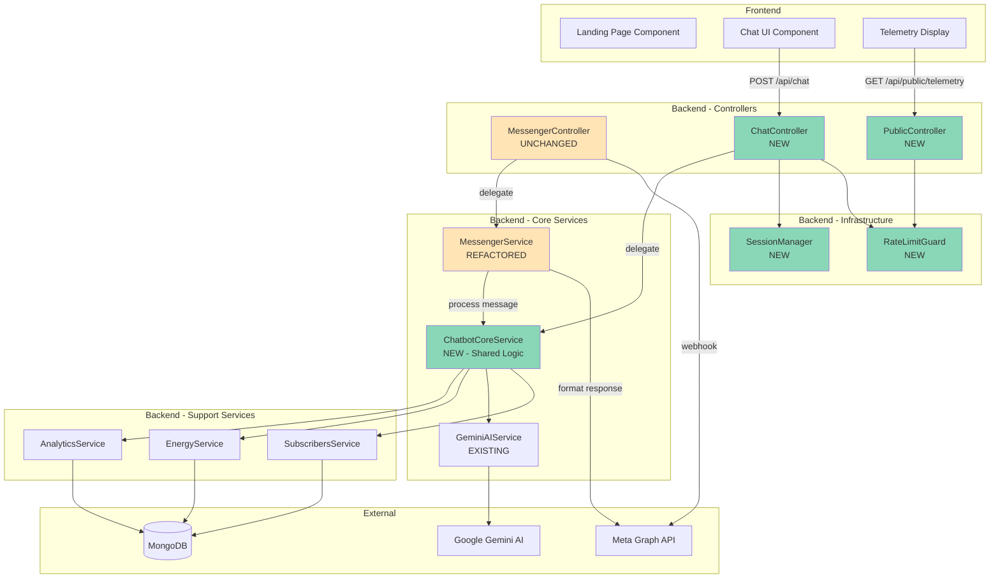
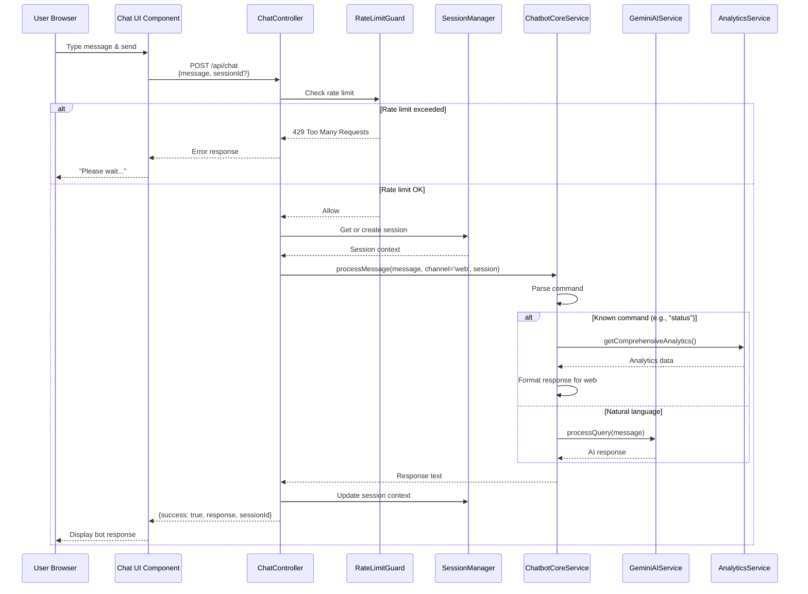
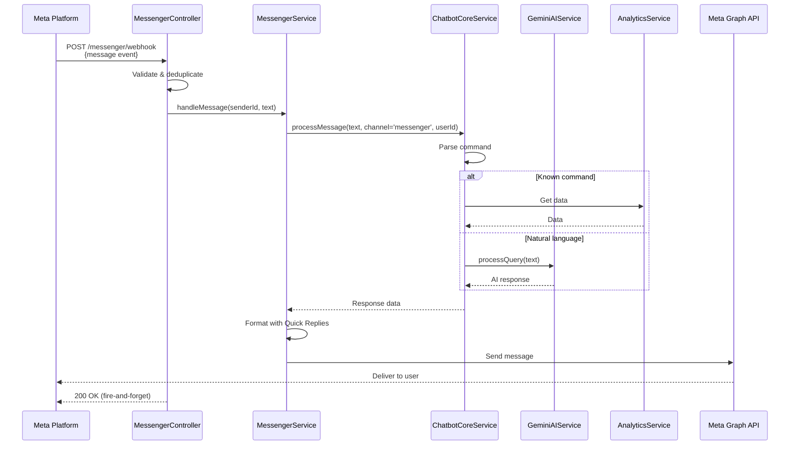
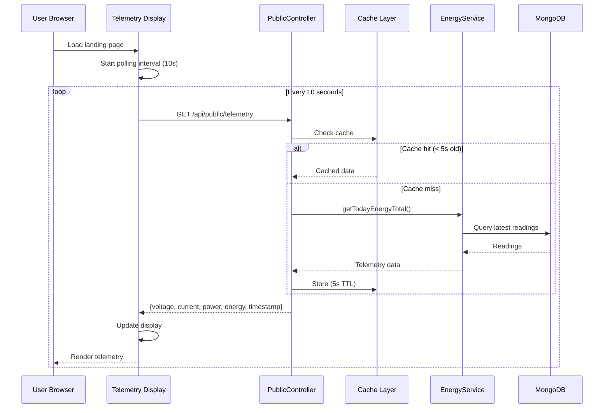

# Design Document: Landing Page Chat Interface

## Overview

This document details the technical design for extending EcoStep's chatbot system to support a public landing page chat interface alongside the existing Meta Messenger integration. The design prioritizes code reusability, maintainability, and security while ensuring both chat channels provide consistent user experiences.

### Goals

1. **Preserve Existing Integration**: The Meta Messenger webhook integration remains completely unchanged
2. **Shared Core Logic**: Both channels use the same chatbot processing engine
3. **Channel-Specific Features**: Each channel supports appropriate platform features (Quick Replies for Messenger, markdown for web)
4. **Public Access**: Landing page visitors can chat without authentication
5. **Security**: Public API is protected against abuse while maintaining usability
6. **Performance**: Fast response times and efficient resource usage
7. **Maintainability**: Clear separation of concerns and minimal code duplication

### Non-Goals

1. Real-time WebSocket chat (Phase 1 uses REST API polling)
2. Persistent user accounts for public chat (anonymous sessions only)
3. Advanced NLP beyond Gemini AI integration
4. Multi-language support (English only initially)
5. Chat history persistence beyond session lifetime

---

## Architecture

### High-Level Component Diagram



### Data Flow Diagrams

#### Message Flow - Web Channel



#### Message Flow - Messenger Channel (Unchanged)



#### Telemetry Retrieval Flow



---

## Components and Interfaces

### Backend Components

#### 1. ChatbotCoreService (NEW)

**Responsibility**: Channel-agnostic message processing and response generation

**Location**: `src/chatbot/chatbot-core.service.ts`

**Interface**:
```typescript
interface MessageContext {
  userId: string;          // Meta PSID or session ID
  channel: 'messenger' | 'web';
  sessionData?: any;       // For web channel conversation context
  originalText?: string;   // Preserve for AI
}

interface ChatbotResponse {
  text: string;
  suggestions?: string[];  // Follow-up suggestions
  metadata?: {
    commandType?: string;
    dataSource?: string;
  };
}

class ChatbotCoreService {
  /**
   * Main entry point for processing messages
   * Returns channel-agnostic response data
   */
  async processMessage(
    message: string,
    context: MessageContext
  ): Promise<ChatbotResponse>
  
  /**
   * Parse message to identify command type
   */
  private parseCommand(message: string): CommandType
  
  /**
   * Route to appropriate handler
   */
  private async routeCommand(
    command: CommandType,
    context: MessageContext
  ): Promise<ChatbotResponse>
  
  /**
   * Handle informational commands (status, today, etc.)
   */
  private async handleInformationalCommand(
    command: string,
    context: MessageContext
  ): Promise<ChatbotResponse>
  
  /**
   * Handle subscription commands (channel-specific)
   */
  private async handleSubscriptionCommand(
    command: 'subscribe' | 'unsubscribe',
    context: MessageContext
  ): Promise<ChatbotResponse>
  
  /**
   * Handle natural language queries via AI
   */
  private async handleNaturalLanguage(
    message: string,
    context: MessageContext
  ): Promise<ChatbotResponse>
}
```

**Key Design Decisions**:
- All command logic is channel-agnostic
- Returns structured data that each channel formats appropriately
- Subscription commands check channel type and respond accordingly
- AI integration is centralized here

#### 2. MessengerService (REFACTORED)

**Responsibility**: Meta Messenger-specific formatting and API communication

**Changes**:
- Extract command handling to ChatbotCoreService
- Keep Quick Reply generation
- Keep Meta API communication
- Add response formatting from ChatbotResponse

**Updated Interface**:
```typescript
class MessengerService {
  /**
   * Main entry point - delegates to core, then formats
   */
  async handleMessage(senderId: string, messageText: string): Promise<void> {
    // 1. Call ChatbotCoreService.processMessage()
    // 2. Format response with Quick Replies
    // 3. Send via Meta API
  }
  
  /**
   * Format core response for Messenger
   */
  private formatForMessenger(
    response: ChatbotResponse,
    command: string
  ): { text: string, quickReplies: QuickReply[] }
  
  /**
   * Existing Meta API methods unchanged
   */
  async sendMessage(recipientId: string, text: string, quickReplies?: QuickReply[]): Promise<void>
  async sendButtonTemplate(...): Promise<void>
  async setPersistentMenu(): Promise<void>
  async setGetStartedButton(): Promise<void>
  async setGreetingText(): Promise<void>
}
```

#### 3. ChatController (NEW)

**Responsibility**: Handle public chat API requests

**Location**: `src/chat/chat.controller.ts`

**Interface**:
```typescript
@ApiTags('Public Chat')
@Controller('chat')
@UseGuards(RateLimitGuard)
export class ChatController {
  /**
   * POST /api/chat
   * Process chat message from web interface
   */
  @Post()
  @UsePipes(new ValidationPipe())
  @HttpCode(HttpStatus.OK)
  async sendMessage(
    @Body() dto: SendMessageDto,
    @Ip() ip: string,
  ): Promise<ChatResponseDto>
  
  /**
   * GET /api/chat/health
   * Health check endpoint
   */
  @Get('health')
  healthCheck(): { status: string }
}
```

**DTOs**:
```typescript
// Request DTO
class SendMessageDto {
  @IsString()
  @IsNotEmpty()
  @MaxLength(2000)
  message: string;
  
  @IsOptional()
  @IsUUID()
  sessionId?: string;
}

// Response DTO
class ChatResponseDto {
  success: boolean;
  response: string;
  sessionId: string;
  suggestions?: string[];
  timestamp: string;
}
```

#### 4. PublicController (NEW)

**Responsibility**: Serve public telemetry data for landing page

**Location**: `src/public/public.controller.ts`

**Interface**:
```typescript
@ApiTags('Public API')
@Controller('public')
@UseGuards(RateLimitGuard)
export class PublicController {
  /**
   * GET /api/public/telemetry
   * Get current system telemetry data
   */
  @Get('telemetry')
  @UseInterceptors(CacheInterceptor)
  @CacheTTL(5) // 5 seconds
  async getCurrentTelemetry(): Promise<TelemetryDto>
}
```

**DTO**:
```typescript
class TelemetryDto {
  voltage: number;        // Current voltage (V)
  current: number;        // Current current (A)
  power: number;          // Current power (W)
  energyToday: number;    // Total energy today (kWh)
  timestamp: string;      // ISO 8601 timestamp
  status: 'online' | 'offline';
}
```

#### 5. SessionManager (NEW)

**Responsibility**: Manage anonymous web chat sessions

**Location**: `src/chat/session.manager.ts`

**Interface**:
```typescript
interface ChatSession {
  sessionId: string;
  createdAt: Date;
  lastActivity: Date;
  messageHistory: Array<{ role: 'user' | 'bot', text: string, timestamp: Date }>;
  metadata?: any;
}

class SessionManager {
  /**
   * Get existing session or create new one
   */
  async getOrCreateSession(sessionId?: string): Promise<ChatSession>
  
  /**
   * Update session activity timestamp
   */
  async updateSession(sessionId: string, message: any): Promise<void>
  
  /**
   * Delete expired sessions (cron job)
   */
  async cleanupExpiredSessions(): Promise<number>
  
  /**
   * Get session if exists
   */
  async getSession(sessionId: string): Promise<ChatSession | null>
}
```

**Storage Strategy**:
- **Phase 1**: In-memory Map with TTL (30 minutes)
- **Future**: Redis for distributed deployments
- **Cleanup**: Scheduled job every 5 minutes removes expired sessions

#### 6. RateLimitGuard (NEW)

**Responsibility**: Protect public APIs from abuse

**Location**: `src/common/guards/rate-limit.guard.ts`

**Configuration**:
```typescript
interface RateLimitConfig {
  ttl: number;      // Time window in seconds
  limit: number;    // Max requests per window
}

// Default config
const RATE_LIMITS = {
  chat: { ttl: 60, limit: 10 },         // 10 messages per minute
  telemetry: { ttl: 60, limit: 120 },   // 120 requests per minute (every 0.5s)
};

@Injectable()
class RateLimitGuard implements CanActivate {
  async canActivate(context: ExecutionContext): Promise<boolean> {
    const request = context.switchToHttp().getRequest();
    const ip = request.ip;
    const endpoint = request.route.path;
    
    const isAllowed = await this.rateLimiter.consume(ip, endpoint);
    
    if (!isAllowed) {
      throw new HttpException(
        'Too many requests. Please try again later.',
        HttpStatus.TOO_MANY_REQUESTS
      );
    }
    
    return true;
  }
}
```

**Implementation**:
- Uses `@nestjs/throttler` package
- IP-based rate limiting
- Different limits per endpoint
- Returns 429 status with Retry-After header

### Frontend Components

#### 1. ChatInterface Component

**Location**: `frontend/src/features/chat/components/ChatInterface.tsx`

**Component Hierarchy**:
```
ChatInterface (container)
├── ChatHeader
├── MessageList
│   ├── Message (user)
│   ├── Message (bot)
│   └── TypingIndicator
├── SuggestedActions
└── ChatInput
    ├── TextArea
    └── SendButton
```

**State Management**:
```typescript
interface ChatState {
  messages: ChatMessage[];
  sessionId: string | null;
  isLoading: boolean;
  error: string | null;
  suggestions: string[];
}

interface ChatMessage {
  id: string;
  role: 'user' | 'bot';
  text: string;
  timestamp: Date;
}
```

**Props Interface**:
```typescript
interface ChatInterfaceProps {
  className?: string;
  initialMessage?: string;  // Optional welcome message
}
```

**Key Features**:
- Auto-scroll to latest message
- Markdown rendering for bot responses
- Keyboard shortcuts (Enter to send, Shift+Enter for newline)
- Loading states with typing indicator
- Error handling with retry option
- Session persistence in sessionStorage

#### 2. TelemetryDisplay Component

**Location**: `frontend/src/features/landing/components/TelemetryDisplay.tsx`

**Interface**:
```typescript
interface TelemetryDisplayProps {
  refreshInterval?: number;  // Default: 10000ms (10s)
  className?: string;
}

interface TelemetryData {
  voltage: number;
  current: number;
  power: number;
  energyToday: number;
  timestamp: string;
  status: 'online' | 'offline';
}
```

**Layout**:
```
┌─────────────────────────────────────┐
│   Real-Time System Status           │
├─────────────────────────────────────┤
│  ⚡ Voltage      │  12.5 V           │
│  ⚡ Current      │  2.3 A            │
│  ⚡ Power        │  28.75 W          │
│  ⚡ Energy Today │  0.145 kWh        │
│                                     │
│  🟢 Online  •  Updated: 2s ago      │
└─────────────────────────────────────┘
```

**Key Features**:
- Auto-refresh polling (10s interval)
- Animated value transitions
- Offline state handling
- Timestamp display ("Updated X ago")
- Glass morphism design matching EcoStep style

#### 3. Updated LandingPage Component

**Location**: `frontend/src/features/landing/pages/LandingPage.tsx`

**New Layout Structure**:
```
┌──────────────────────────────────────┐
│  Header (Logo, Title, Login)         │
├──────────────────────────────────────┤
│                                      │
│  Hero Section                        │
│  - Headline                          │
│  - Description                       │
│  - CTA Buttons                       │
│                                      │
├──────────────────────────────────────┤
│                                      │
│  Split Section                       │
│  ┌────────────┬──────────────────┐  │
│  │ Telemetry  │  Chat Interface  │  │
│  │ Display    │                  │  │
│  │            │                  │  │
│  └────────────┴──────────────────┘  │
│                                      │
├──────────────────────────────────────┤
│  Features Section (existing)         │
├──────────────────────────────────────┤
│  Footer                              │
└──────────────────────────────────────┘
```

**New Additions**:
- TelemetryDisplay component in left column
- ChatInterface component in right column
- Responsive layout (stacked on mobile)

---

## Data Models

### Session Schema

**Storage**: In-memory Map (Phase 1)

```typescript
interface ChatSession {
  sessionId: string;               // UUID v4
  createdAt: Date;                 // Session creation timestamp
  lastActivity: Date;              // Last message timestamp
  expiresAt: Date;                 // Auto-calculated: lastActivity + 30min
  messageHistory: ChatMessage[];   // Conversation history
}

interface ChatMessage {
  role: 'user' | 'bot';
  text: string;
  timestamp: Date;
}

// Example storage structure
const sessions = new Map<string, ChatSession>();
```

**Session Lifecycle**:
1. **Creation**: First message from user without sessionId
2. **Active**: Each message extends expiresAt by 30 minutes
3. **Expiration**: No activity for 30 minutes → deleted by cleanup job
4. **Max History**: Store last 20 messages to limit memory

### Telemetry Cache Schema

**Storage**: In-memory cache (NestJS CacheModule)

```typescript
interface CachedTelemetry {
  data: TelemetryDto;
  cachedAt: number;     // Timestamp
  ttl: number;          // 5 seconds
}
```

**Cache Strategy**:
- TTL: 5 seconds
- Key: `'public:telemetry'`
- Invalidation: Automatic expiry
- Source: EnergyService.getTodayEnergyTotal()

---

## Error Handling

### Backend Error Strategy

#### Error Types and Responses

```typescript
// 1. Validation Errors (400)
{
  statusCode: 400,
  message: 'Message cannot be empty',
  error: 'Bad Request'
}

// 2. Rate Limit Errors (429)
{
  statusCode: 429,
  message: 'Too many requests. Please try again later.',
  error: 'Too Many Requests',
  retryAfter: 60  // seconds
}

// 3. Server Errors (500)
{
  statusCode: 500,
  message: 'An error occurred while processing your request',
  error: 'Internal Server Error'
  // Stack trace and internal details NOT exposed
}

// 4. Service Unavailable (503)
{
  statusCode: 503,
  message: 'Service temporarily unavailable. Please try again later.',
  error: 'Service Unavailable'
}
```

#### Error Handling Flow

```typescript
// ChatController error handling
@Post()
async sendMessage(@Body() dto: SendMessageDto) {
  try {
    // Process message
    return await this.chatbotCore.processMessage(...);
    
  } catch (error) {
    this.logger.error('Chat error', error.stack);
    
    if (error instanceof ValidationError) {
      throw new BadRequestException(error.message);
    }
    
    if (error.name === 'MongoError') {
      throw new ServiceUnavailableException(
        'Database temporarily unavailable'
      );
    }
    
    // Generic fallback
    throw new InternalServerErrorException(
      'An error occurred while processing your request'
    );
  }
}
```

#### Graceful Degradation

```typescript
// ChatbotCoreService - AI fallback
async handleNaturalLanguage(message: string) {
  try {
    return await this.geminiAI.processQuery(message);
  } catch (error) {
    this.logger.warn('AI service unavailable, falling back');
    return {
      text: `I'm having trouble understanding that right now. Try one of these commands:\n\n• status\n• energy\n• today\n• help`,
      suggestions: ['status', 'energy', 'help']
    };
  }
}

// ChatbotCoreService - Data unavailable
async handleStatusCommand() {
  try {
    const analytics = await this.analyticsService.getComprehensiveAnalytics();
    return this.formatAnalytics(analytics);
  } catch (error) {
    this.logger.error('Analytics unavailable', error);
    return {
      text: 'System data is temporarily unavailable. Please try again in a few moments.',
      suggestions: ['help', 'about']
    };
  }
}
```

### Frontend Error Handling

```typescript
// ChatInterface error handling
async function sendMessage(text: string) {
  setIsLoading(true);
  setError(null);
  
  try {
    const response = await fetch('/api/chat', {
      method: 'POST',
      headers: { 'Content-Type': 'application/json' },
      body: JSON.stringify({ message: text, sessionId })
    });
    
    if (!response.ok) {
      if (response.status === 429) {
        const data = await response.json();
        throw new Error(`Too many messages. Please wait ${data.retryAfter} seconds.`);
      }
      throw new Error('Failed to send message');
    }
    
    const data = await response.json();
    addMessage({ role: 'bot', text: data.response });
    setSuggestions(data.suggestions || []);
    setSessionId(data.sessionId);
    
  } catch (error) {
    setError(error.message);
    // Show error message in chat
    addMessage({
      role: 'bot',
      text: `❌ ${error.message}\n\nPlease try again or contact support if the problem persists.`,
    });
  } finally {
    setIsLoading(false);
  }
}
```

**User-Friendly Error Messages**:
- ✅ "Too many messages. Please wait 60 seconds."
- ✅ "Failed to connect. Check your internet connection."
- ✅ "Service temporarily unavailable. Try again in a moment."
- ❌ NOT: "MongoError: Connection timeout"
- ❌ NOT: "UnhandledPromiseRejectionWarning"

---

## Testing Strategy

### Property-Based Testing Applicability Assessment

**Question**: Should property-based testing be used for this feature?

**Analysis**:

1. **Infrastructure & External Services**:
   - Messenger webhook verification ✗ (external API behavior)
   - Meta Graph API calls ✗ (external API)
   - Gemini AI integration ✗ (external API)
   - MongoDB queries ✗ (database operations)
   - **Verdict**: Use integration tests with mocks

2. **Session Management**:
   - Session creation ✗ (side effects, storage)
   - Session expiration ✗ (time-based, infrastructure)
   - **Verdict**: Use unit tests with specific examples

3. **Rate Limiting**:
   - Rate limit enforcement ✗ (infrastructure, time-based)
   - **Verdict**: Use unit tests with mock clock

4. **Chat Message Processing** ✓:
   - Command parsing COULD use PBT
   - Response formatting COULD use PBT
   - But: limited input space, simple string matching
   - **Verdict**: Example-based tests sufficient

5. **Public Telemetry API**:
   - Data retrieval ✗ (database query)
   - Caching ✗ (infrastructure)
   - **Verdict**: Integration tests

**Final Decision**: **Property-based testing is NOT appropriate for this feature**

**Rationale**:
- Primary functionality involves external services (Meta API, Gemini AI, database)
- Most logic is infrastructure-related (sessions, caching, rate limiting)
- Command parsing has limited, well-defined input space
- Integration tests and example-based unit tests provide better coverage

### Testing Approach

#### Unit Tests

**ChatbotCoreService**:
```typescript
describe('ChatbotCoreService', () => {
  describe('processMessage', () => {
    it('should handle status command', async () => {
      const response = await service.processMessage('status', {
        userId: 'test-user',
        channel: 'web'
      });
      
      expect(response.text).toContain('Energy System Status');
      expect(response.suggestions).toBeDefined();
    });
    
    it('should handle subscription command on web channel', async () => {
      const response = await service.processMessage('subscribe', {
        userId: 'web-session-123',
        channel: 'web'
      });
      
      expect(response.text).toContain('only available via Messenger');
    });
    
    it('should handle unknown command', async () => {
      const response = await service.processMessage('xyz123', {
        userId: 'test-user',
        channel: 'web'
      });
      
      expect(response.text).toContain('available commands');
    });
  });
  
  describe('parseCommand', () => {
    it('should normalize commands to lowercase', () => {
      expect(service.parseCommand('STATUS')).toBe('status');
      expect(service.parseCommand('Help')).toBe('help');
    });
    
    it('should identify command variants', () => {
      expect(service.parseCommand('stats')).toBe('status');
      expect(service.parseCommand('weekly')).toBe('week');
    });
  });
});
```

**SessionManager**:
```typescript
describe('SessionManager', () => {
  it('should create new session with UUID', async () => {
    const session = await manager.getOrCreateSession();
    
    expect(session.sessionId).toMatch(/^[0-9a-f]{8}-[0-9a-f]{4}-4[0-9a-f]{3}-[89ab][0-9a-f]{3}-[0-9a-f]{12}$/i);
    expect(session.messageHistory).toEqual([]);
  });
  
  it('should retrieve existing session', async () => {
    const session1 = await manager.getOrCreateSession();
    const session2 = await manager.getOrCreateSession(session1.sessionId);
    
    expect(session2.sessionId).toBe(session1.sessionId);
  });
  
  it('should update lastActivity on message', async () => {
    const session = await manager.getOrCreateSession();
    const beforeUpdate = session.lastActivity;
    
    await new Promise(resolve => setTimeout(resolve, 10));
    await manager.updateSession(session.sessionId, { role: 'user', text: 'hello' });
    
    const updated = await manager.getSession(session.sessionId);
    expect(updated.lastActivity.getTime()).toBeGreaterThan(beforeUpdate.getTime());
  });
  
  it('should clean up expired sessions', async () => {
    // Create session with old timestamp
    const session = await manager.getOrCreateSession();
    session.expiresAt = new Date(Date.now() - 1000);
    
    const cleaned = await manager.cleanupExpiredSessions();
    
    expect(cleaned).toBe(1);
    expect(await manager.getSession(session.sessionId)).toBeNull();
  });
});
```

**RateLimitGuard**:
```typescript
describe('RateLimitGuard', () => {
  it('should allow requests within limit', async () => {
    for (let i = 0; i < 10; i++) {
      const result = await guard.canActivate(mockContext);
      expect(result).toBe(true);
    }
  });
  
  it('should block requests exceeding limit', async () => {
    // Make 10 requests (limit)
    for (let i = 0; i < 10; i++) {
      await guard.canActivate(mockContext);
    }
    
    // 11th request should throw
    await expect(guard.canActivate(mockContext))
      .rejects.toThrow(HttpException);
  });
  
  it('should reset after TTL window', async () => {
    // Make 10 requests
    for (let i = 0; i < 10; i++) {
      await guard.canActivate(mockContext);
    }
    
    // Fast-forward time 61 seconds
    jest.advanceTimersByTime(61000);
    
    // Should allow new request
    const result = await guard.canActivate(mockContext);
    expect(result).toBe(true);
  });
});
```

#### Integration Tests

**ChatController E2E**:
```typescript
describe('ChatController (e2e)', () => {
  it('POST /api/chat - should process message and return response', async () => {
    const response = await request(app.getHttpServer())
      .post('/api/chat')
      .send({ message: 'status' })
      .expect(200);
    
    expect(response.body).toMatchObject({
      success: true,
      response: expect.stringContaining('Energy System Status'),
      sessionId: expect.stringMatching(/^[0-9a-f-]{36}$/),
      timestamp: expect.any(String)
    });
  });
  
  it('POST /api/chat - should validate empty message', async () => {
    await request(app.getHttpServer())
      .post('/api/chat')
      .send({ message: '' })
      .expect(400);
  });
  
  it('POST /api/chat - should enforce rate limit', async () => {
    const requests = Array.from({ length: 11 }, () =>
      request(app.getHttpServer())
        .post('/api/chat')
        .send({ message: 'hello' })
    );
    
    const responses = await Promise.all(requests);
    const rateLimited = responses.filter(r => r.status === 429);
    
    expect(rateLimited.length).toBeGreaterThan(0);
  });
  
  it('POST /api/chat - should maintain session context', async () => {
    const firstResponse = await request(app.getHttpServer())
      .post('/api/chat')
      .send({ message: 'hello' })
      .expect(200);
    
    const sessionId = firstResponse.body.sessionId;
    
    const secondResponse = await request(app.getHttpServer())
      .post('/api/chat')
      .send({ message: 'status', sessionId })
      .expect(200);
    
    expect(secondResponse.body.sessionId).toBe(sessionId);
  });
});
```

**PublicController E2E**:
```typescript
describe('PublicController (e2e)', () => {
  it('GET /api/public/telemetry - should return current telemetry', async () => {
    const response = await request(app.getHttpServer())
      .get('/api/public/telemetry')
      .expect(200);
    
    expect(response.body).toMatchObject({
      voltage: expect.any(Number),
      current: expect.any(Number),
      power: expect.any(Number),
      energyToday: expect.any(Number),
      timestamp: expect.stringMatching(/^\d{4}-\d{2}-\d{2}T/),
      status: expect.stringMatching(/^(online|offline)$/)
    });
  });
  
  it('GET /api/public/telemetry - should use cache', async () => {
    const spy = jest.spyOn(energyService, 'getTodayEnergyTotal');
    
    // First request
    await request(app.getHttpServer()).get('/api/public/telemetry');
    expect(spy).toHaveBeenCalledTimes(1);
    
    // Second request within 5s (should use cache)
    await request(app.getHttpServer()).get('/api/public/telemetry');
    expect(spy).toHaveBeenCalledTimes(1); // Still 1, not called again
  });
  
  it('GET /api/public/telemetry - should handle offline state', async () => {
    jest.spyOn(energyService, 'getTodayEnergyTotal')
      .mockResolvedValue(null); // No data
    
    const response = await request(app.getHttpServer())
      .get('/api/public/telemetry')
      .expect(503);
    
    expect(response.body.message).toContain('temporarily unavailable');
  });
});
```

#### Frontend Component Tests

**ChatInterface**:
```typescript
describe('ChatInterface', () => {
  it('should render initial welcome message', () => {
    render(<ChatInterface initialMessage="Welcome!" />);
    expect(screen.getByText('Welcome!')).toBeInTheDocument();
  });
  
  it('should send message on Enter key', async () => {
    const { user } = render(<ChatInterface />);
    const input = screen.getByRole('textbox');
    
    await user.type(input, 'hello{Enter}');
    
    expect(screen.getByText('hello')).toBeInTheDocument();
    expect(screen.getByTestId('loading-indicator')).toBeInTheDocument();
  });
  
  it('should display bot response', async () => {
    mockFetch.mockResolvedValueOnce({
      ok: true,
      json: async () => ({
        success: true,
        response: 'Bot response',
        sessionId: 'test-session',
        suggestions: ['help', 'status']
      })
    });
    
    const { user } = render(<ChatInterface />);
    await user.type(screen.getByRole('textbox'), 'hello{Enter}');
    
    await waitFor(() => {
      expect(screen.getByText('Bot response')).toBeInTheDocument();
    });
  });
  
  it('should handle error responses', async () => {
    mockFetch.mockResolvedValueOnce({
      ok: false,
      status: 500,
      json: async () => ({ message: 'Server error' })
    });
    
    const { user } = render(<ChatInterface />);
    await user.type(screen.getByRole('textbox'), 'hello{Enter}');
    
    await waitFor(() => {
      expect(screen.getByText(/error occurred/i)).toBeInTheDocument();
    });
  });
});
```

**TelemetryDisplay**:
```typescript
describe('TelemetryDisplay', () => {
  it('should fetch and display telemetry on mount', async () => {
    mockFetch.mockResolvedValueOnce({
      ok: true,
      json: async () => ({
        voltage: 12.5,
        current: 2.3,
        power: 28.75,
        energyToday: 0.145,
        timestamp: '2024-01-01T12:00:00Z',
        status: 'online'
      })
    });
    
    render(<TelemetryDisplay />);
    
    await waitFor(() => {
      expect(screen.getByText('12.5 V')).toBeInTheDocument();
      expect(screen.getByText('2.3 A')).toBeInTheDocument();
      expect(screen.getByText('28.75 W')).toBeInTheDocument();
    });
  });
  
  it('should poll for updates at interval', async () => {
    jest.useFakeTimers();
    
    render(<TelemetryDisplay refreshInterval={5000} />);
    
    expect(mockFetch).toHaveBeenCalledTimes(1);
    
    jest.advanceTimersByTime(5000);
    expect(mockFetch).toHaveBeenCalledTimes(2);
    
    jest.advanceTimersByTime(5000);
    expect(mockFetch).toHaveBeenCalledTimes(3);
  });
  
  it('should display offline state', async () => {
    mockFetch.mockResolvedValueOnce({
      ok: false,
      status: 503
    });
    
    render(<TelemetryDisplay />);
    
    await waitFor(() => {
      expect(screen.getByText(/offline/i)).toBeInTheDocument();
    });
  });
});
```

---

## Security

### Input Validation

**Backend Validation**:
```typescript
// DTOs with class-validator decorators
class SendMessageDto {
  @IsString()
  @IsNotEmpty({ message: 'Message cannot be empty' })
  @MaxLength(2000, { message: 'Message too long (max 2000 characters)' })
  @Transform(({ value }) => value?.trim())
  message: string;
  
  @IsOptional()
  @IsUUID('4', { message: 'Invalid session ID format' })
  sessionId?: string;
}

// Global validation pipe in main.ts
app.useGlobalPipes(new ValidationPipe({
  whitelist: true,        // Strip unknown properties
  forbidNonWhitelisted: true,  // Throw error on unknown properties
  transform: true,        // Transform payloads to DTO instances
  transformOptions: {
    enableImplicitConversion: false  // Explicit type conversion only
  }
}));
```

**Frontend Validation**:
```typescript
function validateMessage(text: string): string | null {
  if (!text || text.trim().length === 0) {
    return 'Message cannot be empty';
  }
  
  if (text.length > 2000) {
    return 'Message too long (max 2000 characters)';
  }
  
  // Check for suspicious patterns
  if (/<script|javascript:|onerror=/i.test(text)) {
    return 'Message contains invalid content';
  }
  
  return null;
}
```

### XSS Prevention

**Backend**:
- NestJS automatically sanitizes query parameters
- Use parameterized database queries (Mongoose)
- Helmet.js middleware for security headers

```typescript
// main.ts
app.use(helmet({
  contentSecurityPolicy: {
    directives: {
      defaultSrc: ["'self'"],
      scriptSrc: ["'self'"],
      styleSrc: ["'self'", "'unsafe-inline'"],
      imgSrc: ["'self'", 'data:', 'https:'],
    }
  },
  crossOriginEmbedderPolicy: false, // For API usage
}));
```

**Frontend**:
- React automatically escapes JSX content
- Use DOMPurify for markdown rendering

```typescript
import DOMPurify from 'dompurify';
import { marked } from 'marked';

function renderBotMessage(text: string) {
  const html = marked(text);
  const clean = DOMPurify.sanitize(html, {
    ALLOWED_TAGS: ['p', 'br', 'strong', 'em', 'ul', 'ol', 'li', 'code', 'pre', 'a'],
    ALLOWED_ATTR: ['href', 'target', 'rel']
  });
  
  return <div dangerouslySetInnerHTML={{ __html: clean }} />;
}
```

### CORS Configuration

```typescript
// main.ts
app.enableCors({
  origin: [
    process.env.FRONTEND_URL || 'http://localhost:5173',
    process.env.PRODUCTION_URL || 'https://ecostep.example.com'
  ],
  methods: ['GET', 'POST'],
  allowedHeaders: ['Content-Type', 'Accept'],
  credentials: false, // Public API doesn't need credentials
  maxAge: 3600 // Cache preflight for 1 hour
});
```

### Rate Limiting

**Configuration**:
```typescript
// app.module.ts
ThrottlerModule.forRoot([
  {
    name: 'chat',
    ttl: 60000,    // 1 minute
    limit: 10,     // 10 requests
  },
  {
    name: 'telemetry',
    ttl: 60000,    // 1 minute
    limit: 120,    // 120 requests (every 0.5s)
  }
])

// Controller usage
@UseGuards(ThrottlerGuard)
@Throttle({ chat: { limit: 10, ttl: 60000 } })
@Post()
async sendMessage() { ... }
```

**IP-based Tracking**:
- Extracts real IP from X-Forwarded-For header (if behind proxy)
- Falls back to request.ip
- Stores in-memory (Phase 1) or Redis (future)

### Environment Variables

**Required Variables**:
```bash
# .env.example additions

# Chat Feature
CHAT_RATE_LIMIT_TTL=60
CHAT_RATE_LIMIT_MAX=10
CHAT_SESSION_TIMEOUT_MINUTES=30

# Public API
PUBLIC_TELEMETRY_CACHE_TTL=5
PUBLIC_API_RATE_LIMIT_TTL=60
PUBLIC_API_RATE_LIMIT_MAX=120

# CORS
FRONTEND_URL=http://localhost:5173
PRODUCTION_URL=https://ecostep.example.com
```

**Validation**:
```typescript
// env.validation.ts updates
export const envValidationSchema = Joi.object({
  // ... existing validations
  
  // Chat feature
  CHAT_RATE_LIMIT_TTL: Joi.number().default(60),
  CHAT_RATE_LIMIT_MAX: Joi.number().default(10),
  CHAT_SESSION_TIMEOUT_MINUTES: Joi.number().default(30),
  
  // Public API
  PUBLIC_TELEMETRY_CACHE_TTL: Joi.number().default(5),
  PUBLIC_API_RATE_LIMIT_TTL: Joi.number().default(60),
  PUBLIC_API_RATE_LIMIT_MAX: Joi.number().default(120),
  
  // CORS
  FRONTEND_URL: Joi.string().uri().required(),
  PRODUCTION_URL: Joi.string().uri().optional(),
});
```

---

## Deployment and Configuration

### Backend Module Structure

```
src/
├── chatbot/                      # NEW MODULE
│   ├── chatbot-core.service.ts   # Shared message processing
│   ├── chatbot.module.ts
│   └── __tests__/
│       └── chatbot-core.service.spec.ts
│
├── chat/                         # NEW MODULE
│   ├── chat.controller.ts        # Public chat API
│   ├── chat.service.ts           # Chat orchestration
│   ├── session.manager.ts        # Session management
│   ├── dto/
│   │   ├── send-message.dto.ts
│   │   └── chat-response.dto.ts
│   ├── chat.module.ts
│   └── __tests__/
│
├── public/                       # NEW MODULE
│   ├── public.controller.ts      # Public telemetry API
│   ├── dto/
│   │   └── telemetry.dto.ts
│   ├── public.module.ts
│   └── __tests__/
│
├── messenger/                    # EXISTING - REFACTORED
│   ├── messenger.controller.ts   # UNCHANGED webhook endpoints
│   ├── messenger.service.ts      # REFACTORED to use ChatbotCoreService
│   ├── gemini-ai.service.ts      # UNCHANGED
│   ├── dto/
│   └── __tests__/
│
├── common/
│   ├── guards/
│   │   └── rate-limit.guard.ts   # NEW
│   ├── interceptors/
│   │   └── cache.interceptor.ts  # EXISTING
│   └── decorators/
│
└── app.module.ts                 # UPDATED with new modules
```

### Module Configuration

**app.module.ts Updates**:
```typescript
@Module({
  imports: [
    // ... existing imports
    
    // Cache module for public API
    CacheModule.register({
      ttl: 5,  // 5 seconds default
      max: 100, // Max 100 cached items
      isGlobal: true,
    }),
    
    // Rate limiting
    ThrottlerModule.forRoot([
      {
        name: 'chat',
        ttl: 60000,
        limit: 10,
      },
      {
        name: 'telemetry',
        ttl: 60000,
        limit: 120,
      }
    ]),
    
    // New modules
    ChatbotModule,
    ChatModule,
    PublicModule,
    
    // Existing modules
    MessengerModule,
    AnalyticsModule,
    EnergyModule,
    SubscribersModule,
    // ...
  ],
})
export class AppModule {}
```

**ChatModule**:
```typescript
@Module({
  imports: [
    ChatbotModule,        // For ChatbotCoreService
    ThrottlerModule,      // For rate limiting
  ],
  controllers: [ChatController],
  providers: [
    ChatService,
    SessionManager,
  ],
  exports: [SessionManager],
})
export class ChatModule {}
```

**ChatbotModule**:
```typescript
@Module({
  imports: [
    AnalyticsModule,
    EnergyModule,
    SubscribersModule,
    forwardRef(() => MessengerModule),  // Circular dependency
  ],
  providers: [ChatbotCoreService],
  exports: [ChatbotCoreService],
})
export class ChatbotModule {}
```

**PublicModule**:
```typescript
@Module({
  imports: [
    EnergyModule,
    CacheModule,
    ThrottlerModule,
  ],
  controllers: [PublicController],
})
export class PublicModule {}
```

### Frontend Build Configuration

**Environment Variables** (`frontend/.env`):
```bash
# API URLs
VITE_API_BASE_URL=http://localhost:3000
VITE_API_CHAT_ENDPOINT=/api/chat
VITE_API_TELEMETRY_ENDPOINT=/api/public/telemetry

# Feature flags
VITE_ENABLE_CHAT=true
VITE_ENABLE_TELEMETRY_DISPLAY=true

# Polling intervals (ms)
VITE_TELEMETRY_POLL_INTERVAL=10000
VITE_CHAT_RETRY_DELAY=2000
```

**API Client Configuration** (`frontend/src/lib/api.ts`):
```typescript
const API_BASE_URL = import.meta.env.VITE_API_BASE_URL || 'http://localhost:3000';

export const api = {
  chat: {
    sendMessage: async (message: string, sessionId?: string) => {
      const response = await fetch(`${API_BASE_URL}/api/chat`, {
        method: 'POST',
        headers: { 'Content-Type': 'application/json' },
        body: JSON.stringify({ message, sessionId }),
      });
      
      if (!response.ok) {
        throw new Error(`HTTP ${response.status}: ${response.statusText}`);
      }
      
      return response.json();
    },
  },
  
  telemetry: {
    getCurrent: async () => {
      const response = await fetch(`${API_BASE_URL}/api/public/telemetry`);
      
      if (!response.ok) {
        throw new Error(`HTTP ${response.status}: ${response.statusText}`);
      }
      
      return response.json();
    },
  },
};
```

### Deployment Checklist

**Backend**:
- [ ] Environment variables configured
- [ ] Database migrations run (if needed)
- [ ] CORS origins configured for production
- [ ] Rate limiting thresholds appropriate for prod
- [ ] Logging configured (Winston + CloudWatch)
- [ ] Health check endpoints accessible
- [ ] SSL/TLS certificates installed

**Frontend**:
- [ ] API base URL points to production backend
- [ ] Build optimization enabled
- [ ] CDN configured for static assets
- [ ] Error tracking enabled (Sentry)
- [ ] Analytics configured (if needed)
- [ ] Lighthouse performance score > 90

**Monitoring**:
- [ ] API response time metrics
- [ ] Rate limit violation tracking
- [ ] Session creation/expiration metrics
- [ ] Error rate monitoring
- [ ] Cache hit/miss ratio
- [ ] Telemetry polling frequency

---

## Performance Optimization

### Backend Optimizations

#### 1. Caching Strategy

**Telemetry Cache**:
```typescript
@UseInterceptors(CacheInterceptor)
@CacheTTL(5)
@Get('telemetry')
async getCurrentTelemetry() {
  // Expensive DB query runs max once per 5 seconds
  return this.energyService.getTodayEnergyTotal();
}
```

**Benefits**:
- Reduces database load by 95% (from 6 queries/min/user to 12 queries/min total)
- Sub-millisecond response time for cached requests

#### 2. Session Management

**In-Memory Storage**:
```typescript
private sessions = new Map<string, ChatSession>();

// O(1) lookup
async getSession(sessionId: string): Promise<ChatSession | null> {
  return this.sessions.get(sessionId) || null;
}
```

**Cleanup Strategy**:
```typescript
// Scheduled job every 5 minutes
@Cron('*/5 * * * *')
async cleanupExpiredSessions() {
  const now = Date.now();
  let cleaned = 0;
  
  for (const [id, session] of this.sessions.entries()) {
    if (session.expiresAt.getTime() < now) {
      this.sessions.delete(id);
      cleaned++;
    }
  }
  
  this.logger.log(`Cleaned up ${cleaned} expired sessions`);
}
```

#### 3. Database Query Optimization

**Existing EnergyService queries already optimized**:
- Indexed queries on `timestamp` field
- Aggregation pipelines for analytics
- Connection pooling configured

### Frontend Optimizations

#### 1. Code Splitting

```typescript
// Lazy load chat component
const ChatInterface = lazy(() => import('@/features/chat/components/ChatInterface'));

// In LandingPage
<Suspense fallback={<ChatSkeleton />}>
  <ChatInterface />
</Suspense>
```

#### 2. Debouncing

```typescript
// Prevent rapid message sending
const [canSend, setCanSend] = useState(true);

async function sendMessage(text: string) {
  if (!canSend) return;
  
  setCanSend(false);
  
  try {
    await api.chat.sendMessage(text, sessionId);
  } finally {
    setTimeout(() => setCanSend(true), 1000); // 1s debounce
  }
}
```

#### 3. Polling Optimization

```typescript
// Exponential backoff on errors
const [pollInterval, setPollInterval] = useState(10000);

useEffect(() => {
  const fetchTelemetry = async () => {
    try {
      const data = await api.telemetry.getCurrent();
      setTelemetryData(data);
      setPollInterval(10000); // Reset on success
    } catch (error) {
      // Exponential backoff on errors
      setPollInterval(prev => Math.min(prev * 2, 60000));
    }
  };
  
  const interval = setInterval(fetchTelemetry, pollInterval);
  return () => clearInterval(interval);
}, [pollInterval]);
```

#### 4. React Optimization

```typescript
// Memoize expensive computations
const formattedMessages = useMemo(() => {
  return messages.map(msg => ({
    ...msg,
    formattedTime: formatTimeAgo(msg.timestamp)
  }));
}, [messages]);

// Prevent unnecessary re-renders
const MessageComponent = React.memo(({ message }) => {
  return <div>{message.text}</div>;
}, (prev, next) => prev.message.id === next.message.id);
```

### Performance Targets

| Metric | Target | Measurement |
|--------|--------|-------------|
| Chat API response time | < 200ms (cached commands) | P95 latency |
| Chat API response time | < 2s (AI queries) | P95 latency |
| Telemetry API response time | < 50ms (cached) | P95 latency |
| Frontend initial load | < 2s | Lighthouse |
| Frontend interaction delay | < 100ms | Time to interactive |
| Session cleanup efficiency | > 90% removed | Scheduled job logs |
| Cache hit ratio | > 80% | Cache metrics |

---

## Migration and Rollout Plan

### Phase 1: Backend Setup (Week 1)

**Tasks**:
1. Create ChatbotCoreService and extract logic from MessengerService
2. Refactor MessengerService to use ChatbotCoreService
3. Run existing Messenger tests to ensure no regression
4. Create ChatModule and ChatController
5. Implement SessionManager
6. Add RateLimitGuard
7. Create PublicController with telemetry endpoint
8. Write unit tests for new services

**Verification**:
- All existing Messenger tests pass
- New chat API tests pass
- Manual testing with Postman

### Phase 2: Frontend Development (Week 2)

**Tasks**:
1. Create ChatInterface component
2. Create TelemetryDisplay component
3. Update LandingPage to include both components
4. Implement API client layer
5. Add error handling and loading states
6. Style components with EcoStep design system
7. Write component tests

**Verification**:
- Component tests pass
- Visual QA against design system
- Accessibility audit (keyboard navigation, screen readers)

### Phase 3: Integration Testing (Week 3)

**Tasks**:
1. End-to-end testing of complete flow
2. Load testing (rate limits, concurrent users)
3. Error scenario testing
4. Cross-browser testing
5. Mobile responsive testing
6. Performance profiling

**Verification**:
- All E2E tests pass
- Performance targets met
- No console errors
- Lighthouse score > 90

### Phase 4: Deployment (Week 4)

**Tasks**:
1. Deploy backend to staging environment
2. Deploy frontend to staging environment
3. Smoke testing in staging
4. Deploy to production with feature flag
5. Monitor for 24 hours
6. Enable feature for all users

**Rollback Plan**:
- Feature flag can disable chat UI instantly
- Backend endpoints can be disabled via environment variable
- Messenger functionality unaffected by any rollback

### Success Criteria

**Functional**:
- [ ] Web chat responds to all commands correctly
- [ ] Messenger integration remains 100% functional
- [ ] Telemetry display updates every 10 seconds
- [ ] Rate limiting prevents abuse
- [ ] Sessions expire after 30 minutes
- [ ] Error messages are user-friendly

**Performance**:
- [ ] Chat API P95 latency < 2s
- [ ] Telemetry API P95 latency < 50ms
- [ ] Frontend initial load < 2s
- [ ] Cache hit ratio > 80%

**Security**:
- [ ] No XSS vulnerabilities
- [ ] Rate limits enforced
- [ ] Input validation prevents injection
- [ ] CORS correctly configured
- [ ] No sensitive data exposed in errors

---

## Future Enhancements

### Phase 2 Features

1. **WebSocket Real-Time Chat**:
   - Replace polling with WebSocket connection
   - Instant message delivery
   - Server-push notifications

2. **Persistent Chat History**:
   - Store conversations in database
   - Allow users to review previous chats
   - Export chat transcripts

3. **Rich Media Support**:
   - Image uploads for troubleshooting
   - Chart/graph responses in chat
   - Interactive data visualizations

4. **Advanced Session Management**:
   - Redis-based session storage for scalability
   - Cross-device session sync
   - Session resumption after disconnect

5. **Enhanced AI Capabilities**:
   - Context-aware multi-turn conversations
   - Personalized responses based on history
   - Proactive suggestions

6. **Analytics Dashboard**:
   - Chat usage metrics
   - Common user questions
   - Response time analytics
   - User satisfaction tracking

### Scalability Considerations

**Current Limitations**:
- In-memory sessions (single server only)
- No horizontal scaling support
- Limited concurrent user capacity

**Future Architecture**:
```
Load Balancer
├── App Server 1 ──┐
├── App Server 2 ──┼──> Redis (Sessions)
└── App Server 3 ──┘

├── MongoDB (Data)
└── Redis (Cache + Sessions)
```

**Required Changes**:
1. Replace in-memory SessionManager with Redis
2. Add sticky sessions or session replication
3. Implement distributed rate limiting (Redis)
4. Add database read replicas
5. CDN for static assets

---

## Documentation Requirements

### API Documentation

**Swagger/OpenAPI**:
```typescript
@ApiTags('Public Chat')
@Controller('chat')
export class ChatController {
  @Post()
  @ApiOperation({
    summary: 'Send chat message',
    description: 'Process a chat message from the web interface and return a bot response'
  })
  @ApiBody({
    type: SendMessageDto,
    examples: {
      statusCommand: {
        value: { message: 'status' },
        description: 'Request system status'
      },
      naturalLanguage: {
        value: { message: 'How much energy was generated today?' },
        description: 'Natural language query'
      },
      withSession: {
        value: {
          message: 'What about yesterday?',
          sessionId: '123e4567-e89b-12d3-a456-426614174000'
        },
        description: 'Follow-up message with session'
      }
    }
  })
  @ApiResponse({
    status: 200,
    description: 'Successful response',
    type: ChatResponseDto
  })
  @ApiResponse({
    status: 400,
    description: 'Invalid request (empty message, too long, etc.)'
  })
  @ApiResponse({
    status: 429,
    description: 'Rate limit exceeded'
  })
  async sendMessage(@Body() dto: SendMessageDto): Promise<ChatResponseDto> {
    // ...
  }
}
```

### Developer Documentation

**README Updates**:
```markdown
## Chat Feature

### Architecture

The chat system supports two channels:
1. Meta Messenger (existing webhook integration)
2. Web interface (new public chat API)

Both channels share the same core logic via `ChatbotCoreService`.

### Running Locally

1. Set environment variables:
   ```bash
   cp .env.example .env
   # Edit .env with your configuration
   ```

2. Start backend:
   ```bash
   npm run start:dev
   ```

3. Start frontend:
   ```bash
   cd frontend
   npm run dev
   ```

4. Access landing page: http://localhost:5173

### Testing

```bash
# Backend tests
npm run test
npm run test:e2e

# Frontend tests
cd frontend
npm run test
```

### API Endpoints

#### POST /api/chat
Send a chat message and receive bot response.

**Request**:
```json
{
  "message": "status",
  "sessionId": "optional-uuid"
}
```

**Response**:
```json
{
  "success": true,
  "response": "📊 Energy System Status...",
  "sessionId": "123e4567-e89b-12d3-a456-426614174000",
  "suggestions": ["today", "energy", "help"],
  "timestamp": "2024-01-01T12:00:00Z"
}
```

#### GET /api/public/telemetry
Get current system telemetry data.

**Response**:
```json
{
  "voltage": 12.5,
  "current": 2.3,
  "power": 28.75,
  "energyToday": 0.145,
  "timestamp": "2024-01-01T12:00:00Z",
  "status": "online"
}
```

### Adding New Commands

1. Add command to `ChatbotCoreService.routeCommand()`:
   ```typescript
   case 'newcommand':
     return this.handleNewCommand(context);
   ```

2. Implement handler:
   ```typescript
   private async handleNewCommand(context: MessageContext): Promise<ChatbotResponse> {
     // Fetch data
     const data = await this.someService.getData();
     
     // Format response
     return {
       text: `New Command Response: ${data}`,
       suggestions: ['related', 'commands']
     };
   }
   ```

3. Add tests:
   ```typescript
   it('should handle new command', async () => {
     const response = await service.processMessage('newcommand', context);
     expect(response.text).toContain('New Command Response');
   });
   ```
```

### User Documentation

**Help Command Response**:
```
🌞 EcoStep Chat Assistant

I can help you with:

📊 System Status
• status - Comprehensive system overview
• energy - Current energy generation
• battery - Battery status

📈 Analytics
• today - Today's energy summary
• week - This week's summary
• month - This month's summary
• peak - Peak generation this month

🌱 Environmental Impact
• impact - CO₂ avoided and equivalents
• savings - Cost savings analysis

ℹ️ Information
• help - Show this message
• about - About EcoStep

💡 Tip: You can also ask questions in plain English!

Example: "How much energy was generated today?"
```

---

## Appendix

### Technology Stack Summary

**Backend**:
- NestJS 10
- TypeScript 5
- MongoDB (Mongoose)
- @nestjs/throttler (rate limiting)
- @nestjs/cache-manager (caching)
- class-validator (input validation)
- axios (HTTP client)
- uuid (session IDs)

**Frontend**:
- React 19
- TypeScript 5
- Vite 5
- Tailwind CSS 4
- DOMPurify (XSS prevention)
- marked (Markdown rendering)

**External Services**:
- Meta Graph API (Messenger)
- Google Gemini AI (NLP)

### Configuration Reference

**Environment Variables**:
```bash
# Backend
PORT=3000
NODE_ENV=development

# Database
MONGODB_URI=mongodb://localhost:27017/ecostep

# Messenger (existing)
MESSENGER_PAGE_ACCESS_TOKEN=your_token_here
MESSENGER_VERIFY_TOKEN=my-custom-verify-token

# Chat Feature
CHAT_RATE_LIMIT_TTL=60
CHAT_RATE_LIMIT_MAX=10
CHAT_SESSION_TIMEOUT_MINUTES=30

# Public API
PUBLIC_TELEMETRY_CACHE_TTL=5
PUBLIC_API_RATE_LIMIT_TTL=60
PUBLIC_API_RATE_LIMIT_MAX=120

# CORS
FRONTEND_URL=http://localhost:5173
PRODUCTION_URL=https://ecostep.example.com

# AI (existing)
GEMINI_API_KEY=your_gemini_key_here
```

**Frontend Environment**:
```bash
VITE_API_BASE_URL=http://localhost:3000
VITE_API_CHAT_ENDPOINT=/api/chat
VITE_API_TELEMETRY_ENDPOINT=/api/public/telemetry
VITE_ENABLE_CHAT=true
VITE_ENABLE_TELEMETRY_DISPLAY=true
VITE_TELEMETRY_POLL_INTERVAL=10000
VITE_CHAT_RETRY_DELAY=2000
```

### API Response Examples

**Successful Chat Response**:
```json
{
  "success": true,
  "response": "⚡ Current Energy Status\n\n📊 Today's Generation\nEnergy: 0.145 kWh\nAverage Power: 23.45 W\nPeak Power: 32.10 W\nUpdated: Just now\n\n🎯 Next Milestone\n500 Wh (29% complete)\n\n💡 Try \"today\" for full daily report",
  "sessionId": "123e4567-e89b-12d3-a456-426614174000",
  "suggestions": ["today", "battery", "help"],
  "timestamp": "2024-01-01T12:00:00.000Z"
}
```

**Rate Limited Response**:
```json
{
  "statusCode": 429,
  "message": "Too many requests. Please try again later.",
  "error": "Too Many Requests",
  "retryAfter": 60
}
```

**Validation Error**:
```json
{
  "statusCode": 400,
  "message": ["message must be shorter than or equal to 2000 characters"],
  "error": "Bad Request"
}
```

**Telemetry Response**:
```json
{
  "voltage": 12.5,
  "current": 2.3,
  "power": 28.75,
  "energyToday": 0.145,
  "timestamp": "2024-01-01T12:00:00.000Z",
  "status": "online"
}
```

**Telemetry Offline**:
```json
{
  "statusCode": 503,
  "message": "No recent sensor data available",
  "error": "Service Unavailable"
}
```

---

## Summary

This design document provides a comprehensive blueprint for implementing a public chat interface on the EcoStep landing page while preserving the existing Messenger integration. The architecture prioritizes:

1. **Code Reuse**: Shared ChatbotCoreService eliminates duplication
2. **Separation of Concerns**: Clear boundaries between channels, core logic, and support services
3. **Security**: Input validation, rate limiting, XSS prevention, CORS configuration
4. **Performance**: Caching, efficient session management, optimized queries
5. **Maintainability**: Well-structured modules, comprehensive tests, clear documentation
6. **Scalability**: Foundation for future enhancements (WebSocket, Redis, horizontal scaling)

The implementation follows NestJS best practices, leverages existing services, and maintains backward compatibility with the Messenger integration. The frontend integrates seamlessly with the EcoStep design system while providing an intuitive chat experience.
